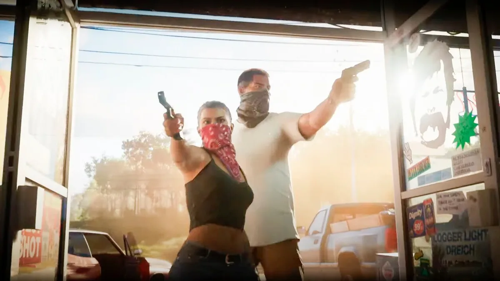

Obbe Vermeij had jarenlang een sleutelrol bij het razend populaire computerspel Grand Theft Auto (GTA), waarvan het aankomende deel deze week alle records brak met ruim honderd miljoen kijkers voor een voorvertoning. Vermeij snapt de wereldwijde opwinding. ,,Toen ik hoorde dat GTA VI een vrouwelijke hoofdrolspeler kreeg, dacht ik: O, o, als dat maar goed gaat.”

> [!NOTE]
> Dit interview verscheen eerder op [AD](https://www.ad.nl/tech/nederlander-obbe-was-de-man-achter-het-populaire-gta-alle-seks-in-nieuwe-trailer-is-wel-wat-banaal~a2dba9c9/).

GTA is uitgegroeid tot een van de grootste gamereeksen ter wereld. Deze week verscheen de eerste trailer voor het geplande GTA VI, een video die met 117 miljoen views in een paar dagen tijd alle records heeft verbroken. Ontwikkelstudio Rockstar bevindt zich aan de absolute top van de game-industrie.

Ook de Nederlandse gamemaker Obbe Vermeij, jarenlang werkzaam bij Rockstar, heeft de trailer gezien, vertelt hij vanuit Canada. ,,Ik vond hem fantastisch, echt heel mooi. Je kan zien dat ze technisch veel voortgang hebben geboekt. Er zit echt veel meer variatie in alle personages die rondlopen en de auto’s die op straat rondrijden.”

Rockstar was nog geen gevestigde naam toen Vermeij in 1995 solliciteerde. ,,Ik zat al van kinds af aan te pielen met de Commodore 64 en Amiga. Het duurde zes jaar voor ik mijn opleiding aan de TU Delft afrondde, omdat ik maar spelletjes bleef maken, maar het was nooit in me opgekomen dat ik het ook professioneel kon gaan doen. Dat bestond toen nog niet.”

Rockstarvoorganger DMA was een veel kleiner bedrijf toen Vermeij er begon. ,,Er werkten toen zo’n honderd man, het jaar ervoor waren dat er slechts tien. Alles stond nog in de kinderschoenen, ons kantoor zat bijvoorbeeld in een soort opslagcentrum. In dat gebied was veel criminaliteit, dus om 17.30 uur werd altijd een bezorgbusje midden in ons kantoor geparkeerd. Anders zouden de wielen ’s nachts worden gestolen.”

## Beroepscrimineel in de stad

Vermeij begon eerst aan de Nintendo 64-game Space Station Silicon Valley en mocht zich daarna over _GTA III_ buigen. Als _technical director_ was hij verantwoordelijk voor de techniek die achter het spel schuilgaat - een belangrijke taak bij deze game, die feitelijk de eerste vrij verkenbare 3D-stad was. ,,We waren toen een klein team, dus je mocht echt van alles doen.”

In de GTA-games speel je een beroepscrimineel die vrij een stad kan verkennen en misdaden kan plegen. Ze zaten vol geweld, maar Vermeij vond het belachelijk dat mensen zich daar druk over maakten. ,,Het was ontzettend _cartoony_ en leek nergens op. Uiteindelijk heeft ons bedrijf er nog op ingespeeld door iemand te betalen om in Engeland controverse te genereren. Er werden zelfs Kamervragen gesteld en de game verkocht daardoor goed.”

## Groter en groter

Na deel drie werkte Vermeij mee aan Vice City, San Andreas en uiteindelijk GTA IV. Met ieder nieuw deel werd het team groter en groter. ,,Ik werk liever met een klein team, dus tegen de tijd dat we aan deel vier begonnen, vond ik het al wat minder leuk. Toen mijn kinderen werden geboren en mijn Canadese vrouw naar haar thuisland wilde terugkeren, heb ik maar besloten te vertrekken en iets anders te gaan doen.”

GTA V was de eerste driedimensionale GTA-game waar Vermeij niet bij betrokken was, al zag hij zijn invloed er nog wel in terug. ,,Toen we deel vier maakten zag de stad er ’s nachts doods uit, dus had ik een code geschreven waardoor je de autolichten in de verte nog ziet branden. Dat zat er in het vijfde deel nog steeds in.”

Inmiddels is hij al ruim veertien jaar weg bij de GTA-maker en geniet hij op afstand van de eerste beelden van GTA VI. ,,Ik heb de trailer al heel vaak bekeken om alle details er goed uit te kunnen vissen. Alle seks die er in zit is wel wat banaal en overdadig. Mijn puberkinderen tonen nog niet echt interesse in de game, dus ik ga ze natuurlijk ook nog niet die kant op sturen.”

beeld uit de nieuwste Grand Theft Auto (GTA - 6) © Rockstar

## Goed verhaal met goede personages

De nieuwste GTA heeft voor het eerst ook een vrouwelijke hoofdpersoon. ,,Toen ik voor het eerst hoorde dat ze dit van plan waren, dacht ik: O, o, als dat maar goed gaat. Er zijn veel spelletjes te woke geworden, omdat de vrouwelijke hoofdpersoon bijna niet kan verliezen en allerlei superkrachten heeft. Dat is hier helemaal niet het geval, dit is denk ik een goed verhaal met goede personages.”

Recent begon Vermeij een blog over zijn tijd bij Rockstar, maar hij haalde die snel weer offline. ,,Het leek me leuk om eens te vertellen hoe het er twintig jaar geleden aan toeging en had verwacht dat het hooguit duizend keer per dag zou worden gelezen. De teller liep op naar 150.000 lezers per dag en ik hoorde dat oud-collega’s het vervelend vonden dat ze het verhaal niet vanuit hun oogpunt konden vertellen.

Inmiddels woont Vermeij al jaren met zijn vrouw en drie kinderen in Canada, waar hij op kleinere schaal games maakt. ,,Ik vind het echt fijn om spellen met een klein team te maken en bij _GTA VI_ hebben ze alle ontwikkelaars bij elkaar gevoegd. Dat zijn 1500 man.” Dus spijt van zijn vertrek heeft hij niet.
