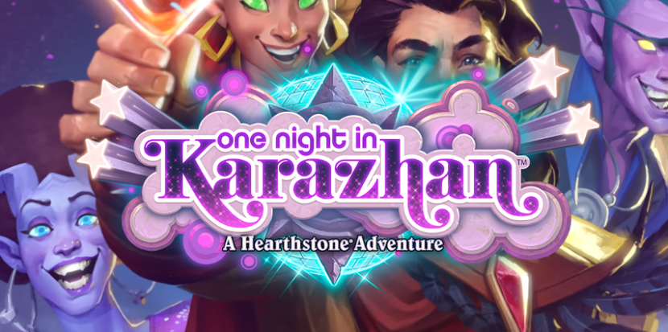
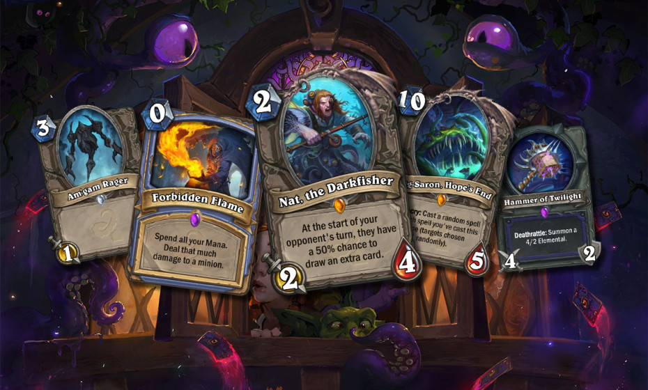
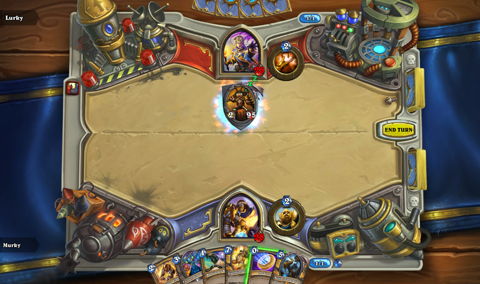
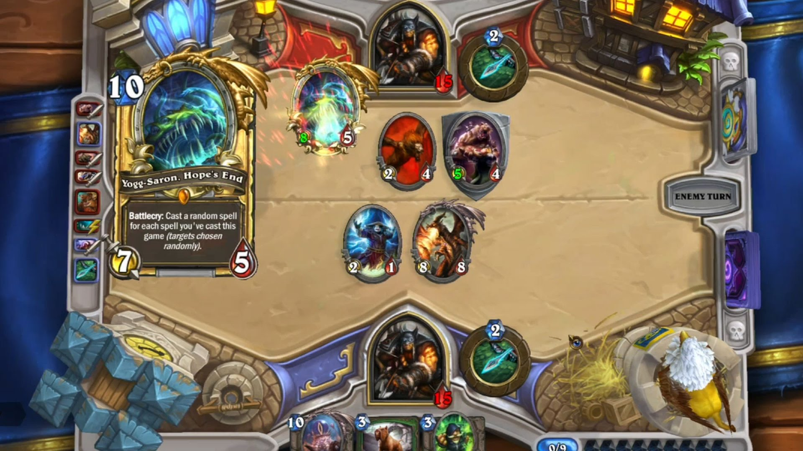
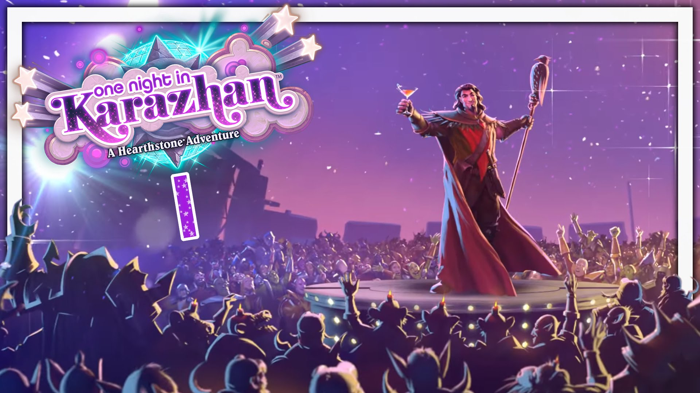

**Inmiddels is Hearthstone een van de grootste titels onder de riem van Blizzard, met ook een complexe metagame en diepgaande strategieën.**

Toen Hearthstone jaren geleden werd aangekondigd, bleek de game flink wat anders dan we van Blizzard gewend waren. Dit was immers geen mmo, strategiegame of andere klassieke titel, maar een kaartgame. Inmiddels is het een van de grootste titels onder de riem van de ontwikkelaar, met ook een complexe metagame en diepgaande strategieën.

> [!NOTE]
>
> Dit interview verscheen eerder op [Insidegamer](https://inside.gamer.nl/124325-hearthstone-zelfs-lollige-lore-moet-je-serieus-nemen/).

Hoe is het om daarvoor te ontwikkelen? We spraken er op GamesCom over met gamedesigner [Peter Whalen](http://hearthstone.gamepedia.com/Peter_Whalen) en executive producer [Hamilton Chu](http://hearthstone.gamepedia.com/Hamilton_Chu).

Met League of Explorers hebben jullie een volledig eigen verhaal bedacht in het Warcraft-universum. Waarom keren jullie nu weer terug naar een bestaande Raid met Karazan?

**Peter Whalen:** “We proberen veel verschillende dingen. Dat zag je bij League of Explorers, waarbij we materiaal gebruikten dat minder aandacht kreeg in Warcraft. Bij Naxxramas en Blackrock Mountains hebben we hardcore raids waarheidsgetrouw neergezet, maar met een beetje Hearthstone-charme.”

“Bij Karazhan wilden we een net wat andere twist geven aan een raid waar we echt dol op waren. Daarbij vroegen we ons af: hoe zag Karazhan er vroeger uit? Er is daar iets verschrikkelijks gebeurd wat leidde tot de raid in World of Warcraft, maar je merkt dat het een plek met geschiedenis was. Dat valt meteen op als je de raid ingaat: je ziet de balzaal, het operahuis en de schaakset. Iemand heeft daar fenomenale feestjes gegeven. Al die coole, onbelichte dingen wilden we in Hearthstone verkennen.”

**Zouden jullie in een nieuwe Adventure willen voortbouwen op bestaand materiaal? Of iets compleet nieuws maken?**

**Whalen:** “Ik zou het eerlijk gezegd niet weten. We proberen altijd om nieuwe dingen te doen, om te zien welke kant Hearthstone nog op kan. Soms duiken we op klassiek materiaal uit World of Warcraft, of soms slaan we een nieuwe richting in met League of Explorers. Af en toe pakken we er ook obscuurdere delen van de games bij, zoals met de Old Gods. Deze goden zijn een belangrijk onderdeel van het Warcraft-universum, maar wij hebben ze wat meer achtergrond gegeven. We hebben zelfs een god in ons spel dat nog niet in World of Warcraft is verschenen.”

**Hebben jullie een persoonlijke voorkeur voor een nieuw project?**

**Whalen:** “Niet echt, ik vind het allemaal wel tof om te doen.”

**Hamilton Chu:** “Ik vind het zelf vooral cool hoe we inmiddels meerdere ‘tempo’s’ in de game hebben voor verschillende soorten spelers. Met Old Gods hebben we Hearthstone bijvoorbeeld wat enger en spannender gemaakt. Het is dan echt heel leuk om dat op te volgen met iets dat over de top en grappig is. Misschien dat we hierna teruggaan naar iets dat duisterder en serieuzer is – of we gaan wat in het midden zitten. Maar ik vind het zelf echt fijn hoe we verschillende thema’s in één game kunnen stoppen.”

**Iedereen lijkt het erover eens te zijn dat Priest al erg lang de zwakste Hero is. Wat voor rol speelt dit bij het maken van nieuwe kaarten?**

**Chu:** “We negeren de feedback die binnenkomt absoluut niet. We proberen altijd om goed naar onze community te luisteren: we lezen mee en bespreken de feedback die we tegenkomen ook intern.”
“Ik zou echter niet zeggen dat deze gesprekken direct invloed hebben op kaartdesign. De problemen die mensen opmerken zijn wel echte problemen, dus het is voor ons belangrijk om te snappen hoe alles op elkaar aansluit voordat we iets nieuws ontwerpen.”

**Waar ligt de grens? Is er niet een punt waarop binnenkomende feedback onterecht is?**

**Chu:** “Ik denk dat er daarbij twee dingen meespelen. Ten eerste zijn er de gevoelens van spelers, die aangeven wat de emotie bij bepaalde spelelementen is. Daar kun je moeilijk over liegen en we nemen dat zeer serieus. De oplossingen die mensen echter bieden om problemen op te lossen zijn een ander verhaal. Soms hebben ze een slim idee, maar soms vergissen ze zich ook. Het belangrijkste voor ons is hoe dan ook dat we de emoties van spelers goed aanvoelen.”

**Dat moet soms wel eng zijn. De kans bestaat immers dat je te maken hebt met een zeer vocale minderheid, die iets wil veranderen dat op het moment perfect is.**

**Chu:** “Oh zeker, dat speelt ook een rol. We hebben een groot publiek met veel soorten spelers en we proberen de beste oplossingen voor iedereen te bieden. Daarbij helpt het soms om te kijken wat de vocale minderheid zegt, maar soms ook niet.”

**Tavern Brawl kan regelmatig op volledig nieuwe spelmodi rekenen. In hoeverre is dit een manier om toekomstige functies voor Adventures en andere modi te testen?**

**Whalen:** “Oh ja, Tavern Brawl is voor ons geweldig. We kunnen er allerlei gekke dingen mee uitproberen, zoals die coöperatieve modus. (…) Het is een arena waarin we met van alles kunnen experimenteren. We hebben bijvoorbeeld ook uitdagingen gehad waarin je verschillende classes speelde.”

**Zijn er Taven Brawl-probeersers die jullie in andere vorm aan de game willen toevoegen?**

**Whalen:** “Dat gebeurt af en toe wel. Soms hebben we ideeën zoals Lady Naz’jar in League of Explorers, die uiteindelijk een kaart werd in Old Gods. Op die manier experimenteren we vaker met dingen die later een kaart worden. Dat is best cool.”

**Letten jullie bij Tavern Brawl meer op statistieken? Is het een verkapte bèta?**

**Whalen:** “Het is een mix. Aan de ene kant is het een nieuwe ervaring voor spelers. Iedere Brawl is nieuw en anders – spelers vinden het wel of niet tof. Ten tweede leren wij meer over een nieuwe mechanic. Misschien zien we bij een Brawl toffe dingen gebeuren, of we zien dingen waarvan we geen idee hadden dat ze mogelijk waren. Af en toe kan dat leiden tot iets verschrikkelijks, waardoor we een idee achteraf laten liggen. Soms vinden spelers iets leuk om totaal andere redenen dan wij hadden verwacht, waar we ook weer van leren. Hierdoor krijgen we langzaam een beeld van wat bij mensen klikt en waar we gebruik van moeten maken.”

**Een voorbeeld van een verschrikkelijk idee?**

**Whalen:** “Oh man. We hebben een paar Tavern Brawls die we nooit hebben uitgebracht en die waren afschuwelijk. Zo hadden we er bijvoorbeeld één waarbij je niet iedere beurt een mana crystal kreeg. In plaats daarvan had je kaarten in je deck waarmee je een crystal kon genereren. Dat was een stuk minder leuk dan we hadden gehoopt. Je komt vaak vast te zitten, of je krijgt alleen crystal-kaarten waardoor je ook niks kunt doen. Het ergste is als een tegenstander een counterspell-kaart speelt waardoor je crystal-kaart niet werkt. Dat voelt afschuwelijk. Wellicht is er een versie van deze Tavern Brawl die in e toekomst wel tof kan zijn. Maar de huidige variant is er echt nog niet.”

**Enig idee hoe je het kan laten werken?**

**Whalen:** “Oh, ja hoor. Misschien moeten we een andere versie maken, waarin de crystal-kaarten extra effecten hebben. Of misschien moet de speler meer controle krijgen over hoe de crystals in het deck terechtkomen. Er zijn een paar dingen die we nog kunnen uitproberen, maar de huidige versie werkt echt niet.”

**Iedere Hero heeft ondertussen zo zijn kenmerken. In hoeverre voelen jullie je hier beperkt door? Mage is altijd een class met voornamelijk spells geweest, en bij Hunter is het haast onmogelijk om niet agressief te spelen.**

**Whalen:** “Niet echt. We hebben classes gehad die niet in hun archetype bleven hangen. Neem bijvoorbeeld de Pirate Warrior, die erg sterk was rond het verschijnen van Old Gods. Die deed het erg goed op de ranglijsten, maar was een stuk agressiever dan traditionele Warriors. Dan is er nog het Yogg and Load-deck voor Hunters, die met valstrikken vooral proberen om het speelveld te beheersen. Die speelt een stuk defensiever dan een standaard Hunter-deck.”

Hearthstone lijkt al een tijdje een soort ‘gateway drug’ voor Blizzard-games. Zien jullie veel spelers overvloeien van de kaartgame naar andere spellen?
**Whalen:** “Toegankelijk is heel erg belangrijk voor ons. Je komt binnen, krijgt een toffe tutorial voorgeschoteld en hoeft niet te betalen. De kaarten bevatten geinige animaties en zeggen lollige dingen. Al die dingen maken het spel ontzettend toegankelijk. Daarnaast is het voor ons echter belangrijk dat het Warcraft-universum ons toegang geeft tot ontzettend veel in-game geschiedenis, die spelers in een ander spel ook weer kunnen verkennen.”

**Alsof het een Hearthstone-mmo is…**

**Whalen:** “Hahaha. Ja, laten we hem zo maar noemen. World of Warcraft is fantastisch, maar het werkt ook twee kanten op. Mensen komen ook uit World of Warcraft om onze game te bekijken. Hoe vaak dat gebeurt kan ik niet zeggen.”

**De nadruk ligt in Hearthstone op het Warcraft-universum, maar er zijn natuurlijk aardig wat meer franchises. Hoe lang totdat we een Overwatch Adventure hebben?**

**Whalen:** “We hebben op dit moment al een Overwatch-kaarthoes. Dat is een coole manier om andere franchises te ‘vieren’, maar Hearthstone blijft een Warcraft-game. We kunnen soms dingen uit andere franchises laten zien als het op de thema’s van Hearthstone aansluit, maar er is nog zoveel in World of Warcraft om gebruik van te maken. En het is voor ons heel belangrijk om het universum logisch te houden. World of Warcraft is gigantisch en het is van belang om alles goed met elkaar te blijven verbinden.”

**Maar Hearthstone is best luchtig. Is het niet makkelijk om te zeggen: ‘We doen jolige dingen, dus laten we er dan maar alle franchises bij pakken’?**

**Whalen:** “Ik denk van niet. We hebben echt wel een bepaalde grens. Hearthstone benadert het materiaal van World of Warcraft net wat lichter dan de mmo. We zeggen het altijd zo: World of Warcraft is episch met een vleugje lol, Hearthstone is lollig met een vleugje epos. Die mix is voor ons echt heel erg belangrijk. We hebben nog niet een punt bereikt waarop we zeggen: ‘we zijn de grappige game, dus het maakt ons allemaal niet uit. Laten we nog gekkere dingen doen’. Zo ver zijn we gewoon niet. Het is voor ons belangrijk dat we de Warcraft-geschiedenis respecteren.”

**Dat klinkt een stuk conservatiever dan je zou verwachten.**

**Chu:** “Ik denk dat de diepte en cohesie die erachter schuilt, ook al zie je die niet, wel te voelen is in de game. One Night at Karazhan is daar een geweldig voorbeeld van. Dit avontuur is gebaseerd op een epische raid waar je bekend mee bent, die een bepaald gevoel weet over te brengen. De personages hebben allemaal een geschiedenis en sluiten goed op elkaar aan. Die vibe kunnen mensen opmerken als ze spelen. Ik denk dat het belangrijk is om alles goed samen te brengen, zelfs als het spel soms niet serieus overkomt.”

**Van alle onderdelen in de game, lijkt de Arena het minste aandacht te hebben gekregen in de afgelopen jaren. Zijn er plannen om daar iets mee te doen?**

**Whalen:** “We praten altijd over wat we met de Arena kunnen doen, door hem bijvoorbeeld beter benaderbaar of anders te maken. Op het moment is het wel al een vrij dynamische ervaring, omdat je iedere keer een ander deck maakt waar je geen directe invloed op hebt. Maar we kijken altijd naar nieuwe dingen om hiermee te doen.”

**Al concrete plannen?**

**Whalen:** “We hebben op dit moment niks om aan te kondigen, maar het is absoluut iets waar we gepassioneerd over zijn. We hebben het er ontzettend veel over.”

**Kunnen we een aankondiging verwachten binnenkort, of…?**

**Chu:** “We hebben vandaag geen aankondigingen om aan te kondigen, hahaha!”

**Whalen:** “[Blizzard Soon](http://wowwiki.wikia.com/wiki/Soon), hé. Uiteindelijk.”

**Om het nog even over Priest te hebben: een tijd terug werd er gesproken over een Unicorn Priest-deck. Een geweldig deck wat de class een stuk beter zou maken…**

**Whalen:** “Hahahaha!”

**Heeft iemand hem al gevonden? Of wordt ‘ie nog vermist?**

**Whalen:** “De Unicorn-deck komt voort uit iets dat ontwikkelaar Ben Brode zei, dat wellicht niet helemaal werd geïnterpreteerd zoals hij bedoelde. Er zijn absoluut decks die mensen nog niet hebben gevonden, maar er zijn meerdere manieren om daarnaar te kijken.”

“Met One Night in Karazhan experimenteren mensen op veel verschillende manieren. Zo is er bijvoorbeeld het deck Priest of the Feast dat het erg goed doet – spelers zijn daarmee de top 50 van de ranglijsten binnengedrongen. Er wordt op hoog niveau met Priest gespeeld en het is geweldig om dat te zien.”

**Chu:** “Het is cool hoe dynamisch onze metagame is. Ik denk dat Brode het niet echt specifiek had over Priest, maar over Hearthstone in het algemeen. Neem bijvoorbeeld het deck Wall Shaman. Dat is vier, vijf weken geleden pas ontdekt. Sindsdien is dit een ontzettend populaire optie onder spelers. De kaarten hiervan zitten echter al maanden in Old Gods, maar zijn nu pas door spelers op die manier samengebracht.”

**Zijn jullie nooit geneigd om mensen de juiste kant op te duwen, zodat ze die decks eerder ontdekken?**

**Chu:** “Nee. Het is geweldig hoe miljoenen spelers vaak veel slimmer en creatiever zijn dan wij. Dat maakt het fantastisch om te zien hoe ze nieuwe decks en oplossingen zelf vinden.”
