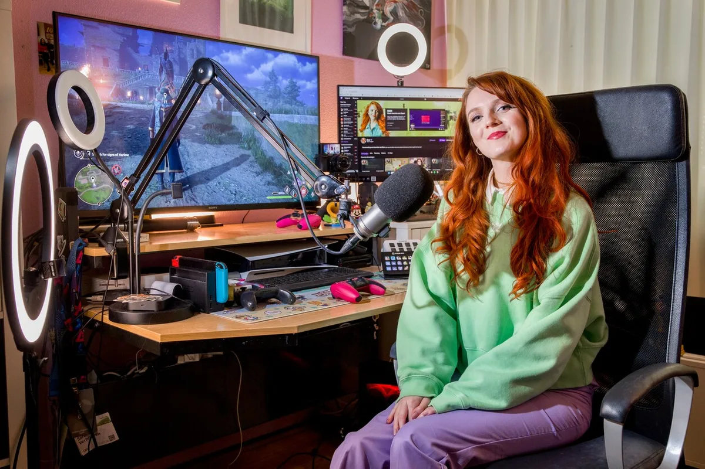

De 26-jarige Sarah Verhoeven uit Spijkenisse heeft de droombaan van menig gamer: ze wordt betaald om iedere dag urenlang haar favoriete spellen te spelen. Recent won ze voor de tweede keer de prijs voor ‘beste vrouwelijke streamer van Nederland’. ,,Gamer girl? We doen gewoon allemaal hetzelfde - we hebben het toch ook niet over ‘gamer boys’?”

> [!NOTE]
> Dit interview verscheen eerder op [AD](https://www.ad.nl/tech/sarah-verdient-haar-brood-met-gamen-maar-heb-er-geen-fijn-gevoel-bij-als-kijkers-met-geld-strooien~a20b774a/).

Loopt ze rond op Comic-Con of grote gaming-evenementen, dan wordt ze geregeld staande gehouden door fans die even een praatje willen maken. ,,Maar in het dagelijks leven gebeurt dat nog niet. Ik kan nog gewoon naar de supermarkt”, zegt Sarah lachend.

Vijf uur lang streamt ze iedere dag games. Dat doet ze vooral op Amazons streamingplatform Twitch voor haar bijna 30.000 volgers. ,,Sinds kort stream ik ook twee tot drie uur van mijn dag op TikTok, waar ik vooral nostalgische content maak. Daar speel ik dan bijvoorbeeld een Mario-game.”

Daar hebben haar video’s bij elkaar opgeteld zo’n 275.000 likes verzameld. Twitch is groot onder gamers: in Nederland wordt de streamingdienst maandelijks door 1,3 miljoen mensen bezocht, blijkt uit recente cijfers van marktonderzoeker Newcom.

## Zelda spelen

Als vrouw bevindt Sarah zich overduidelijk in een mannenwereld. Volgens de site TwitchTracker telt ons land tweehonderd streamers met meer dan 10.000 volgers, waaronder maar dertig accounts van vrouwen zijn.

,,Ik game al van jongs af aan. Mijn broers hadden een Nintendo 64 en ik ging altijd gezellig meekijken als ze daarop Zelda speelden. Zo raakte ik helemaal ‘into gaming’. Op de middelbare school wilde ik daar heel graag met anderen over kletsen en ontdekte ik Twitch. Toen verdiende ik er nog geen geld aan, maar later werd ik benaderd door partijen die vroegen of ik voor hen wilde livestreamen.”

Inmiddels levert het livestreamen haar genoeg geld op om goed van rond te komen. De meeste inkomsten komen uit samenwerkingen met gamemakers. ,,Die betalen dan bijvoorbeeld zodat ik een aantal keer hun games op stream speel, of dat ik content maak voor op sociale media.” Kijkers kunnen ook rechtstreeks geld doneren, maar daar is ze liever niet te afhankelijk van: ,,Ik heb er geen fijn gevoel bij als kijkers maar iedere dag met geld moeten strooien.”

## Ook geen ‘gamer boys’

Uit onderzoeken blijkt dat ongeveer de helft van alle gamers vrouw is, toch heerst vaak het vooroordeel dat het een mannenhobby is. ,,Ik vind de term ‘gamer girl’ ook helemaal niet leuk, dat er onderscheid wordt gemaakt tussen mannelijke en vrouwelijke gamers. We doen gewoon allemaal hetzelfde - we hebben het toch ook niet over ‘gamer boys’?”

© Arie Kievit

Sommige vrouwelijke streamers zenden nog uit vanuit een opblaasbadje, terwijl ze in een bikini zitten te gamen. Sex sells. ,,Dat zijn vaak streamers waarbij het verdienmodel heel erg bij de kijker ligt. Ik vind het wel jammer dat heel veel vrouwelijke streamers daarmee geconfronteerd worden of daar vragen over krijgen. Er zijn veel vrouwen die gewoon een passie voor gaming hebben en totaal niet op die manier streamen - en ook succesvol zijn.”

De hoofdredacteur van _Power Unlimited,_ het oudste gamesblad van Nederland, bood recent excuses aan voor de vroeger seksistische ondertonen in artikelen. Voor Sarah had dat niet gehoeven. ,,De toon is inmiddels wel anders.”

## Zelfde inhoud als mannen

Sarahs streams wijken inhoudelijk bijna niet af van die bij haar mannelijke concurrenten, stelt ze. Net als bij hen speelt ze haar favoriete games en reageert daar op. Dat ziet ze ook terug in haar publiek: van vervelende kijkers heeft ze niet meer last dan andere streamers die ze kent.

Tweemaal won Sarah nu de _Dutch Stream Award_ voor beste vrouwelijke streamer. Dat mannen en vrouwen bij die prijs zijn gesplitst, vindt ze wel logisch: ,,Op die manier kunnen ze vrouwen extra uitlichten. Dat is alleen maar positief.”

Streamers bespreken vaak lief en leed tijdens uitzendingen, waardoor kijkers soms het gevoel krijgen een band met die persoon op te bouwen. Daar kijkt ze wel extra voor uit. ,,Soms heb je kijkers bij wie je je afvraagt of ze niet wat obsessief worden. Ik snap dat ergens wel, want je bespreekt veel persoonlijke dingen. Maar ik probeer daarom wel afstand te houden tussen mij en mijn publiek, ook zodat het veilig blijft voor mij.”
