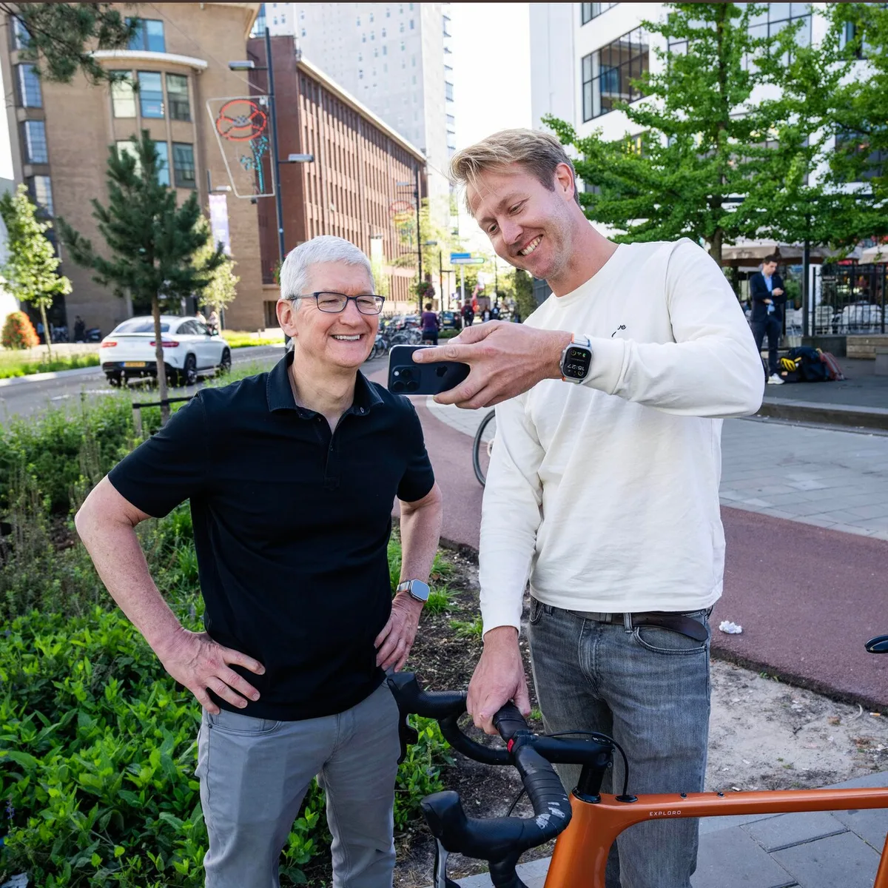

Apple-topman Tim Cook was maandag op werkbezoek in Eindhoven, waar hij onder anderen sprak met leden van wielerteam Jumbo-Visma. Binnenkort kunnen tv-kijkers én profrenners etappes van de Tour de France volgen met een VR-bril op, voorspelt Cook in een exclusief interview met deze site. ,,Dat wordt een heel emotionele ervaring.”

> [!NOTE]
> Dit interview verscheen eerder op [AD](https://www.ad.nl/binnenland/apple-baas-tim-cook-op-bezoek-bij-jumbo-visma-wielrennen-kijken-wordt-verbazingwekkend~a4842ab5/).

Cook (62) volgde in 2011 Steve Jobs op als ceo van Apple. Hij is deze week bezig met een reis door Europa. Afgelopen weekend trapte hij af in Spanje, waar hij sprak met een paralympische zwemkampioen over hoe ze haar iPhone gebruikt met haar handicap. Even daarna bezocht hij het stadion van Real Madrid.

Maandag was Nederland aan de beurt: de topman kwam naar Eindhoven om onder andere het wielerteam Jumbo-Visma te ontmoeten, dat het afgelopen seizoen ontzettend goed scoorde. Hij kreeg een korte demonstratie van hoe fietsers de iPhone gebruiken om hun prestaties te maximaliseren, bijvoorbeeld door tot in de kleinste details te loggen wat ze allemaal eten.

Een flinke delegatie van het team was naar Eindhoven afgereisd om de topman te spreken: van de directeur tot een wielrenner van het vrouwenteam, en daarnaast meerdere medewerkers die verantwoordelijk zijn voor de app die de voeding van de profrenners trackt.

De laatste editie van de Tour de France heeft Cook slechts deels gekeken, alleen de laatste ritten volgde hij op de voet, vertelde hij. Lachend: ,,Voor een Amerikaan is het niet echt een makkelijke wedstrijd om te volgen. Je moet je wekker heel vroeg zetten, of alles opnemen en later maar terugkijken.”

## Fitnessapps populair

Naast Jumbo-Visma waren ook de oprichters van de Nederlandse app Relive te gast. Met hun app kun je een fietstocht bijhouden, maar ligt de nadruk meer op het overbrengen van de ervaring dan op de rauwe statistieken, zoals gemaakte kilometers. Zij vroegen Cook of hun app rechtstreeks in de iPhone-software geïntegreerd kan worden. ,,Ik dacht al dat je zoiets ging vragen”, reageerde hij guitig.

Fitness-apps zijn buitengewoon populair in de App Store: marktleider Strava heeft honderd miljoen klanten. Relive heeft sinds zijn introductie in 2016 zo’n twintig miljoen gebruikers, van wie er iedere zomer twee miljoen veelvuldig de app gebruiken. Het bedrijf erachter is daardoor gegroeid naar ruim dertig werknemers. ,,Dat hebben we gehaald zonder ooit iets aan marketing te doen”, vertelt oprichter Lex Daniels. ,,Nadat we een filmpje van onze app deelden in een vriendengroep is het vanzelf zo gegaan.”

Fitness-apps zijn erg populair in de App Store. Tim Cook wil van Apple meer een gezondheidsbedrijf maken. Op de foto met Lex Daniels van Relive. © Brooks Kraft

Cook - zakenblad _Forbes_ schat zijn vermogen op 1,9 miljard dollar - staat bekend als fervent wandelaar, maar vertelde tijdens zijn werkbezoek ook heel graag een rondje te fietsen. ,,Ik heb een trackbike, die gebruik ik om lange afstanden af te leggen. De afgelopen jaren fietste ik steeds een route door Georgia voor een actie waarbij geld werd ingezameld voor de strijd tegen MS. Op die manier kan ik mijn liefde voor buitensporten en de natuur combineren met een goed doel.”

## Gezondheid als nalatenschap

Apple is primair een techreus, maar Cook is afgelopen jaren hard bezig om het in een gezondheidsbedrijf te transformeren. Dat begon met de introductie van de Apple Watch in 2014, die met sensoren je gezondheid in de gaten houdt en inmiddels ook alarm kan slaan als bepaalde afwijkingen van het hart worden gedetecteerd. Enkele jaren geleden stelde Cook dat Apples werk in de medische hoek de belangrijkste bijdrage van het bedrijf aan de mensheid zal worden. ,,Daar sta ik nog steeds achter”, zegt hij nu.

Cook: ,,De aankondiging van de recente iPhone begonnen we met een filmpje over hoe we mensen hun levens hebben verbeterd, door bijvoorbeeld alarm te slaan na een val of door een probleem met het hart te detecteren. Daarnaast ontvang ik dagelijks een grote hoeveelheid berichten van mensen wiens levens we hebben geraakt. Ik ben er van overtuigd dat dit Apples nalatenschap zal worden.”

Apples slimme bril, de Vision Pro, moet daar volgend jaar ook een bijdrage aan leveren. Deze toont een virtuele wereld bovenop je echte omgeving, zodat je bijvoorbeeld digitale objecten bovenop de echte wereld kunt projecteren.

## Virtuele bril voor Tour de France

In eerdere demonstraties liet Apple zien hoe zo’n gigantisch virtueel computerscherm in je kamer lijkt te hangen. ,,Het is nu nog onmogelijk te voorspellen hoe dat allemaal precies zal werken bij fietsers - ontwikkelaars hebben nog maar net hun brillen ontvangen om er software voor te maken. Maar wielrenners kunnen er straks bijvoorbeeld hun eigen prestaties mee bekijken.”

De impact van die bril zal eerst merkbaar zijn bij toeschouwers - mensen die bijvoorbeeld thuis op de bank naar de Tour de France zitten te kijken. Daarbij zou dan gebruik worden gemaakt van virtual reality: een speciaal soort 3D-video wordt ingeladen waarin je zelf kunt rondkijken, waardoor het voelt alsof je er zelf bent.

,,Je kunt de race dan zelf kijken vanuit het perspectief van een wielrenner. Dat wordt een heel emotionele ervaring, waarbij we gaan merken hoe anders het is om iets in 3D te bekijken dan op een plat 2D-scherm. Het wordt verbazingwekkend.”
