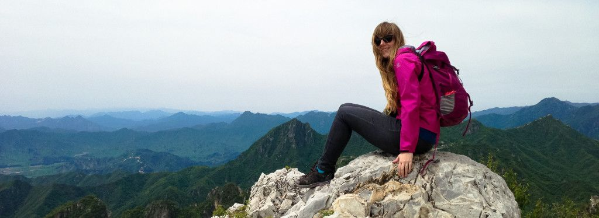

De afgelopen maanden hebben we het al een paar keer gehad over werken in de game-industrie buiten Nederland. Maar wat als Engeland, Frankrijk of Duitsland niet genoeg voor je zijn en je echt ver van huis aan de slag wilt? Daar spraken wij over met Marthe Jonkers, een Nederlandse concept artist die inmiddels al jaren in Japan werkt. Een hoekje van de wereld waar toch verdraaid veel van onze favoriete games vandaan komen.

> [!NOTE]
>
> Dit artikel verscheen eerder op [Gamer.nl](https://gamer.nl/artikelen/interview/als-nederlandse-concept-artist-in-japan/?ref=gamepraat.nl).

**Vertel eens kort: wat heb je gestudeerd voordat je aan de slag ging?**

**Marthe Jonkers:** Ik heb archeologie gestudeerd en tijdens m'n masterjaar begon ik ook aan de opleiding 'game design en development' aan de HKU. in 2009 studeerde ik daar af met een master in game design. Ik heb me gespecialiseerd in concept art. Tegenwoordig kan ik mijn passie voor tekenen en geschiedenis vaak heel mooi combineren in het maken van games.

**Ben je tijdens je studie al wat gaan werken? Of ben je dat pas echt gaan doen toen je een diploma had?**

Tijdens het laatste jaar van m'n studie werkte ik inderdaad al een beetje bij, freelance als designer en ook even parttime als game artist. Ik heb het wel even stopgezet zodat ik me kon concentreren op mijn afstudeerproject. Na te zijn afgestudeerd ben ik weer vol aan de slag gegaan met freelance concept art-werk, totdat ik een baan kreeg bij Capcom en daar fulltime aan de slag ging.

**Hoe ben je in Japan terechtgekomen?**

Mijn eerste kennismaking met Japan was toen ik in mijn derde jaar aan de HKU een uitwisseling met Kyoto Seika University had geregeld. Eenmaal daar was ik erg onder de indruk van de Japanse cultuur, natuur en kunst. In Nederland leerde ik veel over ideeprocessen en concepten, maar in Japan waren de lessen veel technischer en meer gericht op tekenvaardigheden. Ik vond dat een fantastische aanvulling op mijn opleiding.

Toen ik na een geweldig half jaar weer terug was in Nederland moest ik best weer een beetje wennen. Ik kreeg zelfs wat heimwee naar Japan en ben daarom aan de slag gegaan met het regelen van een onderzoeksstage in Kioto. Door middel van een aantal beurzen kon ik na mijn studie in Nederland een jaar onderzoek doen in Kioto naar Japans game design. In die tijd werkte ik ook erg hard aan m’n taal en portfolio. Ik kwam in contact met allerlei gamebedrijven via mijn universiteit in Kioto en kon freelance aan de slag als concept artist voor onder andere Metal Gear Rising en Square Enix’ techdemo Agni’s Philosophy.

Toen mijn jaar in Japan ten einde liep, besloot ik dat ik toch echt nog niet weg wilde en solliciteerde ik bij Capcom. Ik had daarvoor twee sollicitatiegesprekken, helemaal in het Japans. Supermoeilijk en eng! Ter voorbereiding had ik op internet een lijst met veelgestelde vragen opgezocht en geoefend, zodat ik wat mooie verhalen klaar had. Uiteindelijk ging het gesprek heel goed en werd ik in de trein terug al gebeld of ik terug kon komen voor een tweede ronde. M’n tweede gesprek had ik uiteindelijk de dag voordat ik terug naar Nederland moest omdat m'n visum was afgelopen. In Nederland kreeg ik te horen dat ik weer terug kon komen en aan de slag kon als concept artist. Dat is inmiddels vier jaar geleden.

**Wat doe je nu precies bij Capcom?**

Ik ben concept artist. Mijn hoofdtaak is het ontwerpen van de omgevingen, personages en monsters voor Capcoms nieuwe titels. Daarnaast denk ik met m’n tekeningen ook na over game en level design en werk nauw samen met de directors en art directors.

Ik teken geregeld illustraties voor promoties in bladen en posters. Ik geef ook les aan nieuwe employees en begeleid junior artists. De laatste uitgebrachte titel waar ik aan gewerkt heb is de Dragon's Dogma-serie. Het leuke aan Capcom vind ik dat ze aan zoveel verschillende IP’s werken: Resident Evil, Monster Hunter, Street Fighter… je doet dus heel veel afwisselende ervaring op.

> De eerste week had ik geen meubels, behalve een kartonnen doos die ik gebruikte als tafel

**Was het veel werk om te emigreren?**

Zeker weten! Ik had gelukkig nog niet zoveel wat me echt aan Nederland bond (geen huis, geen huisdieren, weinig spullen) dus de verhuizing zelf viel relatief mee. Ik heb gewoon twee grote koffers met spullen gevuld en ben op het vliegtuig gestapt. Eenmaal aangekomen woonde ik de eerste twee weken in een hotel. In die tijd ben ik als een gek een appartement gaan zoeken - wat niet makkelijk is als buitenlander vanwege allerlei regeltjes. De dag voordat ik naar m’n eerste werkdag moest kreeg ik de sleutel van m’n nieuwe huis (nou ja, kamertje).

De eerste week had ik geen meubels, behalve een kartonnen doos die ik gebruikte als tafel. Ik sliep op de grond en at elke avond een Japans kant-en-klaar-lunchboxje van de supermarkt. Het eerste weekend kocht ik gelijk een koelkast en een bed, haha. Je moet wat over hebben voor zo'n avontuur natuurlijk.

**Liep je tegen gekke complicaties aan tijdens je emigratie?**

Ja, er zijn ontzettend veel rare regels in Japan die niet in het voordeel zijn van buitenlanders. Voor het openen van een bankrekening heb je bijvoorbeeld een woonadres nodig. Maar voor een woning heb je een bankrekening nodig. Om dat op te lossen heb ik een adres van een vriend opgeschreven, ook al woonde ik daar eigenlijk niet.

Daarnaast moet je in Japan voor veel huizen een Japans familielid hebben die garant voor je wil staan als je bijvoorbeeld de huur te laat betaalt. Tja, ik heb geen Japanse familie. Gelukkig was er een ontzettend lieve familie die ik had leren kennen in Kioto bereid om mijn 'Japanse familie' te zijn en me te helpen met het huis.

**Je hoort vaak dat Japanners dicht op elkaar wonen in kleine huizen. Heb je het gevoel dat je ‘krapper’ woont in Japan dan in Nederland?**

Haha, wonen in Japan is alsof je een sardientje bent. De huizen zijn echt piepklein. Ik woon nu in het centrum van Osaka, wat natuurlijk helemaal krap is omdat iedereen daar wil wonen. Het huis dat ik nu heb is kleiner dan waar ik als student in Nederland woonde.

Veel huizen hebben geen uitzicht of soms niet eens een raam. Omdat de meeste Japanners veel op werk zitten, hebben ze ook niet zo’n behoefte aan een groot en licht huis. Waarom zou je, als je er toch nooit bent? Gelukkig heb ik inmiddels zelf wel een appartement gevonden met een prachtig “Blade Runner”-achtig uitzicht over de stad.

**Merk je een verschil in mentaliteit tussen Nederlandse en Japanse industrieleden?**

Absoluut. Mijn ervaring in de game-industrie is dat Nederlanders heel berekenend zijn. Ze denken na over een proces, ze optimaliseren. Nederlanders discussiëren veel met elkaar, zijn open, hebben veel ideeën en van hiërarchie is amper sprake.

Japanners zijn denk ik bijna het tegenovergestelde. Ze zijn heel gesloten en rustig. Ze werken heel gedetailleerd en geconcentreerd, maar niet per se efficiënt. Japanners hebben vaak een hekel aan discussie en zullen dit altijd proberen te vermijden. Ze houden daarom erg van een hiërarchie waarbij iemand het gewoon voor het zeggen heeft en er geen lange discussies nodig zijn.

**Wat zouden Nederlandse industrieleden en studenten kunnen leren van de Japanners? En andersom?**

Waar Japanners heel goed in zijn is doorzetten. Ze kiezen niet altijd de snelste of efficiëntste weg, maar nemen de tijd om iets zo goed mogelijk uit te werken. In Nederland hebben we denk ik vaak de neiging alles efficiënt en in optimale tijd te doen. Ook kun je leren wat meer jezelf te zijn en je niet te veel te laten leiden door bijvoorbeeld doelgroepen of verkoopcijfers.

Veel van de Japanse eigenzinnigheid en originaliteit komt omdat ze zich niet veel aantrekken van wat 'in' is of wat goed verkoopt. Ze maken gewoon wat ze zelf leuk vinden.

Andersom zouden we in Japan wat meer structuur en processen kunnen hebben. Maar wat Japanners vooral kunnen leren: niet zoveel overwerken. Het is echt waar, in Japan werkt iedereen standaard (onbetaald) over. Naar huis gaan doe je op z'n vroegst pas rond 10 uur.

> In Japan maken ze gewoon wat ze zelf leuk vinden

**Zijn er tips die je zou geven aan Nederlanders die in Japan willen werken?**

Leer in ieder geval Japans! Weinig mensen kunnen Engels, zeker op werk. Als je wat Japans kan, dan kan je zoveel beter meedoen in het Japanse werkleven. Verder is het handig om te weten over het sollicitatiesysteem dat ze in Japan gebruiken. Hier nemen ze over het algemeen twee soorten mensen aan: 'shinsotsu-jin' oftewel pas afgestudeerden en mid-career, mensen met ervaring. Shinsotsu-jin worden getraind in het bedrijf zelf, terwijl mid-career mensen gelijk aan de slag kunnen.

Het voordeel van dit systeem is dat mensen zonder enige ervaring dus ook een kans krijgen op een baan. Het nadeel is, dat die shinsotsu-jin vaak jarenlang met een laag salaris allerlei (saaie) taken te doen krijgen (tot schoonmaken aan toe). Ik kon gelukkig als mid-career aan de slag. Omdat ik vaak vragen krijg van studenten die wel interesse hebben in een baan in Japan, adviseer ik daarom altijd wel goed te overwegen of je niet eerst wat ervaring op wilt doen voordat je in Japan gaat solliciteren.

**Wordt er anders tegen je aangekeken omdat je een Nederlander bent?**

Absoluut. Een buitenlander in Japan blijft een buitenlander, het maakt niet uit hoe goed je Japans is of hoe lang je er al woont. Je wordt altijd anders behandeld. Aan de ene kant is dat leuk, ik hoef bijvoorbeeld niet elke dag per se over te werken. Mensen zijn over het algemeen extra aardig en beleefd. Mijn mening wordt vaak gevraagd omdat ik als buitenlander toch een andere kijk heb op dingen.

Aan de andere kant krijg ik na vier jaar nog steeds de opmerking van collega's dat ik "zo goed ben met eetstokjes" als we uit eten gaan. Goh, misschien omdat ik hier al vier jaar woon en dagelijks eet met stokjes? Als Nederlander krijg ik ook nog steeds vaak vragen over molens, tulpen en natuurlijk drugs. Je blijft eigenlijk voor altijd een toerist in de ogen van Japanners. Dat kan zowel grappig als vermoeiend zijn.

**Merk je verder nog iets van de taalbarrière?**

Bijna niemand op het werk spreekt Engels. Velen kunnen het niet eens lezen. Daar was ik aan het begin best verbaasd over. Vaak zat ik als enige Engels-sprekende in een team. Ik heb hard gewerkt aan m’n Japans voor ik hier kwam werken. Doordat ik daarom een basis had, kon ik op werk supersnel de taal en specifieke woorden oppikken. Het blijft echter moeilijk, omdat je bijvoorbeeld in snelle gesprekken altijd een beetje achterloopt waardoor je niet snel kan inspringen op een onderwerp.

Ook heeft het Japans zulke aparte woorden en specifieke dialecten, die leer je allemaal niet in je lesboek. In Osaka gebruiken ze heel andere woorden dan in Kioto, dat een korte treinrit verderop ligt. Omdat ik vooral tekenwerk doe is de taal gelukkig minder belangrijk, ik kan tenslotte tekenen wat ik bedoel. Maar voor game designers is het helemaal essentieel om Japans te kunnen.

**Inmiddels zit je al een paar jaar in Japan. Zou je ooit weer terug willen?**

Ja hoor! Ik zou op een gegeven moment best wel weer eens naar een andere plek willen. Dat hoeft niet eens per se Nederland te zijn, Amerika of Canada lijken me bijvoorbeeld ook wel wat. Japan is een geweldige plek om ervaring op te doen, maar ik sta altijd open voor nieuwe avonturen. En ik mis Nederlandse kaas!

**De aardbevingen in Japan recent waren wereldnieuws, maar waren voor jou veel dichterbij dan voor ons. Hoe werd er daar mee omgegaan?**

Aardbevingen zijn zo normaal hier dat er niet veel over gepraat wordt, eerlijk gezegd. Ongeveer een week voor de grote aardbeving in Kumamoto hadden we een relatief zware vlakbij Osaka, dus het alarm ging opeens af en het gebouw begon te zwaaien. We moesten onder onze bureau’s gaan zitten. Uit de veiligheidskasten werden de helmen al tevoorschijn gehaald. Dat was wel even slikken. Maar als het dan weer voorbij is gaat iedereen ook gewoon weer aan het werk alsof er niets gebeurd is.

De tweede aardbeving in Kumamoto was zo heftig dat die voelbaar was in Osaka, 500 kilometer verderop. Ik werd om half twee ’s nachts wakker omdat het bed schommelde alsof ik in een boot zat. Het hele huis kraakte. Dat was erg schrikken. Als ik het in Osaka al zo erg kan voelen, dan moet het in Kumamoto helemaal heftig zijn geweest. In het nieuws later zag ik dat het inderdaad om een hele zware aardbeving ging.

Japanners zijn wel altijd voorbereid op dit soort gebeurtenissen. Voor zware aardbevingen hebben we altijd noodpakketten met eten op werk. In dat pakket zit rijst, curry en miso soep. Je verwarmt het met een ingenieus systeem waarbij je twee chemicaliën bij elkaar gooit in een gesloten plastic zak. Die wordt vervolgens superheet en zo wordt je rijst gaar gekookt en je soep verwarmd.

****Hadden de aar**d**bevingen een praktisch effect op de situatie binnen Capcom?****

De aardbevingen in Kumamoto hebben weinig effect gehad op werk, ze waren te ver weg om echt invloed te hebben. Ook zijn Japanners ontzettend pragmatisch. Ze raken niet in paniek, ze accepteren de ramp en proberen het leven te hervatten. Soms lijkt dat afstandelijk, maar ik denk dat het voor hun de manier is om om te kunnen gaan met de vele rampen die ze te verduren krijgen.

Ons bedrijf heeft wel sinds de aardbeving in Fukushima van 2011 een nieuw kantoor gebouwd dat een state-of-the-art bevingsysteem heeft. De onderste drie verdiepingen vangen alle bevingen op zodat de rest van het gebouw niet gaat zwaaien. De Japanners blijven hun bouwkunst verbeteren en perfectioneren om de onvermijdelijke aardbevingen te kunnen opvangen.
