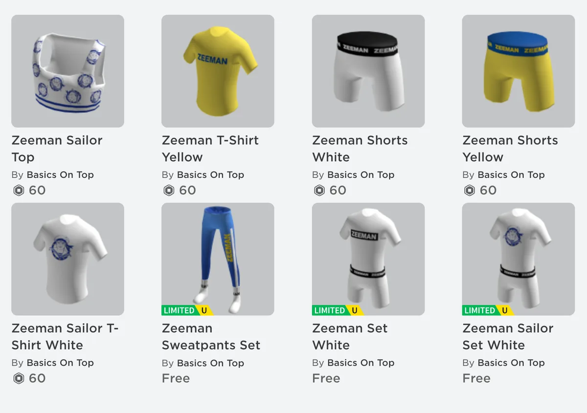

Je koopt voor 60 Robux een topje, t-shirt, onderbroek, t-shirt of broek. Dat is een stuk goedkoper dan wat je in de winkel zou betalen: voor 400 Robux betaal je op het moment 6 euro, wat betekent dat de kledingstukken omgerekend 90 cent per stuk kosten.

> [!NOTE]
> Dit artikel verscheen eerder op [Bright](https://www.bright.nl/nieuws/1183087/ja-echt-de-zeeman-verkoopt-digitale-kleding-in-roblox.html).

Volgens de winkelketen is dat het laagst mogelijke bedrag waarvoor ze iets kunnen aanbieden. Voor dat geld plak je trouwens je personage wel vol met het Zeeman-logo, dat prominent op de kledingstukken staat. Voor wie niks wil uitgeven zijn er ook twee tijdelijk beschikbare shirts gratis te claimen.

## Winkel met DJ en dansvloer

De kleding kan worden gekocht in een virtueel bestaande winkel, waar de speler wordt begroet door 'Sailor Stan' die je helpt. De winkel is een stuk hipper dan je gemiddelde Zeeman, met ook een DJ en dansvloer.

Zeeman is misschien niet het meest hippe kledingmerk, maar de winkelier hoopt dat spelers hun digitale kleding aantrekken om een statement te maken: door deze te dragen, laat je namelijk zien dat je niet voor dure merkkleding kiest. "Zo hoopt Zeeman een trend in de [metaverse](https://www.bright.nl/onderwerpen/metaverse) te lanceren", leest een persbericht. "En een nieuw geluid te laten horen."

Lees meer de [metaverse](https://www.bright.nl/onderwerpen/metaverse) en abonneer op onze [nieuwsbrief](https://www.bright.nl/nieuws/1175658/abonneer-je-gratis-op-de-bright-nieuwsbrief.html).
