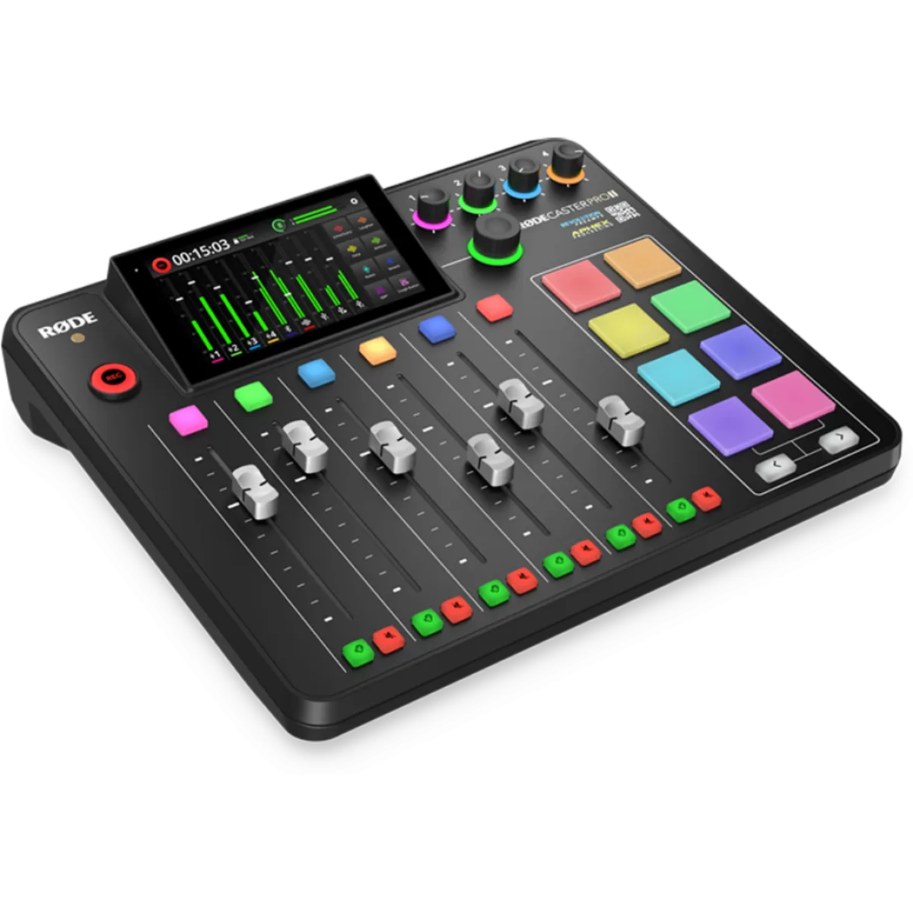

De afgelopen jaren sprongen nieuwe, Nederlandse podcasts als paddenstoelen uit de grond. Wil je er ook één beginnen? We zetten vijf tips op een rij die je op gang helpen.

> [!NOTE]
> Dit artikel verscheen eerder op [AD](https://www.ad.nl/tech/je-eigen-podcast-starten-deze-vijf-tips-helpen-je-op-weg~ac0a5602/).

Steeds meer Nederlanders zijn de afgelopen jaren een podcast gestart, maar het idee is eigenlijk al heel oud: begin 21e eeuw werden de eerste podcasts al opgenomen en online gezet, die toen nog op MP3-spelers werden gezet om te beluisteren.

In Nederland werden podcasts populair gemaakt door Adam Curry, terwijl het medium in Engelstalige gebieden ook flink groeide. De true crime-podcast Serial was in 2014 een wereldhit waarna podcasts vaker als mainstream werden gezien.

Inmiddels zijn podcasts steeds meer gemeengoed, met veel shows die door BN’ers worden gemaakt. Nederland heeft een jaarlijkse prijsuitreiking voor populaire podcasts en podcastuitgever Dag en Nacht Media werd overgenomen door het Zweedse Podimo.

**Tip 1: start voordat je de perfecte apparatuur hebt
**Het kan intimiderend zijn om je eerste podcast te starten: die oude oordopjes van je telefoon klinken lang niet zo goed als een studiomicrofoon, en bestaande podcasts worden vaak opgenomen in dure studio’s voor gespecialiseerde apparatuur.

Het is daarom verleidelijk om te wachten met opnemen tot je de juiste apparatuur in huis hebt. Je wil immers dat je luisteraars meteen een perfect klinkende aflevering hebben. Dat is echter onverstandig: het kan weken duren tot je alles precies hebt zoals je precies wil, en als achteraf blijkt dat je podcasten toch niet leuk vindt heb je honderden euro’s verspild.

Negeer daarom dat onderbuikgevoel en begin gewoon met wat je in huis hebt. Want hoewel de microfoon van je telefoon wellicht niet fenomenaal klinkt, is het geluid hiervan best aardig als je opneemt in een goede ruimte. Ga eens in een kledingkast of tussen de hangwas zitten en luister naar hoe je microfoon dan klinkt. Al dat textiel helpt om echo's weg te nemen, wat dit goed geïmproviseerde studio’s maakt.

**Tip 2: Haal de juiste soort microfoon
**Bij je zoektocht naar een nieuwe microfoon zullen de termen je al snel om de oren vliegen: de één adviseert een PodMic van Rode, de ander een dure Shure SM7B en weer een ander denkt dat je met Blue-microfoons het beste af bent. Welke microfoon het beste voor jou werkt is vaak een persoonlijke kwestie, maar het is belangrijk om het verschil tussen een dynamische microfoon en een condensatormicrofoon te weten.

In de regel zijn condensatormicrofoons gevoeliger, waardoor ze in theorie beter geluid kunnen produceren. Maar die gevoeligheid zorgt er ook voor dat je een goede studiosetting nodig hebt om helder, echoloos geluid op te nemen. Wil je gewoon in je eetkamer of kantoortje opnemen? Dan kan een dynamische microfoon beter voor je zijn.

**Tip 3: opnemen met meerdere gasten? Kijk naar een XLR-microfoon
**Een usb-microfoon is lekker makkelijk: je zet hem neer of hangt hem op, waarna je hem rechtstreeks in je computer prikt. Als je alleen een podcast opneemt is dat een ideale oplossing zonder dat de kosten hoog oplopen.

Maar als je lokaal met anderen wil opnemen zijn usb-microfoons minder handig. Ze verschijnen als individuele apparaten op je computer en het is een gedoe om die allemaal soepel binnen te laten komen in montagesoftware.

Wie meerdere microfoons gebruikt, kan daarom ook kiezen voor XLR-microfoons. Deze hebben ouderwetse audiopoorten, die je vervolgens in een extra apparaten genaamd een audio-interface kunt prikken. En die interface sluit je dan weer met usb aan op je computer.

Het wordt hierdoor wel wat duurder: een goede XLR-interface kan al snel 100 euro kosten. Maar XLR-microfoons zijn soms weer goedkoper dan usb-varianten, omdat ze geen ingebouwde voorversterkers nodig hebben.

**Tip 4: neem een podcastcomputer als je het serieus wil aanpakken
**Microfoons, audio-interfaces en een verbonden laptop zorgen al snel voor een wirwar aan kabels. Wie bereid is wat dieper in de buidel te tasten kan daarom ook een losse podcastcomputer kopen, waar je XLR-microfoons rechtstreeks op aansluit en gelijk mee kunt opnemen.

Wij hebben afgelopen periode bijvoorbeeld veel de Rodecaster Pro 2 gebruikt. Deze heeft achterop plek voor vier microfoons, maar kan ook via usb-poorten met twee computers verbinden waarvan geluid kan worden opgenomen. Nog leuker: als je een telefoon met bluetooth koppelt, kun je bellers in de uitzending betrekken en ook hun audio opnemen.

Rodecaster Pro 2. © Rode

De Rodecaster heeft flink wat ingebouwde functies die vanaf het ingebouwde touchscreen te bedienen zijn. Zo kun je het geluid ter plekke aanpassen zodat je dat niet meer tijdens het nabewerken hoeft te doen. Veel van de knoppen zijn rubberachtig waardoor ze geen klikgeluid maken - zodat ook niemand in de opname hoort wanneer je bijvoorbeeld het geluid van een ander op ‘mute’ zet.

Audio wordt ook op meerdere kanalen bewaard, zodat je tijdens nabewerken iedereens geluid individueel kunt monteren. Het maakt op locatie met meerdere mensen podcasten een stuk makkelijker, al moet je daar wel flink voor in de buidel tasten: de Rodecaster Pro 2 gaat op het moment voor 740 euro over de toonbank. De vorige versie is ook nog te koop voor tegen de 530 euro. Dat maakt het vooral een apparaat om te kopen wanneer je zeker weet je podcastavontuur lange tijd vol te houden.

**Tip 5: betalen voor hosting hoeft niet
**Het online zetten van je podcast was vroeger een duur gedoe: de gebruikte opslag en bandbreedte van die audiobestanden kon immers fors oplopen, al helemaal als je podcast populair bleek te zijn. Sindsdien zijn er veel bedrijven opgedoken, gespecialiseerd in het hosten van je podcast.

Veel van die diensten kosten je al snel een tientje per maand, maar er is een handjevol gratis diensten die ook prima zijn. Zelf zijn we bijvoorbeeld fan van Anchor, een dienst van Spotify waar je afleveringen bij kunt uploaden om ze automatisch bij alle podcastdiensten te laten verschijnen. Anchors verdienmodel zit in advertenties: je kunt aan het begin van je aflevering reclame van hun partners afspelen, waar zowel zij als jij dan geld aan verdienen. Maar je kunt die advertentie ook uitschakelen. Ook dan blijft Anchor gewoon gratis.

Wie liever betaalt, heeft aan het Nederlandse Springcast ook een goede. Zij zijn met 8 euro per maand relatief goedkoop, en voor dat geld krijg je onbeperkte opslag.
