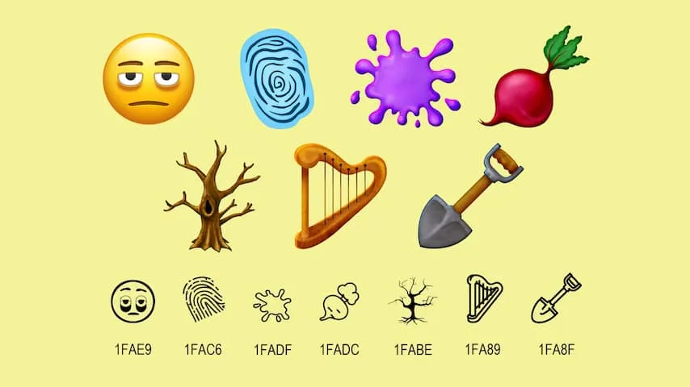

Acht nieuwe emoji's worden aan je smartphone toegevoegd: een smiley met wallen onder de ogen, een verfspetter, vingerafdruk, biet, bladloze boom, harp en een schep. Tot slot staat er een nieuwe vlag in de bestaande vlaggenlijst van het emojitoetsenbord voor het Kanaaleiland Sark, dat voor de Franse kust van Normandië ligt.

> [!NOTE]
> Dit artikel verscheen eerder op [NU.nl](https://www.nu.nl/slimmer-leven/6330712/je-smartphone-krijgt-nieuwe-emojis-hier-komen-ze-vandaan.html).

_Je smartphone krijgt nieuwe emoji's, hier komen ze vandaan — Beeld: Unicode Consortium_

De nieuwe emoji's zijn onderdeel van 'Emoji Version 16.0', een pakket dat vanaf september beschikbaar is voor softwaremakers. Zij kunnen de smileys vanaf september dit jaar in hun telefoonsoftware opnemen.

Wanneer jij ze op je smartphone kunt gebruiken, hangt af van Apple en Google. Zij zullen immers updates moeten uitbrengen voor iOS en Android waar de emoji's in verwerkt zijn. Bij iPhones gebeurt dat mogelijk al in oktober: volgens de techreus staat de volgende iOS 18.1 voor deze maand gepland.

Bij Android is het lastiger een datum aan de nieuwe smileys te plakken: los van dat er geen concrete datum voor de volgende Android-update is, ben je hierbij ook afhankelijk van wanneer de fabrikant van jouw toestel de update beschikbaar stelt.

Het ontwerp van de plaatjes zal mogelijk ook anders op jouw toestel staan. Bovenstaande afbeelding is de interpretatie van het Unicode Consortium, waarna Google en Apple hun eigen ontwerpen hier op baseren.

## Speciale emojiraad kiest de smileys

Het Unicode Consortium is de non-profit-organisatie die de tekenset van computertoetsenborden bepaalt. Medewerkers van bijna alle grote techbedrijven helpen hieraan mee. Als blijkt dat een bepaald teken op het toetsenbord ontbreekt, dan beslist deze partij of deze in een latere software-update toegevoegd moet worden.

Deze non-profit heeft ook een eigen emojiraad die ieder jaar bepaalt of er nieuwe smileys aan het toetsenbord toegevoegd moeten worden. Dat gebeurt verreweg het meeste: met de toevoeging van deze acht staat de teller op 3.800 emoji's op je smartphone.
