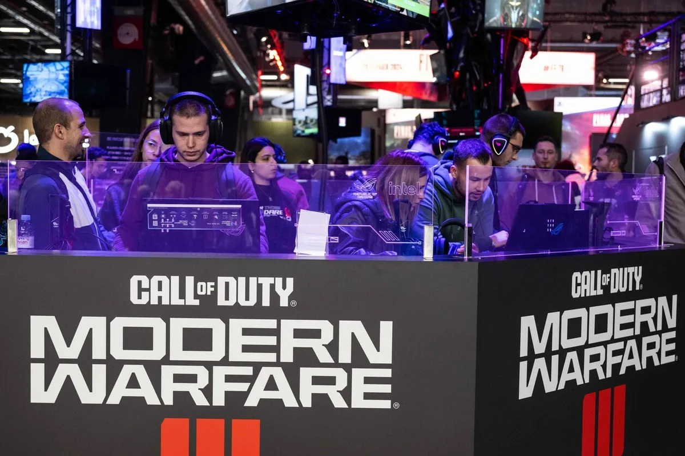

Na eerder al talrijke ontslagen in het buitenland staat inmiddels ook de Nederlandse game-industrie onder druk. Zelfs één van de belangrijkste brancheorganisaties moet sluiten. ,,We raken nu in Nederland heel veel kwijt.”

> [!NOTE]
> Dit artikel verscheen eerder op [AD](https://www.ad.nl/tech/kaalslag-in-de-game-industrie-raakt-nu-ook-nederland-we-verliezen-het-kloppende-hart~ac14449a/).

De Dutch Game Garden is bij de gemiddelde Nederlander niet bekend, maar was jarenlang de motor van de game-industrie. Maar liefst 150 gamebedrijven huurden er een kantoor, de grootste gamemakers verzamelden zich op de conferenties en evenementen van de organisatie. Nu moeten de deuren alsnog sluiten. Komende maanden wordt het bedrijf afgebouwd, tot in januari 2025 de deuren definitief dichtgaan.

,,Deze beslissing is genomen als gevolg van een gewijzigd subsidielandschap, waardoor het niet langer mogelijk is om een sluitende begroting te realiseren”, leest de aankondiging. De provincie Utrecht zou niet langer bereid zijn om net als in vorige jaren in de Dutch Game Garden te investeren, waardoor er onvoldoende geld is om het initiatief voort te zetten.

,,We verliezen het kloppende hart van de Nederlandse game-industrie”, stelt Rami Ismail, die namens brancheorganisatie Dutch Games Association met de overheid onderhandelt. ,,De Game Garden had invloed op ieder Nederlands succesverhaal. Overheden in landen om ons heen waren jaloers dat wij zoiets hadden.”

## Duizenden ontslagen wereldwijd

Het is het zoveelste gamebedrijf dat in korte tijd zijn deuren moet sluiten. Internationaal hebben alleen al in 2024 meer dan 11.000 mensen hun baan verloren bij een gamebedrijf, waaronder een recordaantal van 1900 ontslagen bij Microsofts Call of Duty-studio Activision Blizzard. Die ontslagteller blijft oplopen: er zijn nu al meer mensen bij gamebedrijven in 2024 ontslagen dan in heel 2023 bij elkaar, een jaar waarin ook al een stijging was gezien.

Deze trend werd in Nederland afgelopen jaar ook steeds meer voelbaar. Het Nederlandse Paladin Studios dat eerder met Nintendo samenwerkte, sloot dit voorjaar zijn deuren, net als het internationaal geprezen Ronimo Games dat deed in 2023. Bij een ontslagronde zette Nederlands grootste gamestudio Guerrilla [tien procent van het personeel](https://www.ad.nl/games/ontslagronde-bij-nederlandse-gamemaker-guerrilla-tientallen-medewerkers-op-straat~a492e6fb/) op straat. KeokeN Games ontsloeg noodgedwongen al zijn personeel.

© Getty Images

Het zijn niet alleen studio’s die hard zijn getroffen: eerder deze week kondigde Game Mania, de grootste gamewinkelketen van Nederland, zijn faillissement aan. Op zijn piek had het bedrijf tientallen winkels verspreid door Nederland, vlak voor de sluiting waren dat er achttien. De verkoop van games in fysieke winkels levert te weinig op.

Advocaat René Otto hielp afgelopen jaar veel bij ontslagrondes van gamebedrijven. ,,Dat zijn trajecten die alleen verliezers kennen.” Ook hij is van slag over het verdwijnen van de Dutch Game Garden: ,,Het is spijtig dat de overheid te weinig heeft gezien wat voor belangrijke functie ze hadden. Het was het clubhuis van de Nederlandse game-industrie.”

## Wachten op betere tijden

Het is afwachten wanneer de sector weer aantrekt. Veel bedrijven lijden nog onder de gevolgen van de coronacrisis. Toen werd er bovengemiddeld veel gegamed, waardoor meer omzet werd gedraaid en investeerders meer in computerspellen gingen investeren. Die cijfers konden na de pandemie niet worden geëvenaard, waardoor investeringsgeld weer werd weggetrokken en bedrijven mensen moesten ontslaan.

Ismail ziet de eerste tekenen dat het weer beter begint te worden. ,,We zien meer investeringen opduiken en het optimisme in de game-industrie neemt weer toe. Dat maakt het nieuws van de Game Garden nog droeviger: als ze nog twee jaar hadden overleefd en er een gefocuster overheidsbeleid en meer investeringen waren, dan hadden ze zich wellicht staande gehouden.”

© AFP

Nederlandse ministeries zijn volgens Ismail inmiddels meer bereid om over mogelijke gamesubsidies voor bedrijven te praten. ,,We lopen wel nog achter op de landen om ons heen, waar gameontwikkelaars beter worden ondersteund. Maar het Ministerie van Onderwijs, Cultuur en Wetenschap begint echt de waarde van ons in te zien.’’

Otto ziet ook dat het in Nederland her en der weer goed gaat: ,,Het Amsterdamse gamebedrijf VaultN haalde recent 1,6 miljoen euro aan investeringsgeld op, terwijl het Groningse Square Glade Games 200.000 euro op crowdfundsite Kickstarter inzamelde.”

## Grand Theft Auto 6

Internationaal wordt reikhalzend uitgekeken naar 2025: dat is het jaar waarin Nintendo een nieuwe spelcomputer uitbrengt die de verkoopcijfers vermoedelijk zal stuwen. Bij een nieuwe spelcomputer wordt een grote groep mensen verleid weer naar de winkel te gaan en iets nieuws te kopen.

Bovendien zal later in het jaar het nieuwe Grand Theft Auto 6 verschijnen. Het vorige deel ging maar liefst 200 miljoen keer over de toonbank, met een omzet van 8,5 miljard dollar. Alleen al die game is van gigantische impact op de internationale industrie - wat er mogelijk voor zorgt dat investeerders weer durven geld in gamemakers te steken.
