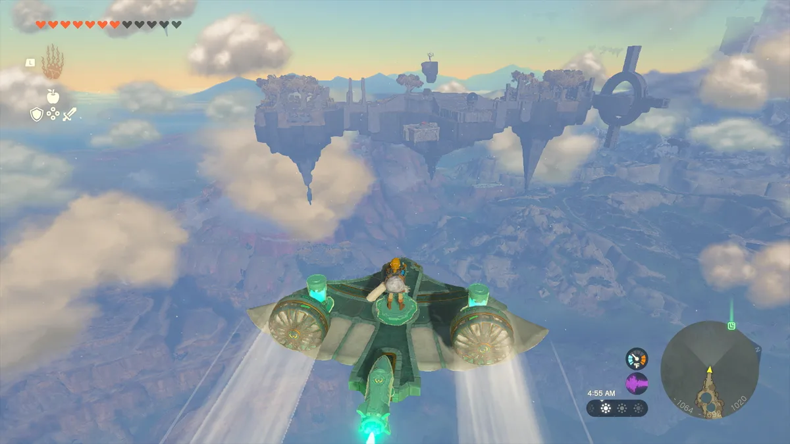

**Bright Preview**

## Luister ook onze podcast:

[Bekijk ingesloten media](https://embed.podcasts.apple.com/nl/podcast/nieuwe-zelda-als-eerste-gespeeld-en-de-asus-spelcomputer/id1451965752?i=1000610750222)

Weinig games zijn zo in mysterie gehuld als Tears of the Kingdom. Sinds het spel in 2019 werd onthuld, heeft Nintendo spaarzaam details naar buiten gebracht. Zo zagen we in trailers dat je reist tussen eilanden die in de lucht vliegen en dat je objecten aan elkaar kunt plakken om bijvoorbeeld voertuigen te maken. Maar hoe het verhaal van de game in elkaar steekt en wat je ditmaal moet doen? Daar heeft Nintendo nog geen woord van verklapt.

> [!NOTE]
> Dit artikel verscheen eerder op [Bright](https://www.bright.nl/nieuws/1134204/legend-zelda-tears-kingdom-preview-nintendo-game.html).

Dat maakte de middag dat we bij Nintendo de game konden spelen bijzonder. Het gaf gelegenheid om voor het eerst te ruiken aan een spel dat tot nu toe slechts een paar korte trailers heeft gehad, om een idee te krijgen wat nu eigenlijk de bedoeling is. Al was ook dat een vrij beperkte indruk: Nintendo had een duidelijk gebied afgebakend om binnen de game te verkennen, en vroeg ons beleefd weer om te draaien als we daar van probeerden af te wijken.

Visueel ziet de game er overigens prima uit. Het is duidelijk dat de zes jaar oude Nintendo Switch wat achterloopt qua grafische prestaties, bijvoorbeeld door de kartelrandjes die je tijdens het spelen ziet. Maar een soepele framerate en mooie belichting zorgen ervoor dat het een mooie game is om naar te kijken.

## Zwevende eilanden

Tijdens het spelen stonden de zwevende landmassa's centraal. We begonnen op een groot eiland, gevuld met grotten, monsters en verstopte schatkisten. In de buurt vlogen andere rotsformaties die we ook konden verkennen. Daarmee werd meteen de grote uitdaging van de game duidelijk: hoe reis je van luchteiland naar luchteiland?

Het zou makkelijk zijn geweest om Link een soort draagbare vliegmachine te geven, maar Tears of the Kingdom vertrouwt in plaats daarvan op de creativiteit van spelers. Je kunt wat planken, een ballon en een vuurspuwer aan elkaar bevestigen om een luchtballon te maken, of raketten aan twee vleugels bevestigen voor een vliegtuigje.

## Creatief nadenken

Dat bouwsysteem dwingt je om steeds weer nieuwe manieren te bedenken om tussen de luchteilanden te reizen. Soms is de oplossing overduidelijk - zie je een half bouwpakket voor een vliegtuig, dan snap je wel wat Nintendo van je verwacht. Maar op andere momenten zijn er geen voor de hand liggende materialen en moet je iets creatiefs verzinnen. En die minder voor de hand liggende alternatieven werken vaak ook nog, want alles in de wereld volgt dezelfde consequente natuurwetten.

Waarschijnlijk is dat bouwen ook waarom Nintendo luchteilanden in de game wilde hebben, want het zorgt dat alles logisch op zijn plaats valt. Zou Tears of the Kingdom op het land afspelen, dan zou het bouwen van creatieve machines weinig hebben toegevoegd. Je had dan wel een vliegtuig of auto kunnen knutselen, maar eigenlijk bereik je daarmee dezelfde plekken waar je ook wandelend komt. Nu alles in de lucht hangt, dwingt de game je om steeds nieuwe ideeën te verzinnen om verder te komen.

[Bekijk ingesloten media](https://www.youtube.com/embed/uHGShqcAHlQ?autoplay=1&modestbranding=1)

## Veel te verkennen

Daar komt bij dat die vliegende eilanden ook leuk zijn om te verkennen. Op ieder eiland is altijd wel wat te vinden of te doen - of het nu gaat om een sterke vijand of een puzzel. De luchtwereld heeft meer focus dan die op het land, waar je soms kan ronddwalen zonder dat je iets bijzonders tegen het lijf loopt. Die focus maakt het voor Nintendo ook makkelijker om puzzels op natuurlijke wijze in de wereld te verstoppen.

Ook boeiend is de mogelijkheid om objecten te fuseren met je wapen of schild. Je kunt een steen aan een stok plakken om er een hamer van te maken, of een scherpe punt aan een roestig zwaard zodat deze sterker wordt. Soms zijn ook onverwachte combinaties mogelijk. Zie je een mijnkar liggen? Dan kun je die aan je schild plakken en daar vervolgens op 'rijden', zodat je een soort skateboard hebt.

## Eén grote zandbak

Breath of the Wild was al een soort creatieve zandbak, maar Tears of the Kingdom is dat door de nieuwe systemen nóg meer. Voor iedere puzzel die je tegenkomt zijn vaak wel twee of drie oplossingen te verzinnen. Je kunt de game spelen zoals Nintendo bedoeld heeft, maar tegelijkertijd word je aangemoedigd om buiten de lijntjes te kleuren. Dat weet de game te doen zonder dat je op een gekke plek vast komt te zitten. Het is een balans in gamedesign die weinig spellen weten te evenaren. Die zandbak zit ook vol geheimpjes en dingen om te doen. Je vindt steeds weer nieuwe schatten waarbij je afvraagt wat je er mee kunt doen, waardoor je perspectief van de wereld blijft veranderen.

We gingen bij onze demo naar huis met meer vragen dan antwoorden. Want ja: we weten nu hoe Tears of the Kingdom speelt en wat er van ons wordt verwacht op die zwevende eilanden. Maar wat waren die gekke vijanden die we tegenkwamen? Waar kwamen de ruïnes vandaan die we aantroffen? En wat kunnen we met dat ene gekke voorwerp?

Dit soort vragen bleven achteraf rondspoken - en het zijn precies dat soort mysteries die Breath of the Wild ook zo geweldig maakte.
