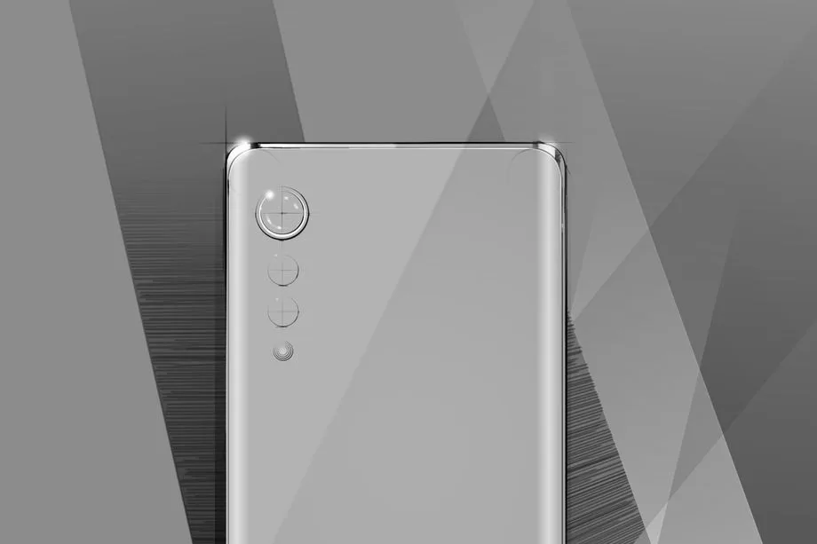
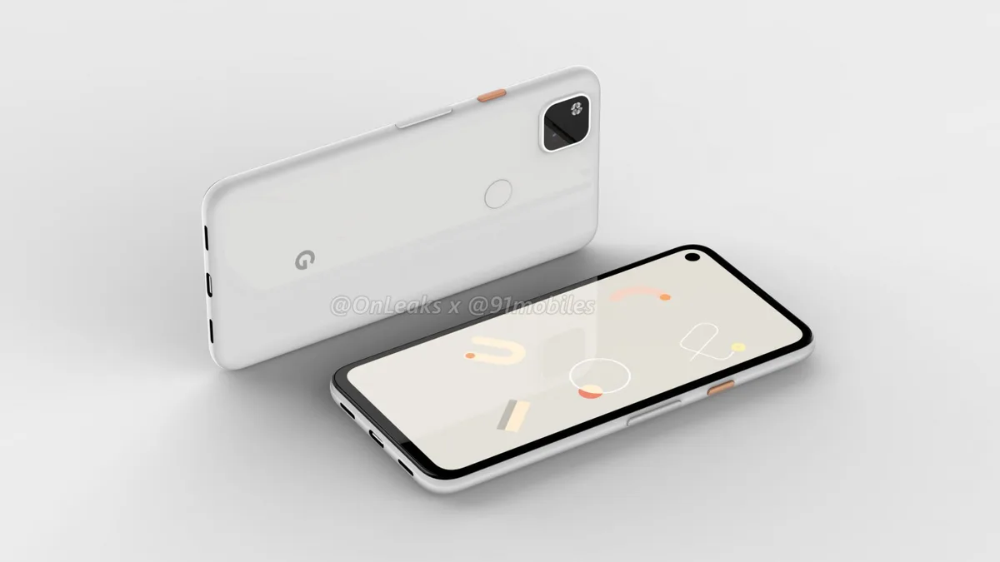

**Smartphonelente**

> [!NOTE]
> Dit artikel verscheen eerder op [Bright](https://www.bright.nl/nieuws/1126095/lg-google-en-motorola-op-het-punt-van-onthullen-nieuwe-smartphones.html).

Motorola heeft zich de afgelopen jaren gericht op het middensegment, terwijl concurrenten zoals Apple en Samsung duurdere telefoons op de markt brachten.

Nu wil het bedrijf met die partijen gaan concurreren: volgens geruchten heeft de nieuwe Motorola Edge+ randloos 6,7 inch-scherm, een Snapdragon 865-chip en tot 12GB aan RAM. Tegelijkertijd zou Motorola ook een goedkopere Edge-telefoon met Snapdragon 765-chip en 6GB werkgeheugen willen presenteren.

Beide telefoons zijn nog niet aangekondigd, maar [op 22 april](https://twitter.com/Moto/status/1249698882130493446) wordt een "nieuw vlaggenschip" door het bedrijf onthuld tijdens een online presentatie. Dan zal ook duidelijk worden wat de Edge-toestellen gaan kosten: prijzen zijn nog niet naar buiten gelekt.

## LG Velvet

Ondertussen heeft LG [de naam](http://www.lgnewsroom.com/2020/04/lg-embarks-on-new-product-roadmap-with-lg-velvet/) van zijn nieuwe smartphone onthuld - de Velvet. Daarmee stapt het bedrijf af van de traditionele naamgeving met simpele letters en cijfers. Het is volgens LG ook de eerste smartphone die een nieuwe, elegante designtaal van het bedrijf gebruikt. "De naam 'Velvet' moet gebruikers laten denken aan glanzende gladheid en een hoogwaardig, zacht gevoel", aldus een persbericht.

De camera's op de Velvet zijn anders gepositioneerd dan bij veel huidige telefoons. LG kiest niet voor een camerahobbel met meerdere lenzen, maar heeft de camera's gespreid. De fabrikant beschrijft dit als zijn regendruppelontwerp.

Het is nog niet bekend wanneer de Velvet onthuld zal worden, maar volgens recente geruchten staat er voor 15 mei een presentatie gepland.

## Google Pixel 4a

Google zou ook op het punt staan om zijn nieuwe Pixel 4a-telefoon te onthullen, aldus [9to5Google](https://9to5google.com/2020/04/09/exclusive-google-pixel-4a-details-specs/). De telefoon zou origineel gepland staan voor Google-ontwikkelaarsbeurs I/O, die niet doorging wegens het coronavirus.

Dit toestel moet een 5,8 inch-scherm krijgen en is de opvolger van de [Pixel 3A](https://www.bright.nl/bright-stuff/artikel/4723161/bright-stuff-google-pixel-3a) van vorig jaar. Het grotere XL-model zou inmiddels zijn geschrapt, om alle aandacht te vestigen op één toestel.

## OnePlus

Het Chinese merk OnePlus presenteerde dinsdag zijn nieuwe [OnePlus 8 en OnePlus 8 Pro](https://www.bright.nl/nieuws/artikel/5090166/oneplus-onthult-nieuwe-duurdere-oneplus-8-en-8-pro). De telefoons verschijnen volgende week voor respectievelijk 699 en 899 euro. Het Pro-model heeft voor het eerste bij OnePlus ook ondersteuning voor draadloos opladen.

[Bekijk ingesloten media](https://www.youtube.com/embed/lnRabHU-5_4?autoplay=1&modestbranding=1)

## Review: OnePlus 8 Pro

**[Volg het Bright YouTube-kanaal](https://bit.ly/brighttv) voor meer smartphone-reviews.**
