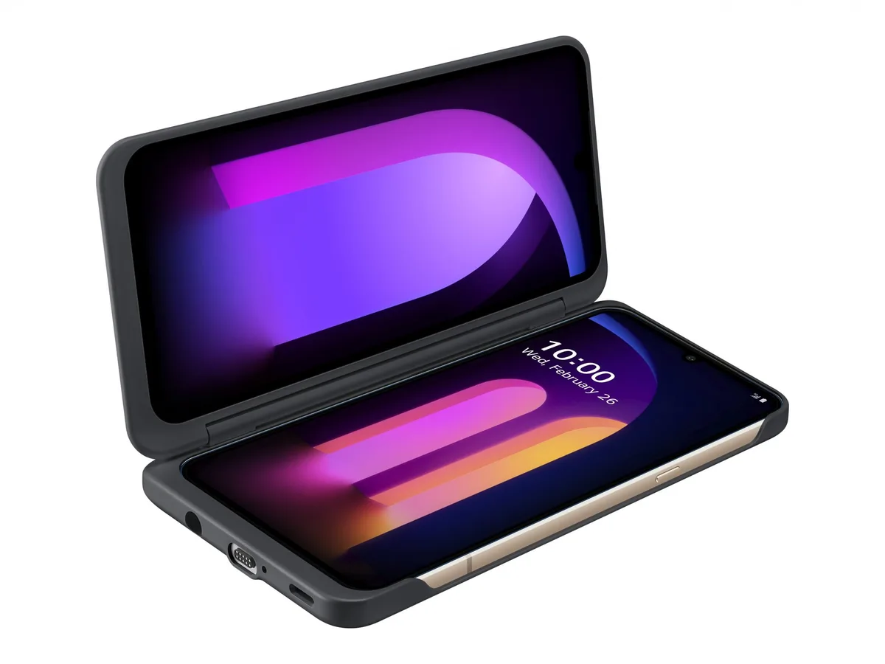

**Twee keer twee**

> [!NOTE]
> Dit artikel verscheen eerder op [Bright](https://www.bright.nl/nieuws/1125531/lg-onthult-v60-smartphone-met-twee-schermen-en-8k-camera.html).

Achterop zit een 64 megapixel-camera die volgens LG buitengewoon goede foto’s bij lage lichtomstandigheden maakt. Bovendien kan hij 8K-video’s opnemen. De 13 megapixel-camera hiernaast heeft een wide-angle-lens.

LG bracht eind vorig jaar de LG G8X uit, die net als de nieuwe V60 ook een dubbel scherm heeft. Net als bij die telefoon zit het tweede scherm hier in een soort hoesje, die je kunt loskoppelen om hem als traditionele telefoon te gebruiken.

Bij het filmen wordt ook een technologie gebruikt die LG 'Voice Bokeh' noemt. Stemgeluid bij opnames wordt van het achtergrondgeluid gescheiden, alsof er een speciale richtmicrofoon is gebruikt.

## Groter scherm, zelfde gewicht

Het scherm in de V60 is wel een slag beter. De oled-schermen bijna een halve inch groter, maar wegen ongeveer hetzelfde omdat de panelen iets dunner zijn gemaakt.

Daarnaast heeft LG ditmaal een 5G-antenne toegevoegd. Op het moment heb je daar weinig aan, maar telecomproviders beloven later dit jaar de eerste 5G-netwerken in Nederland en andere landen te introduceren. Deze bieden hogere download- en reactiesnelheden.

De LG V60 is vanaf volgende maand verkrijgbaar in de Verenigde Staten, Europa en Azië. Een verkoopprijs is nog niet bekendgemaakt, maar volgens LG-medewerkers zal de prijs tussen de 700 en 800 dollar liggen.

## Zie ook: de LG G8X

[Bekijk ingesloten media](https://www.youtube.com/embed/6pfBbt9jqoQ?autoplay=1&modestbranding=1)

**[Volg Bright op YouTube](https://bit.ly/brighttv) voor meer tech-video's**
