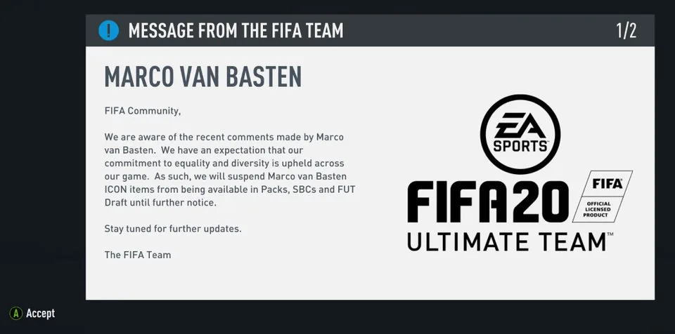

**Tot nader order**

> [!NOTE]
> Dit artikel verscheen eerder op [Bright](https://www.bright.nl/nieuws/1124594/marco-van-basten-uit-fifa-game-gehaald-na-nazigroet.html).

"We zijn ons bewust van de recente uitspraken door Marco van Basten", aldus een boodschap bij het opstarten van de game. "We hebben hem daarom tot nader order uit alle kaartenpakjes gehaald."

De nazigroet staat haaks op ontwikkelaar EA’s visie op het spel. "We willen graag dat de game zo gelijk en divers mogelijk blijft."

Van Basten was als een zogenoemd icoon in [FIFA 20](https://www.bright.nl/tags/onderwerpen/tech/games/fifa-game) beschikbaar. Je kon hem ontgrendelen door virtuele kaarten te kopen, in de hoop dat hij er tussen zat.

## 'Sieg Heil'

De oud-voetballer en voormalig bondscoach riep aan het einde van een interview tussen Hans Kraay jr. en de Duitse trainer Frank Wormuth de woorden 'Sieg Heil'.

Hoewel hij niet in beeld was, was de uitspraak wel bij FOX Sports op tv te horen. Deze woorden werden als nazigroet gebruikt tijdens de Tweede Wereldoorlog.

## Excuses

Achteraf bood Van Basten zijn excuses aan voor het voorval. "Het was niet de bedoeling om mensen te shockeren, dus excuses hiervoor."

De uitspraak had nog meer gevolgen voor de voormalige voetballer. Zo besloot FOX Sports om hem een week lang te schorsen als analist. Hij is pas vanaf 7 december weer te zien in het voetbalprogramma De Eretribune.
