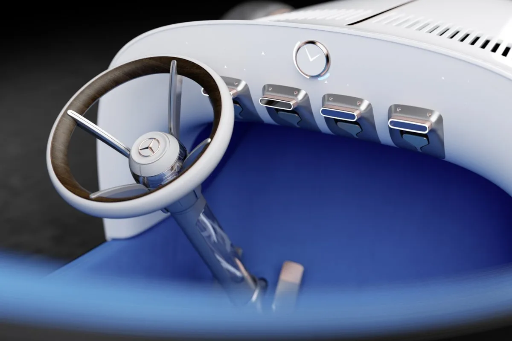
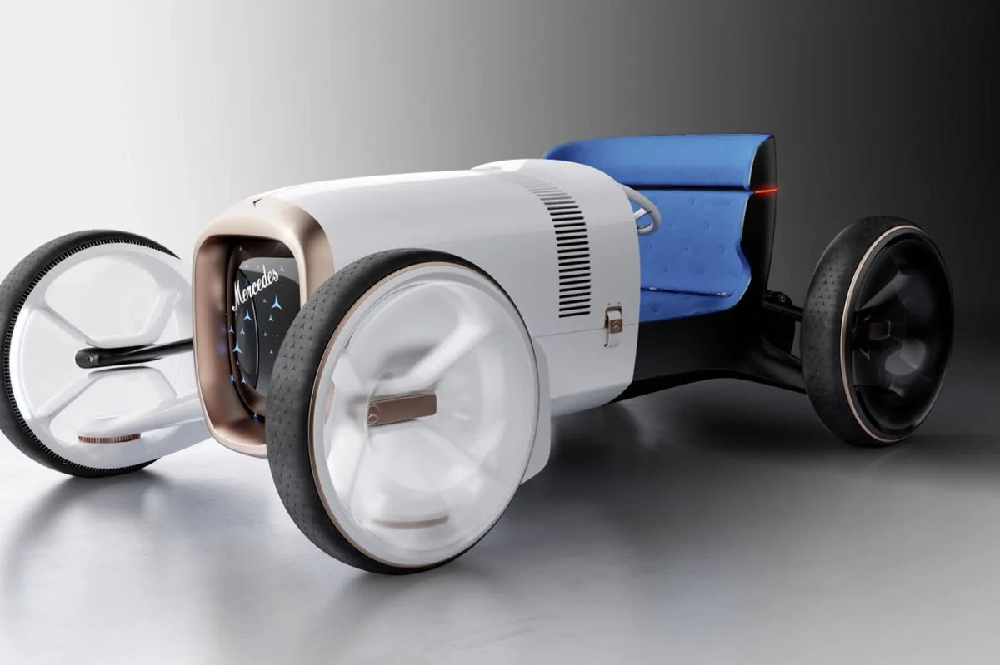

**Nieuw jasje**

> [!NOTE]
> Dit artikel verscheen eerder op [Bright](https://www.bright.nl/nieuws/1123754/mercedes-benz-toont-elektrisch-concept-van-eerste-moderne-auto.html).

De Vision Mercedes Simplex is een conceptwagen die de fabrikant toonde op de [Frankfurt Motor Show](https://www.bright.nl/nieuws/artikel/4844191/autos-frankfurt-autoshow-autobeurs-iaa-audi-rs7-sportback-elektrische-mini). Het is in feite een moderne versie van de Mercedes 35 PS - de eerste Mercedes-auto en de grondlegger van hoe auto’s er uit moesten zien.

In het concept is de benzinemotor vervangen met een elektrische variant. De cockpit van het voertuig is zo simpel en minimalistisch mogelijk gemaakt, met naast het stuur slechts vier kleine displays om essentiële informatie zoals snelheid en toerenaantal op te tonen.

Het algehele ontwerp is ook gewijzigd om aan moderne verwachtingen te voldoen. De auto is wit en zilver, met op een paar specifieke plekken een roségouden afwerking.

De auto zal trouwens nooit echt worden verkocht: het ontwerp werd gemaakt om de opening van een nieuwe designstudio van Mercedes-Benz te vieren.

## Review: elektrische Mercedes EQC

[Bekijk ingesloten media](https://www.youtube.com/embed/VTGbArz7xxA?autoplay=1&modestbranding=1)
