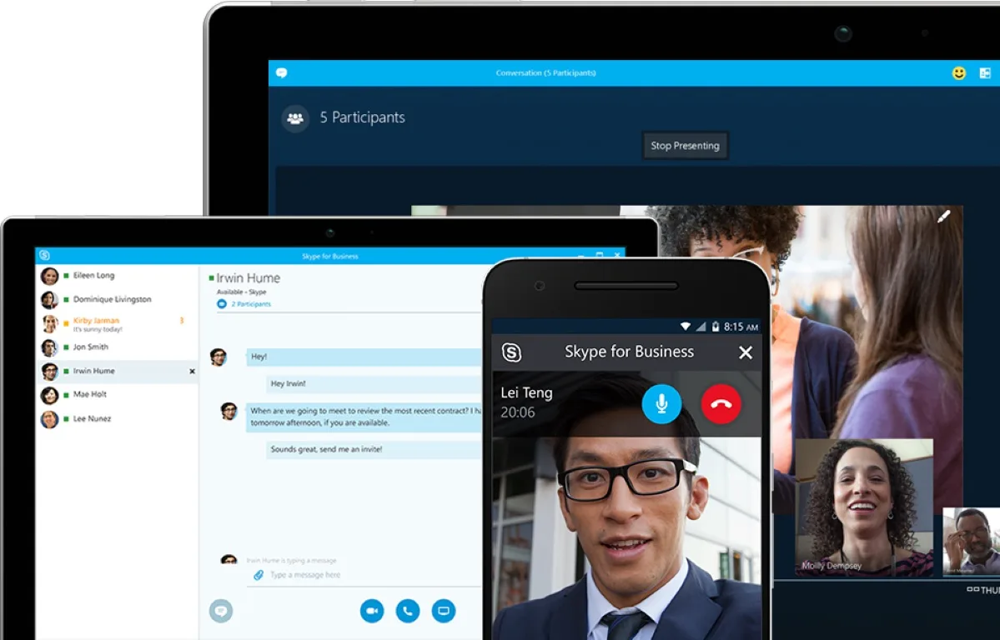

## Do's en dont's van videobellen

[Bekijk ingesloten media](https://www.youtube.com/embed/umb7BJLkhZc?autoplay=1&modestbranding=1)

> [!NOTE]
> Dit artikel verscheen eerder op [Bright](https://www.bright.nl/nieuws/1125801/met-deze-apps-videobel-je-het-handigst-tijdens-het-thuiswerken.html).

We vermelden met hoeveel mensen je tegelijkertijd kunt bellen, maar ook welke apparaten allemaal worden ondersteund. Je hebt immers niks aan een videobel-app als veel van je collega's hem niet kunnen installeren.

## Google Hangouts

Google biedt met Hangouts de mogelijkheid om met meerdere mensen tegelijk te videobellen. In de consumentenversie van die app kun je slechts met 10 man tegelijkertijd bellen, wat alsnog genoeg is voor de meeste kleine vergaderingen.

Gebruikt je bedrijf GSuite voor online diensten, dan heb je ook toegang tot de zakelijke videobel-app [Hangouts Meet](https://www.bright.nl/nieuws/artikel/5043606/thuiswerken-thuiswerk-software-videobellen-google-microsoft-teams-gratis). Tijdens het coronavirus is de uitgebreide variant hiervan gratis voor alle GSuite-gebruikers, om thuiswerken te vergemakkelijken. Met die versie kun je fikse vergaderingen houden, met maar liefst 250 mensen tegelijk.

Beide varianten van Hangouts zijn op nagenoeg ieder platform te gebruiken. Op iOS en Android zijn speciale apps te installeren voor videovergaderingen. Zit je op een computer? Dan heb je alleen een webbrowser, microfoon en webcam nodig.

## Skype

Skype is alom misschien wel de bekendste videobel-app, die anno 2020 nog steeds indrukwekkende groepsgesprekken aan kan: in één online vergadering is plek voor 50 mensen tegelijkertijd. Daarnaast is het mogelijk om een speciale vertaalfunctie te activeren waarbij anderstalige collega's alsnog Nederlands lijken te spreken, al werkt dit alleen in één-op-één-gesprekken.

Skype is gratis te downloaden en werkt ook op de meeste platformen. Voor iOS en Android zijn apps beschikbaar, net als op Windows en macOS. Er zijn zelfs apps voor de Xbox-spelcomputers en de slimme Echo-schermen van Amazon.

## Microsoft Teams

[Microsoft Teams](https://www.bright.nl/nieuws/artikel/5057886/microsoft-teams-heeft-last-van-storing-voor-thuiswerkers), de zakelijke chatapp van Microsoft, heeft ook een videobelfunctie, met ondersteuning voor online vergaderingen met maximaal 250 mensen. Dan moet je bedrijf alleen wel al voor Teams betalen, wat €4,20 per gebruiker per maand kost. Er is een gratis versie, maar die biedt alleen één-op-één-gesprekken via video.

Microsoft Teams is er wel voor nagenoeg ieder platform: er zijn apps voor Windows, macOS, Android en iOS.

## Zoom

Het Amerikaanse [Zoom](https://zoom.us/) heeft een gratis optie waarbij je maar liefst 100 man tegelijk in een online vergadering kunt hebben, maar dan wordt het videogesprek wel na veertig minuten afgekapt. Desalniettemin is het de gratis app met een van de grootste gebruikersgroepen in een videochat.

Wil je zonder tijdsdruk vergaderen, dan betaal je 14 euro per maand - dan kun je maximaal 24 uur achter elkaar in een videovergadering blijven zitten. Je krijgt dan ook een paar extra's zoals de mogelijkheid om vergaderingen op te nemen.

Zoom heeft net als zijn concurrenten opties voor bijna ieder platform. Op smartphones download je de apps voor iOS of Android, en op desktopcomputers bezoek je een site of gebruik je plugins in Outlook of je webbrowser.

## FaceTime

Apples eigen videobelapp FaceTime ondersteunt inmiddels ook groepsgesprekken, waar in totaal 32 mensen aan kunnen deelnemen. Dat kan ook zonder bijkomende abonnementen of andere kosten.

Maar dan moeten al je collega's wel een Apple-product hebben: FaceTime beperkt zich tot iOS en macOS, waardoor het alleen werkt op iPhones, iPads, iPods en Macs.

## WhatsApp

Grote kans dat je WhatsApp al op je telefoon hebt staan, en die app kun je ook voor videovergaderingen gebruiken. Maar het is tegelijkertijd wel de slechtste optie in deze lijst. Zo ben je beperkt tot gesprekken van hooguit vier man tegelijkertijd.

Daarnaast kun je alleen videobellen in de mobiele apps, niet in de bijbehorende desktop-app. Je bent dus genoodzaakt naar je telefoon te kijken, wat multitasken op bijvoorbeeld een laptop buitengewoon lastig maakt.

Daar staat tegenover dat al je collega's waarschijnlijk al WhatsApp hebben geïnstalleerd.
