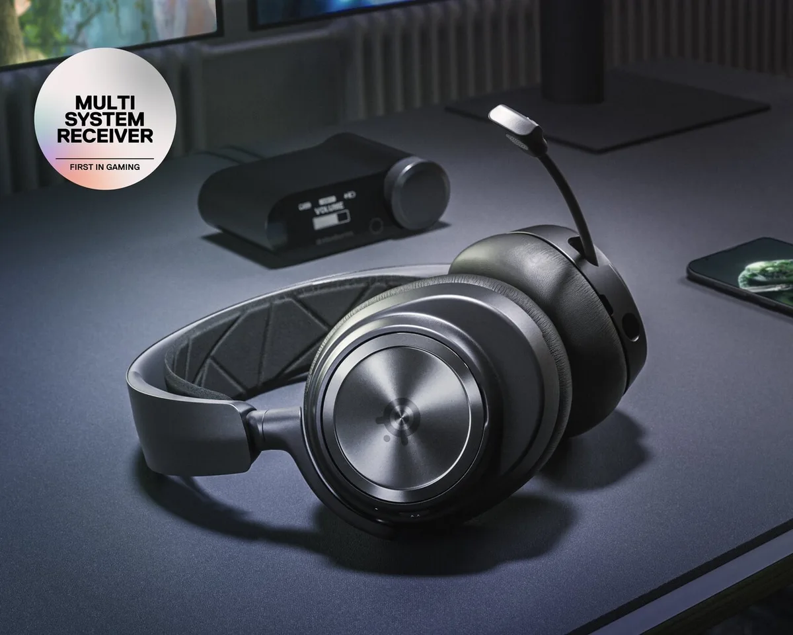
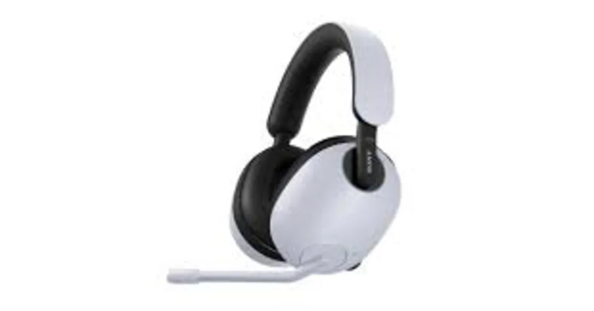
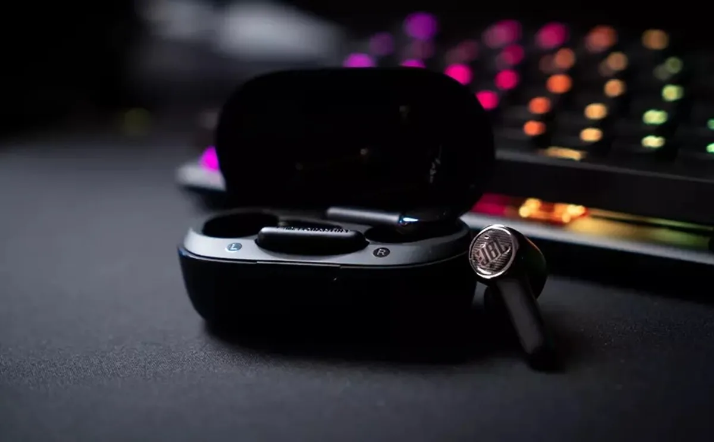

Hoewel spelcomputers vaak audiochatfuncties hebben, gebruiken velen het liefst een externe app zoals Discord om tijdens het gamen in contact te blijven. We zetten drie koptelefoons op een rij die tegelijk met je gameconsole en telefoon verbinden, zodat je tijdens het praten ook nog je game kunt horen.

> [!NOTE]
> Dit artikel verscheen eerder op [AD](https://www.ad.nl/games/met-deze-koptelefoons-kun-je-gamen-en-tegelijk-audiochatten-via-je-smartphone~a5b7c710/).

Het is voor gamers vaak een heel gedoe: ze willen graag de game horen tijdens het spelen, maar ook met vrienden in contact blijven. En als die vrienden niet op dezelfde gameconsole zitten, kan dat alleen via FaceTime, Discord, Skype of een andere audiodienst.

Je kunt dan de oordoppen van je smartphone indoen en de game op de speakers zetten, maar dan horen de medespelers jouw tv-geluid op de achtergrond. Een alternatief is om de tv op mute te zetten, maar dan mis je alle geluiden van je game.

Steeds meer bedrijven maken om die reden een koptelefoon met dual audio. Je verbindt draadloos via een speciale dongle met je gameconsole, terwijl hij ook via bluetooth het geluid van je telefoon afspeelt. Zo heb je het beste van twee werelden.

_Eerder zette BestGetest_ [de beste koptelefoons met ruisonderdrukking](https://bestgetest.nl/de-beste-koptelefoons-met-noise-cancelling-van-2021?utm_source=ad&utm_medium=tekstlink&utm_term=byo&utm_campaign=redactioneel&utm_content=dualaudio) _op een rij._

## Onze favoriet: Steelseries Arctis Pro Nova

Arctis Nova Pro Wireless © Steelseries

Gamingmerk Steelseries maakt al langer gamekoptelefoons met dual audio in meerdere prijsklassen. De Arctis Pro Nova (375 euro) is de duurste, maar ook onze favoriet. Deze is recent in het nieuw gestoken waardoor hij een beter, ergonomisch ontwerp heeft, met een microfoon die je ook helemaal in het ontwerp kunt verstoppen. Zo is hij op straat ook als gewone muziekkoptelefoon te gebruiken.

De Arctis Pro Nova wordt geleverd met een speciaal kastje voor aan je spelcomputer of pc. Let op welke je koopt, want er zijn speciale modellen voor de PlayStation en Xbox. Dat kastje is meteen ook wat de koptelefoon bijzonder maakt: hij legt de draadloze verbinding tusen je spelcomputer en headset, maar kan ook vanaf je koptelefoon worden bediend om bijvoorbeeld de balans tussen je game en de verbonden telefoon aan te passen. Zo kun je het stemgeluid van vrienden harder maken zonder te frummelen met de game-instellingen.

Ook handig: het kastje heeft een oplaadpoort voor de twee accu’s die bij de headset worden geleverd. Zo kun je er altijd eentje opladen en snel omwisselen zodra er eentje leegraakt. Een handige manier om je draadloos te laten gamen zonder alsnog een oplaadkabeltje nodig te hebben.

## Een goedkoper alternatief: Sony Inzone H7 en H9

InZone H9 © Sony

PlayStation-fabrikant Sony heeft ook een reeks nieuwe gamingheadsets aangekondigd, waarvan twee dual audio bieden: de Inzone H7 (229euro) en Inzone H9 (299 euro). Beide koptelefoons zijn zo goed als hetzelfde, met als groot verschil dat de H9 actieve ruisonderdrukking biedt. Zo hoor je de buitenwereld nog maar amper.

Deze Sony-headsets hebben geen kastje voor aan de spelcomputer, maar verbinden met een kleine usb-dongle. Dat maakt deze koptelefoons wat makkelijker om snel ergens anders op aan te sluiten, maar maakt ze ook minder uitgebreid. Je vindt bij de InZones bijvoorbeeld niet de optie om het geluid tussen je smartphone en de game te balanceren, waardoor je dat zelf moet doen vanuit je spelcomputer-instellingen.

Je hebt overigens niks aan de InZone-headsets als je een Xbox hebt: ze zijn gemaakt om specifiek met de pc en PlayStation te werken. Logisch, Sony wil geen concurrerende spelcomputers soelaas bieden.

Het ontwerp is wel wat lomp. De koptelefoon heeft gigantische schelpen waardoor je hoofd snel dubbel zo groot lijkt, met een microfoon die niet naar binnen gestoken kan worden. Prima voor als je met dichte gordijnen zit te gamen, maar we zouden ze buiten niet dragen.

## Net niet: JBL Quantum TWS

Quantum TWS © JBL

JBL verkoopt draadloze oordopjes (150 euro) die ook trots met ‘dual source’ als optie op het doosje prijken. Dat maakt ze een interessant, compact alternatief: oordopjes zijn immers een stuk lichter dan de koptelefoons hierboven beschreven.

Net als concurrenten worden ze geleverd met een usb-zender voor in de gameconsole, waarna ze met bluetooth verbinding met je gameconsole maken. Maar ze werken net wat anders dan we van anderen gewend zijn. Hoewel je twee apparaten kunt verbinden, kunnen de Quantum TWS nooit tegelijkertijd één verbinding maken. In plaats daarvan wordt tussen je twee verbonden apparaten gewisseld.

Tijdens het gamen wordt prioriteit aan de gameconsole gegeven, waardoor je hoort wat er in het spel gebeurt. Word je vervolgens bijvoorbeeld gebeld? Dan wisselen de dopjes naar je smartphone zodat je daar het gesprek kunt opnemen. Maar dan is de verbinding met de game tijdelijk verbroken, zodat je alleen het telefoongesprek kunt horen.

Dat is op zich een handige manier om in contact met de buitenwereld te blijven terwijl je diep een game in bent gezogen. Maar de alternatieven hierboven doen hetzelfde én laten je tijdens een gesprek naar je game luisteren. Dat maakt de JBL-dopjes vooral interessant voor wie draadloos muziek wil luisteren en toevallig ook wat wil gamen, niet voor wie tijdens het gamen met vrienden wil praten. En ze zijn natuurlijk ook een stuk goedkoper.
