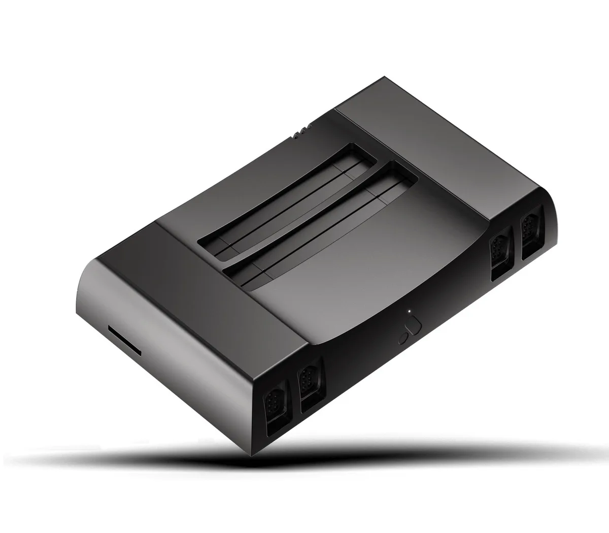

**Analogue NT**

> [!NOTE]
> Dit artikel verscheen eerder op [Bright](https://www.bright.nl/nieuws/1125595/metalen-nes-spelcomputer-voor-puristen-kost-450-euro.html).

De [Analogue NT](https://www.analogue.co/editions/nt-mini-noir/) draait alle games die voor de NES zijn verschenen, plus titels voor zijn Japanse tegenhanger Famicom. Alle hardware werkt vergelijkbaar met de NES, waardoor spellen niet via software geëmuleerd hoeven te worden.

Dat maakt de NT interessant voor puristen en verzamelaars. Hoewel oude games met behulp van emulatie vaak opnieuw worden uitgebracht voor moderne spelcomputers, verschillen deze varianten vaak op kleine manieren. Op de Analogue NT gebruik je ouderwetse hardware, waardoor de game precies zo draait als vroeger.

Toch is de Analogue NT op een paar fronten beter dan de oude variant van Nintendo zelf. Achterop zit bijvoorbeeld een HDMI-poort, zodat je hem op moderne televisies kunt aansluiten. Daarnaast wordt er een draadloze gamepad meegeleverd.

## Honderden euro’s

Goedkoop is de spelcomputer niet: de nieuwe NES wordt aangeboden voor maar liefst 499 dollar, omgerekend ongeveer 450 euro. Voor dat geld krijg je wel een speciale editie van de spelcomputer die in 'kogelkleur’ wordt geleverd en gouden controllerpoorten heeft.

Toch is hij maar 50 dollar duurder dan de originele Analogue NT. Die editie is inmiddels al tijdenlang uitverkocht, wat dit misschien wel de laatste kans maakt om dit verzamelobject te kopen.

Volgens Analogue zal het apparaat slechts beperkt beschikbaar zijn en wordt hij vanaf juli geleverd.

[Bekijk ingesloten media](https://www.youtube.com/embed/-snQ5Fi0LOc?autoplay=1&modestbranding=1)

## Deze Nintendo-gadget maakt fitness weer leuk

**[Volg Bright op YouTube](https://bit.ly/brighttv) voor meer tech-video's**
