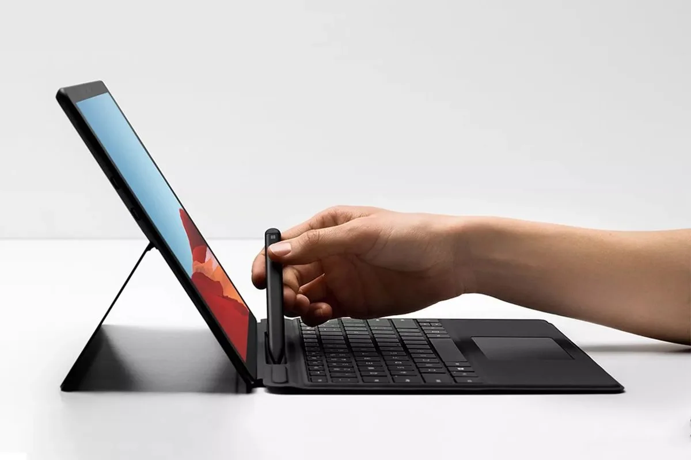
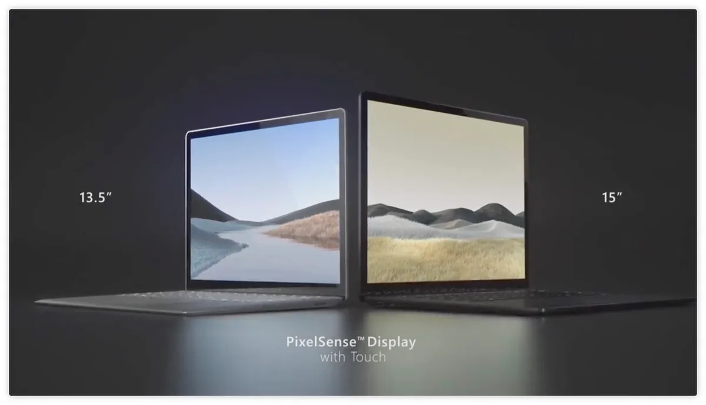
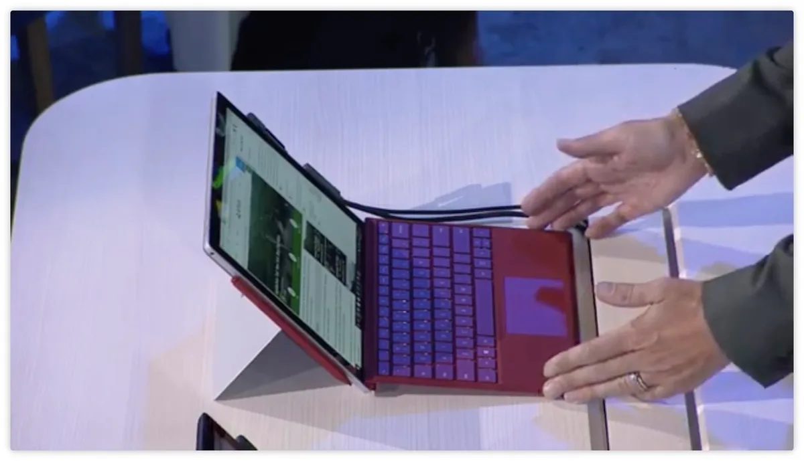

**Nieuwe Surfaces**

> [!NOTE]
> Dit artikel verscheen eerder op [Bright](https://www.bright.nl/nieuws/1123943/microsoft-onthult-slimme-oordoppen-die-werken-met-office.html).

## Eerste indruk: de nieuwe Surface-producten

[Bekijk ingesloten media](https://www.youtube.com/embed/wLsionOOybQ?autoplay=1&modestbranding=1)

Daarmee gaat Microsoft de concurrent aan met de [AirPods](https://www.bright.nl/tests/artikel/4830366/nep-airpods-goedkope-draadloze-oordoppen-apple-oortjes) van Apple en [Galaxy Buds](https://www.bright.nl/tests/artikel/4673596/zijn-de-galaxy-buds-beter-dan-de-airpods) van Samsung. Het techbedrijf beweert dat je de doppen de hele dag kunt dragen, omdat ze op twee plekken in je oren blijven zitten. De bijgeleverde batterijhoes bevat genoeg stroom om 24 uur naar muziek te luisteren.

In iedere oordop zitten twee microfoons om gesprekken mee te voeren. Die microfoons werken ook met apps die bijvoorbeeld live iemands uitspraken kunnen vertalen. De Surface Earbuds worden later dit jaar verkocht voor 249 dollar, Nederlandse prijs en verschijndatum zijn nog onbekend.

## Naar de volgende Powerpoint-slide

Iedere dop is aanraakgevoelig. Met een veeg opzij spring je naar een volgend nummer en met twee taps neem je een telefoongesprek op. Koppel je ze met Office, dan krijg je nog meer functies. Je kunt bijvoorbeeld naar een volgende dia springen in Powerpoint, of bovenop je presentatie je praatje ondertitelen.

Je kunt ook aanrakingen koppelen aan bepaalde apps, zodat je met een tap bijvoorbeeld Spotify kunt opstarten.

> [
>
> View this post on Instagram
>
> ](https://www.instagram.com/p/B3H5LriBDUz/?utm_source=ig_embed&utm_campaign=loading)
>
> [De nieuwe #SurfaceEarbuds van Microsoft: ze werken samen met Office en bieden live vertalingen. Wat vind jij van het platte design? Volg ons kanaal voor meer over de nieuwe Microsoft-gadgets. Zet de bel aan?https://bit.ly/brighttv #microsoft #microsoftevent #surface #oordoppen](https://www.instagram.com/p/B3H5LriBDUz/?utm_source=ig_embed&utm_campaign=loading)
>
> A post shared by [Bright.nl](https://www.instagram.com/bright_nl/?utm_source=ig_embed&utm_campaign=loading) (@bright\_nl) on Oct 2, 2019 at 9:57am PDT

## Surface Pro X

De tevens onthulde hybride laptop Surface Pro X heeft een groter 13 inch-scherm in dezelfde vormfactor als voorgaande Surface Pro's. Dat is mogelijk door de dunnere schermranden in het nieuwe apparaat.

Het scherm heeft een resolutie van 2880 bij 1920 pixels. Aan de zijkant van de tablet zitten twee usb-c-poorten. De hybride laptop geleverd met een verbeterde stylus, die voortaan aan de binnenkant van de toetsenbordcover wordt bewaard. Daar wordt hij automatisch opgeladen.

De nieuwe Surface SQ1-chip aan de binnenkant is door Microsoft en Qualcomm ontwikkeld. Hij verbruikt meer stroom dan de gemiddelde mobiele chip, maar zou per watt efficiënter berekeningen maken. De grafische processor zou net zo krachtig zijn als die in de Xbox One.

Het toetsenbord zit net als bij voorgaande Pro's in de bijbehorende beschermhoes verwerkt, maar zou zijn ontworpen om net zo goed als een laptoptoetsenbord te voelen. Onderop zit wederom een touchpad om de muis mee te bedienen.

Microsoft demonstreerde ook nieuwe technologie waarmee videogesprekken op de Surface Pro X worden verbeterd. Door beelden te bewerken, lijkt het alsof de beller je recht aankijkt. Volgens het techbedrijf is het voor het eerst dat dit mogelijk is op een mobiel apparaat.

De Surface Pro X is vanaf 19 november in Nederland verkrijgbaar voor 1499 euro.

## Surface Laptop 3

De nieuwe Surface Laptop 3 komt voor het eerst met twee schermgroottes: naast de eerdere 13 inch-versie is er nu ook een 15 inch-variant. De laptop is volgens Microsoft dubbel zo snel als zijn voorganger.

Het toetsenbord heeft knoppen die slechts 1,3 millimeter ingedrukt hoeven te worden. Daaronder zit wederom een trackpad, die twintig procent groter is dan het vorige model. De gehele bovenkant kan volgens Microsoft makkelijk worden verwijderd om de laptop te repareren of een harde schijf te vervangen.

Binnenin de laptop zit ook een speciale variant van de AMD Ryzen 7, een videokaart om bijvoorbeeld games mee te spelen. De snellaadfunctie zorgt ervoor dat de laptop binnen een uur voor tachtig procent is opgeladen.

De Surface Laptop 3 is vanaf 22 oktober in Nederland verkrijgbaar. Het 13 inch model is er vanaf 1149 euro, de nieuwe 15 inch uitvoering is er vanaf 1349 euro.

## Surface Pro 7

Microsoft toonde ook de Surface Pro 7, een nieuwe editie van de hybride laptop. Deze zal vanaf 22 oktober worden verkocht voor 899 euro. De nieuwe Surface Pro 7 heeft voor het eerst een usb-c-poort. Andere Surface-producten hadden die poort al, maar de Pro had tot en met de Pro 7 nog een Mini DisplayPort-aansluiting.

Zowel de Surface Laptop 3 als Surface Pro 7 zijn voorzien van dubbele microfoons. Deze worden gebruikt om bijvoorbeeld stemassistent Cortana te bedienen of teksten te dicteren.

Daarnaast heeft Microsoft een aantal softwarevernieuwingen toegevoegd aan Windows 10. Het is bijvoorbeeld makkelijker om met de Surface-stylus aanpassingen in Excel te maken.

**[Volg Bright op YouTube](https://bit.ly/brighttv) voor meer onze videoreviews**
