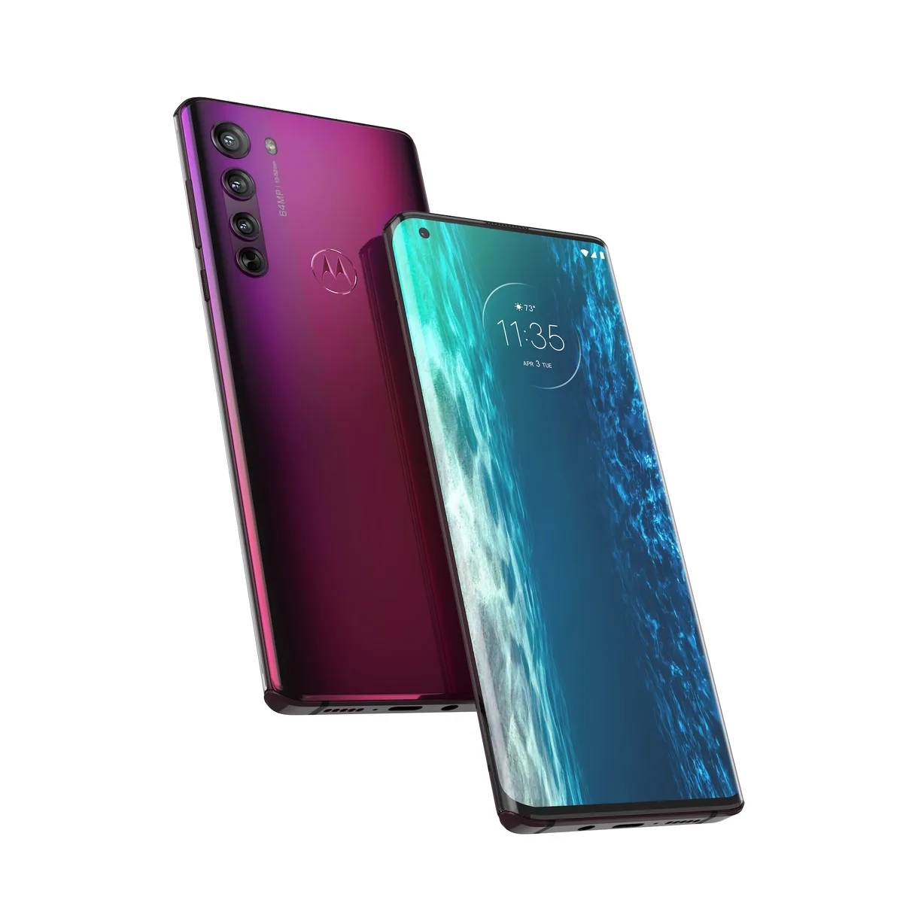

**Smartphones**

> [!NOTE]
> Dit artikel verscheen eerder op [Bright](https://www.bright.nl/nieuws/1126201/motorola-onthult-edge-5g-telefoon-voor-599-euro.html).

De telefoon is voorzien van een 6,7 inch-scherm met een resolutie van 1080 bij 2340 pixels. Het display ververst met 90 beelden per seconde, wat moet zorgen voor vloeiend ogende animaties.

Aan de binnenkant zit een Qualcomm Snapdragon 765-chip en 6GB aan werkgeheugen. De vingerafdrukscanner zit in het scherm verwerkt, maar het toestel is ook via gezichtsherkenning met de selfiecamera te ontgrendelen.

## 5G

De telefoon is ook alvast voorzien van een antenne voor 5G-netwerken. Die zijn er op dit moment nog niet in Nederland, maar moeten later wel beschikbaar komen. Daarbij worden ook meteen de frequenties gepland voor Nederland gebruikt.

Motorola is er van overtuigd dat de 4.500mAh-accu voldoende stroom biedt om de telefoon maximaal twee dagen te gebruiken zonder tussendoor op te laden. Die accu kan worden opgeladen met een meegeleverde 18W-adapter.

## Drie lenzen

Achterop de telefoon zitten drie cameralenzen van 64, 16 en 8 megapixel. De tweede daarvan biedt een wide-angle-perspectief, terwijl de kleinste twee keer optisch zoomt. De selfiecamera voorop heeft een resolutie van 25 megapixel.

De nieuwe Edge is wellicht een alternatief voor telefoons zoals die van OnePlus. Die waren jarenlang het goedkopere alternatief voor vlaggenschepen van Apple en Samsung, maar dit jaar schroefte OnePlus de prijs omhoog. Motorola verkoopt zijn telefoon vanaf juni voor 599 euro.

In de Verenigde Staten onthulde Motorola ook de Edge+, met een prijskaartje van 999 euro, een sterkere processor, grotere accu en drie camera's achterop. Die wordt echter exclusief bij de provider Verizon aangeboden.

## OnePlus 8 Pro: hoe goed is deze smartphone?

[Bekijk ingesloten media](https://www.youtube.com/embed/lnRabHU-5_4?autoplay=1&modestbranding=1)

**[Volg Bright op YouTube](https://bit.ly/brighttv) voor meer tech-video's**
