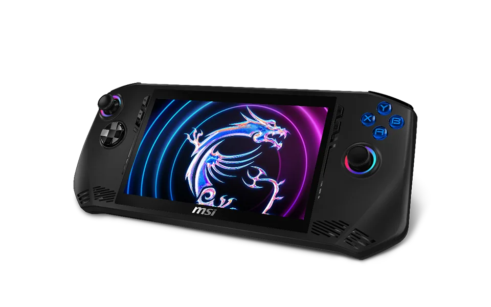

Sinds de introductie van Valve’s Steam Deck is het dringen op de markt voor portable spelcomputers. ASUS en Lenovo maakten met de ROG Ally en Legion Go krachtigere varianten die op Windows draaien, maar ook meer stroom slurpten dan de Deck.

> [!NOTE]
> Dit artikel verscheen eerder op [Bright](https://www.bright.nl/nieuws/1172858/msi-stort-zich-op-gameconsolemarkt-steam-deck-killer-met-intel.html).

De MSI Blade lijkt erg op die twee Steam Deck-concurrenten: het scherm heeft net als bij de ROG Ally een 1080p-resolutie en is 7 inch groot, terwijl de 53Wh-accu vergelijkbaar is met wat je in de Legion Go vindt.

## 'Superieure' Intel-chip

Het grote verschil bij de Blade zit 'm in de chip: waar de Deck, Legion Go en ROG Ally allemaal op AMD-hardware draaien, vind je in deze nieuwe console de Intel Core Ultra. AMD en Intel concurreren al lange tijd op de markt voor pc’s en laptop, een strijd die hiermee ook losbarst op de gameconsolemarkt.

MSI zegt dat die chip sneller is dan de AMD-concurrent - uiteraard zeggen ze dat, zij verkopen het Intel-model. Het is nog afwachten of ze die belofte straks ook waar kunnen maken. De fabrikant mikt op een verkoopstart in de eerste helft van 2024.

## Betere sticks en Wi-Fi

Op de Blade vind je twee zogeheten halsensor-joysticks, die minder snel last hebben van drift. Ook leuk: hij ondersteunt het nieuwe Wi-Fi 7. Dat zorgt voor hogere downloadsnelheden, maar ook voor minder vertraging als je bijvoorbeeld [games](https://www.bright.nl/onderwerpen/games) streamt via Game Pass.
