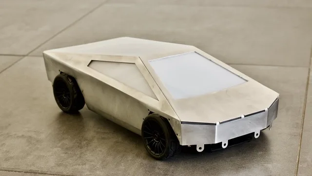

**RC Cybertruck**

> [!NOTE]
> Dit artikel verscheen eerder op [Bright](https://www.bright.nl/nieuws/1126377/nederlander-bouwt-op-afstand-bestuurbare-mini-cybertruck.html).

Op zijn YouTube-kanaal [The Practical Engineer](https://www.youtube.com/channel/UCbU6yTk6NzZSKuBEl0PhABQ) laat Noorlander zien hoe hij de miniwagen precies in elkaar heeft gezet. In de eerste video is de wagen nog niet klaar, maar de knutselaar deelde alvast foto's van het eindproduct met ons.

De Cybertruck van Tesla heeft een bijzonder ontwerp, waarbij een groot stuk metaal over de auto wordt gevouwen. Noorlander bootste dat na met een stuk aluminium, dat bij met vouwranden en lasnaden over een op afstand bestuurbaar frame plaatste.

## 40.000 dollar

Het is misschien wel de enige variant van de Cybertruck die ooit op de Nederlandse weg zal rijden: bij de wagen van Tesla is het nog de vraag of hij voldoet aan Europese regelgeving.

De autofabrikant [presenteerde](https://www.bright.nl/nieuws/artikel/4930361/tesla-lanceert-elektrische-pick-cybertruck) zijn elektrische truck eind vorig jaar. Hij heeft een actieradius van 800 kilometer en moet een kleine 40.000 dollar kosten. De eerste modellen rollen eind 2021 van de band, denkt Tesla.

[Bekijk ingesloten media](https://www.youtube.com/embed/Q9-ahfOOu6A?autoplay=1&modestbranding=1)
