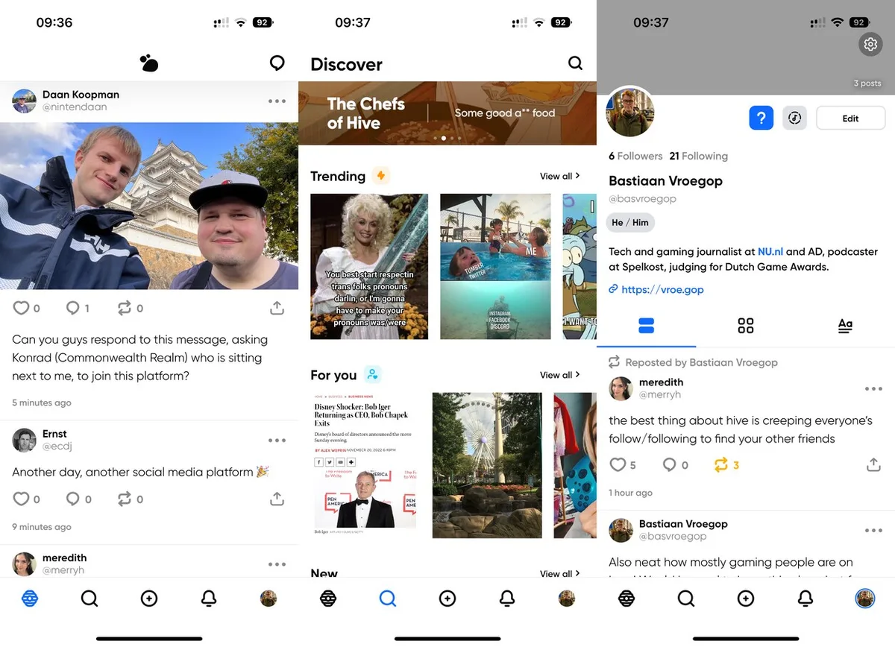

Twitter-gebruikers hebben na Mastodon een nieuw toevluchtsoord gevonden: op het vrij jonge sociale netwerk Hive kunnen ze net als op Twitter met elkaar praten.

> [!NOTE]
> Dit artikel verscheen eerder op [AD](https://www.ad.nl/tech/niet-hyves-maar-hive-nieuw-alternatief-voor-twitter-ineens-populair~a683c8fe9/).

Twitter-concurrenten zitten in de lift sinds Elon Musk het sociale netwerk kocht. Het beleid van de miljardair kon de afgelopen weken op veel kritiek van gebruikers rekenen. Zo liet hij onlangs de geschorste Twitter-accounts van Donald Trump en Kanye West weer toe.

Sinds de overname door Musk is ook een groot deel van het personeel bij Twitter ontslagen, waaronder teams die essentieel zijn voor de werking van het platform. Gevreesd wordt dat de website op termijn daarom niet meer goed zal werken, waardoor bezoekers zoeken naar een alternatief om daar met hun vrienden in contact te kunnen blijven.

## Hive ineens populair op Twitter

Het open platform Mastodon zag zijn gebruikers sindsdien fors groeien: in de afgelopen week hebben een half miljoen mensen zich voor de dienst aangemeld. Sinds dit weekend is er nog een platform dat aan terrein wint: het prille [Hive](https://www.hivesocial.app/help-center/music).

Dat blijkt uit de trending onderwerpen op Twitter, waar in de Verenigde Staten ontzettend veel over de nieuwe app wordt gepraat. Ook Nederlanders zeggen de nieuwe app uit te proberen, al is hij hier nog minder populair. Op het moment van schrijven staat hij op plek elf in de meest besproken onderwerpen. Gebruikers delen hun nieuwe Hive-naam, zodat vrienden hen daar kunnen volgen.

## Twitter zonder de algoritmes

Hive lijkt qua naam op het oude Nederlandse Hyves, maar heeft er verder niks mee te maken. Het sociale netwerk is in 2019 gemaakt door twee studenten. De oprichter, die online actief is onder de naam Raluca, schrijft dat ze ‘moe werd van de beperkingen op sociale platformen, waardoor haar berichten niet gezien werden door vrienden’. Daarom wilde ze een platform zonder ingewikkelde algoritmes maken, waarop berichten chronologisch onder elkaar worden getoond.

De app is in gebruik grotendeels identiek aan Twitter: je hebt een tijdlijn met berichten van mensen die je volgt. Gebruikers delen vooral korte berichtjes, al lijkt er geen maximumlengte te zijn voor wat je kunt plaatsen.

Zo ziet Hive er uit. © Hive

## Je favoriete nummers laten horen

Een paar kleinigheden maken Hive uniek, zoals de mogelijkheid om berichten als ‘_not safe for work_’ te markeren. Dan zijn ze onleesbaar totdat je op een knop klikt en kun je vermijden dat je op de werkvloer - met al je collega’s ernaast - ineens iets ongepasts bekijkt. Daarnaast is het mogelijk een muziekdienst te koppelen en je favoriete liedjes op je profiel te laten horen.

## Grote groei kan spannend worden

Het is nog afwachten of Hive een grote groei in gebruikers aankan. Concurrent Mastodon leidde afgelopen weken onder zijn populariteit, waar beheerders van sommige servers betere apparatuur moesten aanschaffen om de grote groei te kunnen bijhouden. Hive wordt door twee studenten beheerd, waardoor het nog de vraag is of zij de hardware in huis hebben om grote hoeveelheden bezoekers op te vangen.

Daarnaast mist de sociale dienst nog wat extraatjes die concurrenten net iets handiger maken: er is bijvoorbeeld geen webversie, waardoor je alleen in de smartphone-app berichten kunt plaatsen. Al had Instagram die beperking ook jarenlang en werd die app alsnog gigantisch groot.

_Bekijk hieronder onze video’s op techgebied:_

**Praat mee,**

_**reageren** kan onderaan dit artikel. Alleen reacties voorzien van een volledige naam worden geplaatst. We doen dat omdat we een debat willen met mensen die staan voor wat ze zeggen, en daar dus ook hun naam bij zetten. Wie zijn naam nog moet invullen, kan dat doen door rechts bovenaan op onze site op ‘Login’ te klikken._
