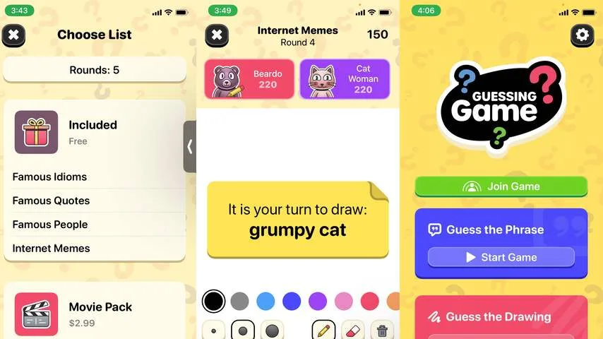

**Door de nieuwe lockdown kunnen veel families niet meer met z'n allen Kerst vieren. Met deze tips kun je digitaal toch nog samen wat leuks doen.**

> [!NOTE]
> Dit artikel verscheen eerder op [NU.nl](https://www.nu.nl/tech/6174494/niet-samen-met-kerst-door-de-lockdown-zo-wordt-het-digitaal-toch-gezellig.html).

Tijdens Kerst geldt het dringende advies om maximaal vier bezoekers te ontvangen. Voor kleine families is dat net voldoende om de feestdagen samen te vieren, maar bij anderen zal het gezin worden opgesplitst om bijvoorbeeld samen te dineren of een film te kijken.

Gelukkig zijn er inmiddels veel manieren om het digitaal alsnog een beetje samen te vieren. Dat is deels te danken aan de lockdowns van een jaar geleden: techbedrijven hebben toen hevig geïnvesteerd in nieuwe manieren om online samen iets te doen, voor het geval dit nog eens zou gebeuren.

## Samen online een film kijken

Zo is het bij meerdere streamingdiensten mogelijk om samen online een film te kijken. Bij Disney+ staat op het detailscherm van een film de GroupWatch-knop, waarmee je een groep kan starten samen met vrienden of familie op een andere locatie. Deze film zal dan op hetzelfde moment worden gestart of gepauzeerd.

Netflix heeft geen officiële samenkijkfunctie, maar een plug-in voor je webbrowser maakt dit wel mogelijk. Met Teleparty kun je online met een groep mensen hetzelfde bekijken, mits iedereen die plug-in heeft geïnstalleerd.

Apple heeft in iOS 15 dit jaar ook de functie SharePlay toegevoegd, waarbij je het beeld van bijvoorbeeld een videostreamingapp kunt delen. Nog lang niet iedere app werkt daarmee, maar je kunt wel samen iets op Apple TV+ starten. Op termijn moet Disney+ hier ook mee werken. Voordeel bij SharePlay is dat je tegelijkertijd met elkaar videobelt via FaceTime.

## Een spelletje spelen

Een alternatief is om samen tijdens Kerst digitaal een spelletje te spelen. Dat hoeft niet meteen een uitgebreide game te zijn: via Google Meet, Zoom of FaceTime is het net zo makkelijk om bijvoorbeeld een pubquiz te organiseren.

Met de app _[Kahoot](https://kahoot.it/)_ kun je bijvoorbeeld zelf een quiz samenstellen en vervolgens het beeld delen met een videobeldienst. Vervolgens kan iedere deelnemer inloggen op zijn of haar smartphone om mee te doen. Wie iets complexers wil kan ook de spellenpakketten van Jackbox kopen. Dat zijn eveneens feestspelletjes die met videobeldiensten werken.

Apples nieuwe SharePlay-functie biedt voor spelletjes ook wat opties. In het spelletje _[Shhh!](https://shhh.games/)_ laat je bijvoorbeeld uitzoeken wie een spion is en bij [_Guessing Game_](https://apps.apple.com/app/apple-store/id1573083328#?platform=iphone) moet je raden wat een ander tekent.

_Niet samen met Kerst door de lockdown? Zo wordt het digitaal toch gezellig_

## Naar dezelfde muziek luisteren

Als je niet per se samen iets hoeft te doen maar wel een gevoel van saamhorigheid wil, kun je via Spotify ook tegelijkertijd naar dezelfde muziek luisteren. In de app kun je een Group Session starten, waarbij iedere deelnemer exact dezelfde afspeellijst hoort.

Als één persoon naar het volgende liedje gaat, wordt het nummer voor iedereen overgeslagen. Zo is het toch een beetje alsof je samen met elkaar in kamer verblijft.
