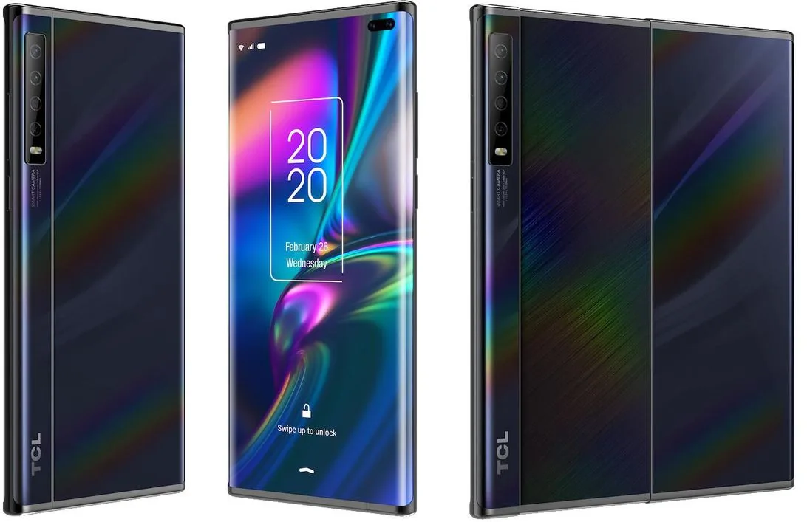

**Opvouwconcurrent**

> [!NOTE]
> Dit artikel verscheen eerder op [Bright](https://www.bright.nl/nieuws/1125412/niet-vouwen-maar-schuiven-tcl-werkt-aan-schuifsmartphone.html).

Het nieuwe toestel is nog niet officieel aangekondigd, maar een paar afbeeldingen zijn gelekt naar [CNET](https://www.cnet.com/news/forget-foldable-these-leaked-images-show-a-phone-concept-with-a-slide-out-screen/). Door aan de zijkant van de telefoon te trekken, maak je plaats voor een tweede scherm dat aan de binnenkant verstopt zit.

Daarmee kan TCL wel eens de nadelen van moderne opvouwtelefoons elimineren. Toestellen zoals de [Galaxy Fold](https://www.bright.nl/nieuws/artikel/4958661/verrassing-samsung-brengt-galaxy-fold-toch-nederland-uit), de [Galaxy Z Flip](https://www.bright.nl/tests/artikel/5019826/samsung-galaxy-z-flip-opvouwbare-smartphone-fold-vouwbaar-mobiele-telefoon) en de [Motorola Razr](https://www.bright.nl/nieuws/artikel/5013461/motorola-razr-gaat-kapot-na-27000-keer-vouwen) gaan relatief snel kapot, omdat de constante vouwbewegingen het toestel kwetsbaar maken. De TCL-telefoon hoeft op zijn beurt niet worden opgevouwen.

## Werkend prototype

Volgens CNET stond TCL op het punt om een werkend prototype van de nieuwe telefoon te onthullen op telefoonbeurs MWC. Deze presentatie werd op het allerlaatste moment uitgesteld, omdat MWC wegens zorgen over het coronavirus [niet doorging](https://www.bright.nl/nieuws/artikel/5019356/telefoonbeurs-mwc-gaat-niet-door-coronavirus-mobile-world-congress-2020).

We moeten nog zien of het schuifsysteem van TCL net zo goed werkt als de afbeeldingen beloven. Gezien de telefoonmaker op het punt stond het apparaat te presenteren, duurt het vermoedelijk niet lang tot de telefoon alsnog in actie is te zien.

[Bekijk ingesloten media](https://www.youtube.com/embed/qtMNxqWF_II?autoplay=1&modestbranding=1)

## Eerste indruk: Samsung Galaxy Z Flip

**[Volg Bright op YouTube](https://bit.ly/brighttv) voor meer tech-video's**
