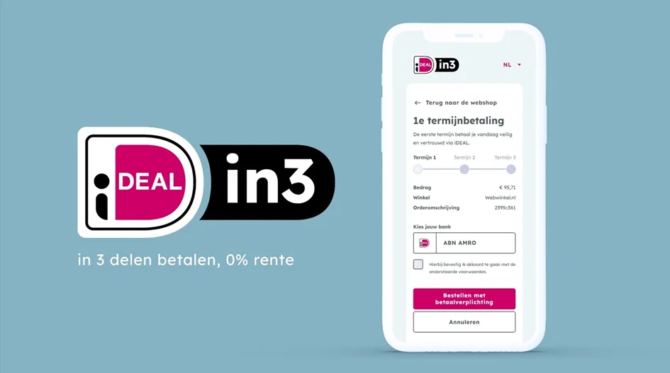

De termijnbetalingen zijn samen met het Eindhovense bedrijf in3 geïntegreerd, dat al langer in zulke betaalconstructies is gespecialiseerd. Amos Kater, Chief Product Officer bij Currence iDEAL: "iDEAL breidt uit om in te spelen op de veranderingen in de manier waarop consumenten shoppen en betalen", aldus iDeal-productbaas Amos Kater.

> [!NOTE]
> Dit artikel verscheen eerder op [Bright](https://www.bright.nl/nieuws/1191130/nieuw-bij-ideal-over-drie-termijnen-betalen.html).

Bij de termijnbetalingen worden drie periodes aangehouden. De eerste betaling wordt meteen gedaan, waarna de tweede na dertig dagen van je rekening wordt afgeschreven. De derde betaling verdwijnt na zestig dagen van je rekening.

## Geen extra kosten voor betaler

Voor het gebruik van iDeal in3 betaal je niks extra’s, en bij de termijnbetalingen wordt ook geen rente in rekening gebracht. Je betaalt hetzelfde wat je normaal zou doen, maar dan in drie verschillende termijnen. De kosten zijn voor de webwinkel zelf, die een vast bedrag per transactie afdraagt.

Tijdens het betalen doet iDeal in3 een automatische kredietcheck, om te zien of je in staat bent over drie termijnen af te rekenen. Bij goedkeuring krijg je vervolgens een e-mail over wanneer je de volgende betalingen uitvoert.

Lees meer over [betalingsverkeer](https://www.bright.nl/onderwerpen/betalingsverkeer) en abonneer op [onze nieuwsbrief](https://www.bright.nl/nieuws/1175658/abonneer-je-gratis-op-de-bright-nieuwsbrief.html).
