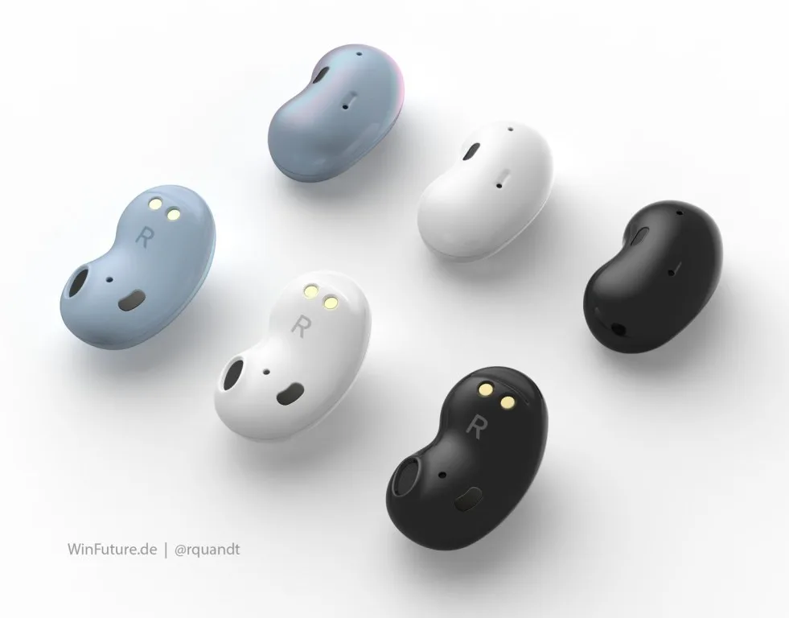

**Boontjes doppen**

> [!NOTE]
> Dit artikel verscheen eerder op [Bright](https://www.bright.nl/nieuws/1126033/nieuwe-draadloze-samsung-oordopjes-lijken-op-kleine-bonen.html).

Dat blijkt uit beelden gepubliceerd door het Duitse [Win-Future](https://winfuture.de/news,115099.html). De renders zijn gebaseerd op informatie die de website ontving van een anonieme fabrikant.

De dopjes zien er dunner en kleiner uit dan de Galaxy Buds die Samsung nu verkoopt. Dat brengt wellicht ook een ander voordeel met zich mee: ze zouden niet heel ver uit je oren steken.

Ieder apparaatje moet ongeveer 2,8 centimeter groot zijn. Het bovenste deel zit in de bovenkant van je oor, terwijl de luidspreker onderop zit. Van actieve ruisonderdrukking lijkt bij de doppen geen sprake te zijn.

## Samsung Bean

Het boonontwerp is Samsung niet ontgaan: intern zouden de doppen onder de codenaam 'Bean' worden gemaakt. Iets daarvoor noemde de techreus zijn experimentele oordoppen nog project 'Popcorn'.

Vermoedelijk duurt het nog even tot Samsung deze doppen op de markt brengt - het bedrijf moet de geruchten nog bevestigen. Op het moment zou het nieuwe product intern worden getest.

Samsung onthulde een maand geleden nog zijn Galaxy Buds+. Deze nieuwe doppen zijn op een aantal fronten verbeterd van Samsungs eerste draadloze set.

## Eerste indruk: Samsung Galaxy Buds+

[Bekijk ingesloten media](https://www.youtube.com/embed/xeRd9BaatJI?autoplay=1&modestbranding=1)

**[Volg Bright op YouTube](https://bit.ly/brighttv) voor meer tech-video's**
