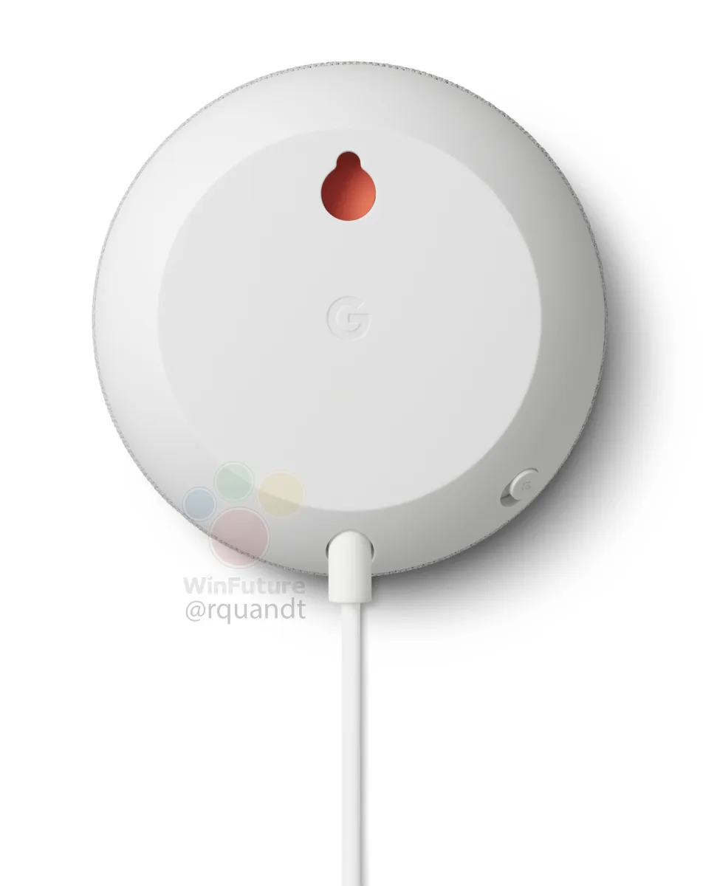

**Google Nest Mini**

> [!NOTE]
> Dit artikel verscheen eerder op [Bright](https://www.bright.nl/nieuws/1124072/nieuwe-slimme-google-speaker-kan-makkelijk-aan-muur-hangen.html).

De nieuwe speaker heet hoogstwaarschijnlijk de Nest Mini. Google geeft al zijn smarthomeproducten inmiddels de Nest-naam. Op afbeeldingen is te zien dat de nieuwe Mini grotendeels identiek is aan eerdere edities van het apparaatje.

De verschillen zitten in de details. De onderkant is niet langer fel oranje, maar sluit qua kleur aan op de rest van de speaker. De oplaadkabel is ronder dan bij de vorige versie, wat doet vermoeden dat Google niet langer een micro-usb-poort gebruikt. De resetknop is op de afbeeldingen verdwenen, maar er is nog wel een schakelaar om de microfoon te dempen.

De afbeeldingen werden gelekt door [WinFuture](https://winfuture.de/news,111816.html#), dat ook meldt dat de 9-watt-lader is vervangen met een 15-watt-variant. Dat doet vermoeden dat de nieuwe Nest Mini iets meer stroom vergt, wellicht om een hoger volume te kunnen produceren.

## Lichtblauw

Afgelopen weekend lekte er ook al informatie over de nieuwe Nest Mini naar buiten. Toen bleek dat de slimme speaker waarschijnlijk in de kleuren lichtgrijs, roze en lichtblauw geleverd zal worden. Die lichtblauwe optie bood Google nog niet eerder aan.

De Nest Mini is de goedkoopste slimme speaker die Google verkoopt. Het huidige model gaat voor rond de 40 euro over de toonbank in Nederland. Waarschijnlijk wordt het nieuwe model al snel gepresenteerd. Op 15 oktober houdt de zoekgigant een groot persevenement waarop meerdere producten worden verwacht, waaronder ook de nieuwe Pixel 4-smartphone.

## Getest: hoe handig is de Google Nest Hub?

[Bekijk ingesloten media](https://www.youtube.com/embed/H3QGhIyKrUI?autoplay=1&modestbranding=1)

**[Volg Bright op YouTube](https://bit.ly/brighttv) voor meer tech-video's**
