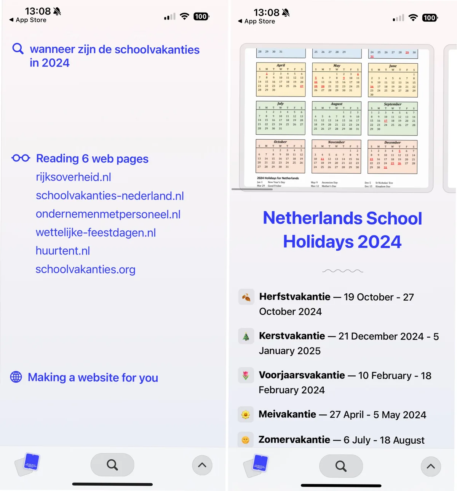

Het maakt [Arc Search](https://arc.net/blog/arc-search) anders dan gebruikelijke online zoekpogingen, waarbij je een overzicht met websites te zien krijgt die wellicht je vraag beantwoorden. De app zoekt deze websites ook op, maar gbebruikt AI om de informatie hieruit de destilleren en één webpagina te genereren die je vragen beantwoordt.

> [!NOTE]
> Dit artikel verscheen eerder op [Bright](https://www.bright.nl/nieuws/1176887/nieuwe-smartphone-browser-arc-search-gebruikt-ai-om-je-te-helpen-zoeken.html).

De app is vrij duidelijk in zijn aanpak: je krijgt te zien welke webpagina’s worden geanalyseerd, zodat je weet wat de bron van de betreffende informatie is. Dat geeft Arc Search een streepje voor op AI’s waar je vragen aan kunt stellen, die vaak in het midden laten waar de gebruikte data van afkomstig is.

Daarnaast is Arc Search stiekem gewoon een webbrowser. Bij de eerste keer opstarten krijg je de vraag of je hem als standaard browser kunt instellen, en je kunt in het zoekveld ook gewoon webadressen invoeren. Het ontwerp is minimalistisch en de app reageert snel, wat het een fijn alternatief maakt voor Safari en Chrome.

## Een ander soort webbrowser

Arc had al een browser voor smartphones, maar dat was vooral een app om naast je desktop-browser te gebruiken. Je kon hierin tabbladen open op je computer bekijken en verder eigenlijk niks.

Webbrowser Arc debuteerde op Mac, waar het een ander soort browser-ervaring beloofde. Inmiddels is ook een Windows-versie in de maak waarvoor de softwaremaker langzaam nieuwe testers uitnodigt. The Browser Company, het bedrijf achter de app, werd opgericht door Josh Miller, die eerder werkte bij [Meta](https://www.bright.nl/organisaties/meta) en het Witte Huis.
