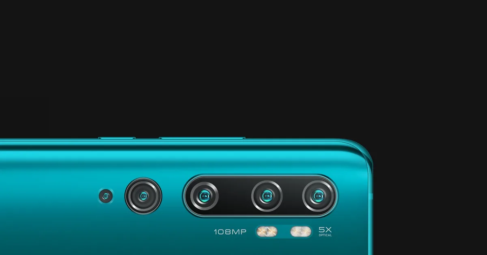
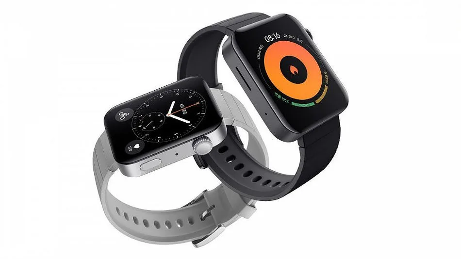

**Xiaomi CC9 Pro**

> [!NOTE]
> Dit artikel verscheen eerder op [Bright](https://www.bright.nl/nieuws/1124316/nieuwe-xiaomi-telefoon-heeft-108-megapixel-camera.html).

Met die sensor kun je foto’s van een buitengewoon hoge resolutie maken, maar je kunt er ook kleinere en mooiere foto’s mee maken. Standaard worden er vier foto’s van ieder 27 megapixel gemaakt, waarvan de pixels in één beeld worden versmolten.

De gebruikte 108 megapixel-sensor werd door Xiaomi [samen met Samsung](https://www.bright.nl/nieuws/artikel/4806551/xiaomi-werkt-aan-telefoon-met-108-megapixelcamera) ontwikkeld. De sensor is groter dan in andere smartphones, waardoor hij grotere pixels kan vastleggen.

## Vijf camera’s achterop

Achterop zitten in totaal vijf camera’s: een 5 megapixel-telelens voor vijf keer optische zoom, een 12 megapixel-lens voor portretfoto’s, een wide-angle-lens van 20 megapixel en een 2 megapixel-macrolens om objecten van dichtbij te fotograferen.

En dan is er ook nog de selfiecamera voorop, die heeft een 32 megapixel-resolutie. Deze zit in een inkeping bovenin het scherm verwerkt.

## Als eerste te koop

Xiaomi onthulde recent al een telefoon met dezelfde 108 megapixel-sensor, maar dat was een imposante concepttelefoon met een scherm dat alle kanten bedekt. Het duurt nog even totdat deze op de markt komt.

De [CC9 Pro](https://www.mi.com/micc9pro) verschijnt daarentegen morgen al in China voor 2799 yuan, omgerekend 360 euro. Een Europese verkoopdatum is nog niet bekendgemaakt.

## Apple Watch-concurrent

De Chinese techfabrikant onthulde ook de Mi Watch. Deze smartwatch lijkt qua ontwerp op de [Apple Watch](https://www.youtube.com/watch?v=bPyxNTFtG9s), maar is wat simpeler in functie en is ook goedkoper. Hij kost omgerekend 170 euro.

In de Mi Watch zit de Snapdragon Wear 3100-chip, 1GB werkgeheugen en 8GB opslag. De 570mAh-accu moet het 36 uur volhouden. Je kunt hem via [eSim](https://www.bright.nl/tips/artikel/4832091/esim-e-sim-elektrische-simkaart-nederland-buitenland-t-mobile-truphone) met een 4G-netwerk verbinden.

[Bekijk ingesloten media](https://www.youtube.com/embed/suYlQVKAudM?autoplay=1&modestbranding=1)

## Cameratest: iPhone 11 Pro

**[Volg Bright op YouTube](https://bit.ly/brighttv) voor meer [smartphone-reviews](https://www.bright.nl/tests/bundel/4500356/smartphone-reviews)**
