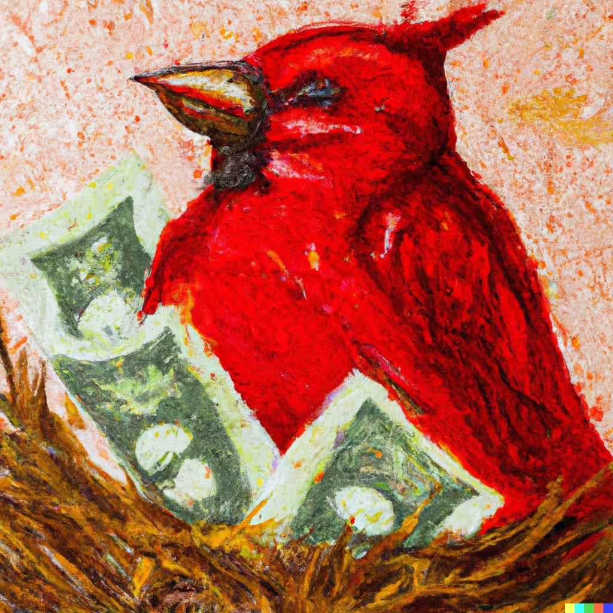

**Verder: de tragedie van Gary Bowser en is Rovio echt zoveel waard?**

Hallo! Sorry dat jullie even op deze editie van Gamepraat moesten wachten. Vorige week lag ik met griep op bed, waarna ik deze week de nieuwsbrief bewust twee dagen heb uitgesteld. Dat geeft me namelijk de ruimte om iets tofs met jullie te delen: het verhaal achter de schermen bij de Nederlandse MMORPG _The Chronicles of Spellborn_, dat twee decennia geleden de strijd met _World of Warcraft_ aanging. Ik ben er speciaal voor de podcast _Goed Verhaal_ ingedoken.

Verder verdiepen we ons in het lot van Nintendo-hacker Gary Bowser. We maken steeds grapjes over zijn naam, maar zijn huidige situatie is niet bepaald iets om van te lachen. En is Rovio echt honderden miljoenen euro’s waard?

Deze nieuwsbrief telt 1.162 woorden en neemt circa. zes minuten van je tijd in beslag. Vind je Gamepraat tof? Tip dan vooral je vrienden en familie! We trappen af.

[Subscribe](#/portal/signup)

## De Nederlandse WoW-killer van Hans Breukhoven

-   Het Nederlandse The Chronicles of Spellborn moest ooit een WoW-killer worden.
-   Afgelopen maanden sprak ik met oud-medewerkers om de ontwikkeling van die game in kaart te brengen.
-   Het is het meest bizarre Nederlandse gamedev-verhaal dat ik ooit heb gehoord.
-   Het volledige verhaal is sinds deze week te horen bij podcastdienst Podimo, in een aflevering van Goed Verhaal.

Zo vlak na de millenniumwissel begon de ontwikkeling van The Chronicles of Spellborn. Deze MMORPG was geïnspireerd door de _Dungeons & Dragons_\-avonden van de makers. Ze wilden hun papieren avonturen verplaatsen naar een grootse, online wereld waar iedereen kon meedoen.

Toen kort daarna World of Warcraft een megahit werd, roken investeerders geld. Iedereen wilde wel meehelpen om _Spellborn_ een realiteit te maken, waaronder zelfs Free Record Shop-topman Hans Breukhoven. De race om er een 'WoW-killer' van te maken was begonnen.

Ik ving afgelopen jaren vaak verhalen op over de ontwikkeling van Spellborn. Soms waren het luchtige anekdotes - over bijvoorbeeld de populaire metalband die de soundtrack had gemaakt, of de Netflix-ster die als zomerbaantje de game-intro insprak. Anderen gingen over de gespannen werksfeer die langzaam ontstond. Exploderende collega’s. Koreaanse supersterren. Ik ken geen andere Nederlandse game waarbij de ontwikkeling zo bizar verliep.

Ik sprak voor de podcast Goed Verhaal met meerdere oud-medewerkers om dat alles eindelijk eens op een rij te zetten. Ik wil niet teveel van de inhoud verklappen - de podcast is het leukst als je er blanco instapt. Maar ik viel van de ene verbazing in de ander.

[**Je kunt de aflevering hier luisteren.**](https://share.podimo.com/episode/fc263183-6ec2-458b-85d8-23a8d6454d19?creatorId=77bcb4c2-8269-4efd-b0c3-b17b5c4b3d39&key=A9jtPdh57V6h&source=ln&from=mobile)

## Grappig dat ie Bowser heet, maar…

-   Nintendo-hacker Gary Bowser werd in 2022 veroordeeld tot 40 maanden cel, maar is sinds eind maart weer [op vrije voeten](https://torrentfreak.com/nintendo-hacker-gary-bowser-released-from-federal-prison-230417/?ref=gamepraat.nl).
-   Hij moet nog steeds 14,5 miljoen dollar aan schadevergoeding betalen.
-   Hij zal waarschijnlijk zijn hele leven tot 30 procent van zijn inkomen aan Nintendo moeten overschrijven.

Las je online over Gary Bowser, dan hadden de artikelen vaak een schijtlollige toon. Logisch ook: het is best wel grappig dat de hacker die Nintendo's spelcomputer openbrak dezelfde achternaam heeft als de grote schurk uit Super Mario. Een achternaam die hij ook nog eens deelt met Doug Bowser, de topman in de Verenigde Staten.

Dus ik snap wel dat je al snel koppen hebt als 'Nintendo daagt Bowser voor de rechter'. Ik heb er op Twitter geheid ook wel aan meegedaan. Maar als je dieper in het dossier van Gary Bowser duikt, is het vooral een tragische zaak.

Gary Bowser maakte modchips, waarmee je een spelcomputer kunt openbreken om er zelf software op te installeren. Dat deed hij al jaren, maar hij kwam in de problemen toen hij een variant voor de Nintendo Switch produceerde. Het Japanse gamebedrijf stapte naar de rechter en haalde alles uit de kast. Het moest een waarschuwing zijn voor iedereen die durfde Nintendo's apparatuur te kraken.

Uiteindelijk werd een schikking bereikt, maar ook die leek ontworpen om af te schrikken. Bowser kreeg een gigantisch hoge schadevergoeding opgelegd en moest de cel in. Omdat hij niet genoeg verdient om zomaar miljoenen af te tikken, zal hij waarschijnlijk de rest van zijn leven bezig zijn om Nintendo af te betalen. En wordt zijn inkomen altijd met dertig procent gedrukt.

Het kan verstrekkende gevolgen hebben voor de rest van Bowsers leven. De kans dat hij een huis kan kopen is waarschijnlijk nihil - hoeveel banken gaan met je in zee als je een miljoenenschuld hebt? En omdat hij maandelijks zoveel moet betalen, zullen alledaagse zaken als boodschappen en huur waarschijnlijk altijd een probleem voor hem blijven. Hij is de cel uit, maar zijn leven is waarschijnlijk voor altijd verpest door deze ene zaak. Het afschrik-effect is geslaagd.

## Is Angry Birds echt zoveel geld waard?

-   Sega heeft 706 miljoen euro geboden om Angry Birds-maker Rovio te kopen.
-   Het is de tweede kaper aan de kust - eerdere gesprekken met een partij uit Israël liepen vast.

Angry Birds blijft één van de meest fascinerende mediafranchises ter wereld voor mij. De serie werd ooit groot door toevallig op het juiste moment op de juiste plek te zijn: het was de eerste succesvolle game in Apples App Store, waar toen nog niet zoveel concurrentie was. Wereldwijd speelde iedereen het vogelschietspelletje omdat ze het bovenaan de App Store-hitlijsten zagen staan - want speltechnisch was het stiekem helemaal niet zo bijzonder.

_Illustratie gemaakt met de kunstmatige intelligentie DALL-E._

Het werd de basis voor een media-imperium. Er volgde een pretpark en twee bioscoopfilms. En gigantisch veel nieuwe games. Geen van deze producten staat echt bekend om zijn kwaliteit - maar ze leverden wel steeds weer geld op.

En nu het wat stiller rond Rovio was, doet Sega een bod om het bedrijf te kopen. Aan de oppervlakte voelt dat ook logisch - Sega wil meer geld in mobiele games stoppen nadat de verkoop van arcadekasten leed onder de coronacrisis. En wie kun je dan beter kopen dan het oudste mobiele gamesucces?

En dat is dan bij elkaar 706 miljoen euro kwijt. Simpelweg omdat Rovio ooit op tijd in de App Store stond. Of dat het een slimme koop maakt, vraag ik me eigenlijk af. Want wanneer heeft Rovio voor het laatst iets gemaakt dat het succes van 14 jaar geleden wist te evenaren?

## Verder interessant deze week

-   Deze week verscheen **Mega Man Battle Network Legacy Collection**. Een verzameling toffe rpg's die eerst voor de Game Boy Advance verschenen, die hevig geïnspireerd waren door Pokémon. De multiplayer is net als vroeger fantastisch, en ditmaal beter speelbaar omdat er een online modus is. [Ik schreef bij Gamer.nl waarom dit alles in huis heeft om een potentiële esport te worden](https://gamer.nl/artikelen/column/mega-man-battle-network-heeft-alles-in-zich-om-een-serieuze-e-sport-te-worden/?ref=gamepraat.nl).
-   [Harde woorden](https://twitter.com/Destiny2Team/status/1648146957477756930?ref=gamepraat.nl) van **Destiny 2**\-maker Bungie, nadat ze ontdekten dat recente leaks afkomstig waren van iemand die een vertrouwelijke bijeenkomst had bezocht. Ik weet te weinig over Destiny om iets over de leaks te zeggen, maar blijf het idee van NDA's breken om game-info te lekken bijzonder vinden. Je verbrandt bruggen met partijen waarmee je in de toekomst wellicht wil samenwerken om bijvoorbeeld een goed, journalistiek verhaal te maken.
-   Fangamer heeft twee grote Hollow Knight-figurines in de webwinkel staan. Eén van [de Knight](https://fangamer.eu/products/hollow-knight-statue-figurine?ref=gamepraat.nl) en een ander van [Hornet](https://fangamer.eu/products/hollow-knight-hornet-resin-statue?ref=gamepraat.nl). Lang op gewacht, blij dat ze er nu zijn.

[Subscribe now](#/portal/signup)
