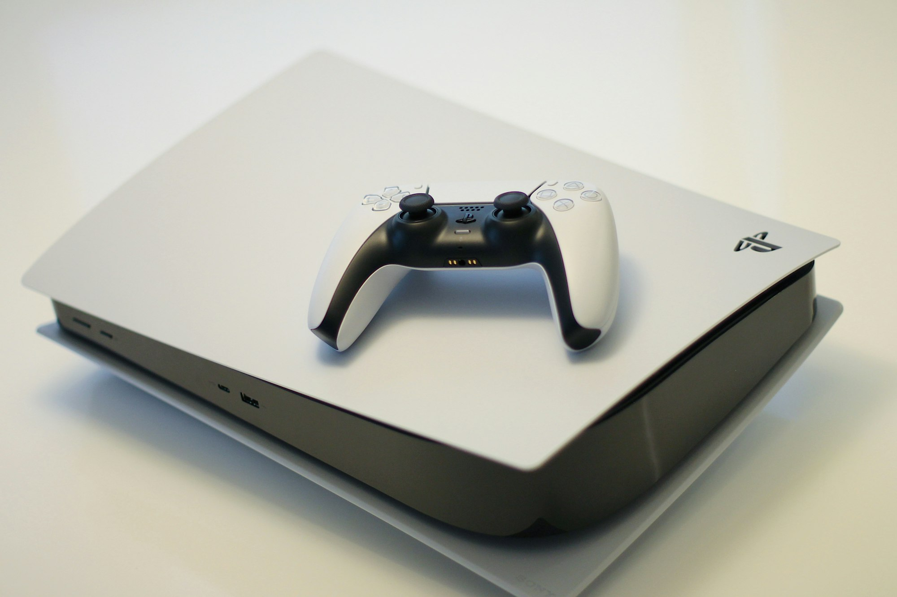

Wie (net als ik) had gegokt dat dit het jaar van de Switch 2 zou worden, kan het wel eens mis hebben. De Nintendo-console zou iets langer op zich laten wachten. Achteraf gezien hadden we dat kunnen verwachten - ik leg je straks uit waarom.

Het is een week gevuld met de grote drie consolemakers. Want naast Nintendo Switch-geruchten kondigde Xbox zijn koerswissel aan. En Sony teleurstelde veel fans door alvast te verklappen dat we bepaalde games dit jaar niet meer hoeven te verwachten.

_Deze editie van Gamepraat telt 1.011 woorden en neemt vijf minuten van je tijd in beslag. Vind je dit leuk om te lezen? Neem een betaald abonnement, doneer eenmalig iets_ [_op Petje Af_](https://petjeaf.com/gamepraat?ref=gamepraat.nl) _of stuur de nieuwsbrief door naar een vriend! Dat helpt allemaal ontzettend._

## 'De Switch 2 komt in Q1 2025’

De verkoopdatum van de Nintendo Switch 2 zou zijn vertraagd naar het eerste kwartaal van 2025. Dat is een gerucht, maar wel één met zoveel bronnen dat je het eigenlijk wel als waarheid kunt aannemen: [Eurogamer](https://www.eurogamer.net/nintendo-switch-2-release-date-now-q1-2025-report?ref=gamepraat.nl), [VGC](https://www.videogameschronicle.com/news/nintendo-switch-2-could-now-launch-in-2025-its-claimed/?ref=gamepraat.nl), [Bloomberg](https://www.bloomberg.com/news/articles/2024-02-17/nintendo-is-telling-game-publishers-switch-2-will-be-delayed?ref=gamepraat.nl) hebben het afzonderlijk van elkaar gehoord van bronnen, nadat de Braziliaanse journalist Pedro Henrique Lutti Lippe met het nieuws naar buiten kwam.

Lange tijd werd verwacht dat de console in 2024 zou verschijnen. Dat dit ambitieus was, bleek recent bij het lekken van de productie-aantallen eigenlijk al. Nintendo zou voor dit jaar [10 miljoen exemplaren](https://www.bloomberg.com/news/articles/2024-01-31/nintendo-s-record-gain-tested-in-wait-for-switch-2-tech-watch?ref=gamepraat.nl) hebben besteld. Dat zou veel te weinig zijn: de Nintendo Switch 1 werd in het eerste jaar 13,2 miljoen keer verkocht en vermoedelijk doet de Switch 2 het straks zelfs iets beter dan dat.

Een verkoop in 2025 zorgt ervoor dat Nintendo in 2025 kan blijven produceren om goed aan de vraag in dat gehele jaar te voldoen. Toch is het jammer voor de gamegigant: ze missen de feestdagen waarin altijd veel consoles worden verkocht.

## Vier Xbox-games naar PlayStation 5 en Switch

We hadden het in de [vorige editie van Gamepraat](/dit-gaat-er-deze-week-bij-xbox-veranderen) al over de plannen van Xbox, die grotendeels naar buiten waren gelekt. Inmiddels heeft het bedrijf officieel het volgende aangekondigd:

-   **Vier Xbox-games komen naar de Switch en PS5.** Ze zeggen niet welke, maar het zijn twee kleinere games en twee communitygames, allemaal meer dan een jaar oud. Eerdere geruchten wijzen op **Hi-Fi Rush**, **Pentiment** en **Sea of Thieves**. Als vierde lijkt dan **Grounded** een logische, die voldoet aan alle kwalificaties.
-   **Volgens Microsoft is dat geen strategiewissel.** Spencer: "We kijken altijd naar of een game zich leent voor andere platformen." Ik denk dat hij vooral aandeelhouders hier naar de mond praat, om duidelijk te maken dat deze wissel geen 'verlies' is.
-   **Activision Blizzard-games komen naar Game Pass.** Op 28 maart is **Diablo IV** de eerste game die naar de dienst komt. Het is afwachten hoe ze Call of Duty gaan aanpakken: tijdens alle overname-rechtszaken van vorig jaar waren waakhonden bang dat Call of Duty of Game Pass een oneerlijk voordeel op de cloudgamingmarkt zou geven.
-   **Dit najaar horen we over een nieuwe Xbox.** Details zijn schaars, maar volgens Microsoft gaan ze 'de grootste technologische sprong bij een console ooit maken'. Grote woorden - en ook een beetje marketing. We gaan zien wat het betekent.

[Bekijk ingesloten media](https://www.youtube.com/embed/v3EfjT2oqXw?feature=oembed)

## Geen grote PlayStation-sequels meer tot eind maart 2025

Bij de presentatie van de [kwartaalcijfers](https://www.sony.com/en/SonyInfo/IR/library/Sony_Quarterly_Securities_Report_2023Q3.pdf?ref=gamepraat.nl) zei Sony twee steekhoudende dingen over de PlayStation 5. Ten eerste zou de console zich nu in een later stadium van zijn leven bevinden, wat betekent dat het niet héél veel jaar meer duurt tot een PlayStation 6.

Het tweede punt was spraakmakender: volgens de consolemaker verschijnen er in het komende fiscale jaar 'geen nieuwe delen in grote franchises'. Met andere woorden: tot en met maart 2025 kun je niet rekenen op _God of War 3_, _Spider-Man 3_, _The Last of Us: Part III_ of een nieuwe _Ratchet & Clank_.

Photo by [Kerde Severin](https://unsplash.com/@kseverin?ref=gamepraat.nl) / [Unsplash](https://unsplash.com/?utm_source=ghost&utm_medium=referral&utm_campaign=api-credit)

Daarmee belooft het een droog gamejaar te worden - na een najaar waarbij de console ook niet heel veel first-party-titels had. Al kun je afvragen wat een 'grote franchise' is. _Astro Bot_ is het in elk geval niet als we de geruchten mogen geloven, want daar zou dit jaar een nieuw deel voor gepland staan.

Je kunt afvragen of Sony hier probeerde in te spelen op Nintendo’s plannen, door games op te sparen tot een paar maanden na de piek van de Switch 2. Die strategie zou dan ernstig zijn verstoord door het recente Switch-uitstel.

## Elders geschreven

-   Ik was op bezoek bij Bright en mocht daar de Apple Vision Pro testen. [Mijn bevindingen las je deze week in AD](https://www.ad.nl/tech/apple-bril-van-3500-euro-veel-beter-dan-goedkopere-concurrent-waanzinnig-mooi-beeld~ad68e65b/?ref=gamepraat.nl).
-   Bij NRC maakte ik deze week mijn debuut in de weekendkrant met een recensie van _Persona 3 Reload_. Op papier, je kunt hem vandaag nog kopen als je snel bent!
-   Daarnaast heb ik een nieuwe opdrachtgever: Kidsweek. Daar ga ik alle relevante kindvriendelijke games recenseren. De eerste: [Mario vs. Donkey Kong op de Switch](https://twitter.com/BasVroegop/status/1758126771809956340?ref=gamepraat.nl).

## Verder interessant deze week

-   Later deze maand verschijnt Final Fantasy VII Rebirth. YouTuber en muzikant Alex Moukala mocht hem alvast spelen en maakte deze uitstekende analyse over de soundtrack:

[Bekijk ingesloten media](https://www.youtube.com/embed/o5yqYV-KXhE?feature=oembed)

-   Er is een eerste trailer van X-Men ’97, het vervolg op de klassieke tekenfilm op Fox Kids. Heel veel zin in.

[Bekijk ingesloten media](https://www.youtube.com/embed/pv3Ss8o9gGQ?feature=oembed)

-   Veel toffe bundels bij Humble Bundle deze week, waar je [alle Mega Man-games voor 18 euro koopt](https://www.humblebundle.com/games/mega-man-franchise-pack?partner=basvroegop&ref=gamepraat.nl), of [alle Street Fighter-games en een berg arcade-titels](https://www.humblebundle.com/games/capcom-cup-fighters-classics-pack?partner=basvroegop&ref=gamepraat.nl) voor hetzelfde bedrag. (Dit zijn affiliate-links, als je daar op klikt en ze koopt help je mij een handje. Niet de hoofdreden waarom ik deze bundels deel, ik vond ze oprecht gaaf.)
-   De bedenker van _Suikoden_ en de aankomende spirituele opvolger _Eiyuden Chronicles_ [is overleden](https://discord.com/channels/1031277026209955900/1112034718041509998/1207302977946386433?ref=gamepraat.nl). Hij was nog maar 55 jaar oud en had gezondheidsproblemen.
-   Alle pre-orders van zowel de [Analogue Pocket](https://store.analogue.co/?ref=gamepraat.nl) als de [Playdate](https://play.date/?ref=gamepraat.nl) zijn verstuurd. Je kunt de indie-handhelds dus kopen zonder dat je maanden op levering hoeft te wachten.

Tot de volgende keer!
