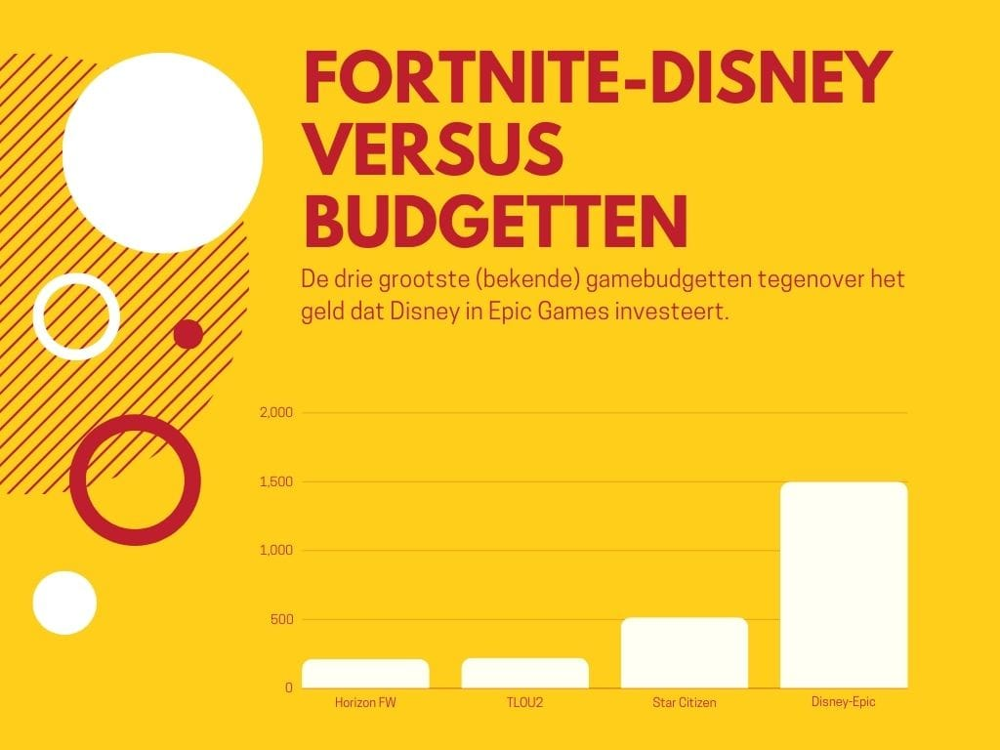

Aankomende donderdag kondigt Microsoft verschuivingen binnen de Xbox-divisie aan. De hoofdpunten lijken al te zijn gelekt, ik zet ze in deze nieuwsbrief voor je op een rij.

Verder moeten we het nog even hebben over de grote deal tussen Disney en Fortnite. Met een bedrag van 1,5 miljard dollar lijkt die onredelijk, maar eigenlijk is dit een ingenieuze manier om het veilig te spelen.

_Deze editie van Gamepraat telt 898 woorden en neemt vier minuten van je tijd in beslag. Vind je dit leuk om te lezen? Neem een betaald abonnement, doneer eenmalig iets_ [_op Petje Af_](https://petjeaf.com/gamepraat?ref=gamepraat.nl) _of stuur de nieuwsbrief door naar een vriend! Dat helpt allemaal ontzettend._

## Dit zijn de plannen bij Xbox

Afgelopen week doken al geruchten op over interne verschuivingen bij Microsoft. Games die ooit exclusief waren voor Xbox zouden gepland staan voor concurrerende platformen. Het maakt de strategie bij Xbox vergelijkbaar met die van bijvoorbeeld Microsoft Office: hoewel Windows en macOS concurrerende besturingssystemen zijn, kun je Office ook gewoon op je MacBook draaien.

De manier waarop Microsoft zijn plannen presenteert is wat gek: niet in een persbericht of een grote presentatie, maar als onderdeel van hun eigen Xbox-podcast. Het zegt wellicht iets over de complexiteit van de aankondigingen, want een podcast geeft een presentator ruimte om vragen te stellen en de diepte in te gaan.

> Please join us for a special edition of the Official Xbox Podcast.
>
> Hear from Phil Spencer, Sarah Bond and Matt Booty as they share updates on the Xbox business. [pic.twitter.com/TxwWJVUbgx](https://t.co/TxwWJVUbgx?ref=gamepraat.nl)
>
> — Xbox (@Xbox) [February 12, 2024](https://twitter.com/Xbox/status/1757102346000286155?ref_src=twsrc%5Etfw&ref=gamepraat.nl)

Niet dat we zo lang hoeven te wachten, want bronnen hebben aan [The Verge](https://www.theverge.com/2024/2/12/24067370/microsoft-xbox-playstation-switch-games-future-hardware?ref=gamepraat.nl) al de grootste aankondigingen verklapt. Die zijn als volgt:

-   Een selectie aan Xbox-games komt naar de PlayStation 5 en Nintendo Switch.
-   De eerste titels zouden **_Hi-Fi Rush_** en **_Pentiment_** zijn. Kleinere games die naast de PS5 ook goed op de Switch kunnen draaien, vermoed ik.
-   Er zou ook worden gewerkt aan een port van **_Sea of Thieves_** voor 'andere consoles dan de Xbox'.
-   De bronnen hinten ook naar een PS5-versie van **_Starfield_**. Althans, ik ga er van uit dat die game alleen op de Sony-console kan draaien, hij ziet er te grafisch intensief uit voor de Switch.

Bovenstaande games zijn een goede collectie om zo’n multiplatformstrategie mee te testen: we hebben twee kleinere games, een service-game en een grote AAA-titel. Vermoedelijk horen we pas over meer games zodra Microsoft de cijfers achter deze ports heeft kunnen analyseren, om te zien of het loont om naar de concurrent te stappen. En of het verschil maakt of ze alleen inzetten op de PS5 of ook op de Switch.

Microsoft zou personeel hebben verzekerd dat dit niets zegt over hun hardware-strategie: de verkoop van Xbox-consoles blijft een prioriteit. Hopelijk blijft het zo, want op het moment is de Xbox de enige concurrent op de high-end-consolemarkt - Nintendo richt zich op een eigen doelgroep met juist goedkopere hardware.

Valt de Xbox weg, dan dreigt een monopolie in handen van Sony. En dat kan ertoe leiden dat PlayStations duurder worden en games minder aandacht krijgen tijdens de ontwikkeling.

## 1,5 miljard dollar voor Disney in Fortnite is een koopje

Disney heeft 1,5 miljard dollar geïnvesteerd in Epic Games. Het mediabedrijf wil dat de gamestudio een 'persistent universum' gaat bouwen dat is gelinkt aan _Fortnite_. Vermoedelijk moeten we daarbij denken aan hoe Fortnite laatst samen met _Lego_ nieuwe gamemodi heeft ontwikkeld. Eigenlijk zijn dat zelfstandige games, maar je start ze op vanuit Fortnite.

Anderhalf miljard dollar is heel veel geld. Om het in perspectief te plaatsen, de ontwikkeling van _The Last of Us Part II_ kostte 220 miljoen dollar 7,5 keer zo weinig als wat nu voor de Fortnite-deal wordt betaald. Het is makkelijk om dan te denken dat Disney voor dat geld net zo goed 7 hele goede games had kunnen ontwikkelen, maar ze betalen in dit geval voor iets heel kostbaars: zekerheid.

Op het moment is het krap op de gamesmarkt. Bedrijven ontslaan en masse personeel omdat de vraag minder is geworden, waardoor ook investeerders niet snel geld in games durven te steken. De enige manier om geld los te weken is door iets te hebben waarvan je redelijk zeker bent dat het goed zal verkopen. De afgelopen jaren waren dat bijvoorbeeld games in bekende franchises, maar inmiddels blijkt zelfs dat niet een zekere zaak: zowel _Marvel’s Avengers_ als _Suicide Squad_, gebaseerd op populaire superheldenreeksen, waren na jaren ontwikkeling een flop.

Met de _Fortnite_\-deal heeft Disney iets gevonden dat nog meer zekerheid biedt. Niet alleen zal dit alternatieve game-universum worden gevuld met hun bekende personages, het is ook nog eens gelinkt aan een game die nu al populair is. De kans op een flop is in dit geval nihil. En omdat die 1,5 miljard dollar een investering is, kan Disney nog jaren meesnoepen van de _Fortnite_\-hit.

## Verder interessant deze week

-   Dead Cells krijgt zijn [laatste update](https://store.steampowered.com/news/app/588650/view/4020094639145168178?ref=gamepraat.nl). De game kreeg maar liefst 35 contentupdates sinds hij in 2018 verscheen.
-   [Volgens Ubisoft](https://www.eurogamer.net/ubisoft-boss-says-70-skull-and-bones-is-a-quadruple-a-live-service-game?ref=gamepraat.nl) is Skull & Bones een AAAA-game. Vier A’s, dus.
-   Deze nieuwe JRPG van Final Fantasy-veteranen ziet er gaaf uit.

[Bekijk ingesloten media](https://www.youtube.com/embed/tfuvkUN5ByI?feature=oembed)

-   Gamejournalist Jason Schreier werkt aan een [nieuw boek](https://www.hachettebookgroup.com/titles/jason-schreier/play-nice/9781538725429/?ref=gamepraat.nl), ditmaal over hoe het er binnen Blizzard aan toe ging. Gezien zijn connecties binnen bedrijven erg benieuwd naar wat voor onthullingen hier in gaan staan.
-   Er is een demo voor Final Fantasy VII Rebirth. De grootste hit daarbinnen: de piano-minigame.

[Bekijk ingesloten media](https://www.youtube.com/embed/mml2UeggbXQ?feature=oembed)

Tot de volgende keer!
