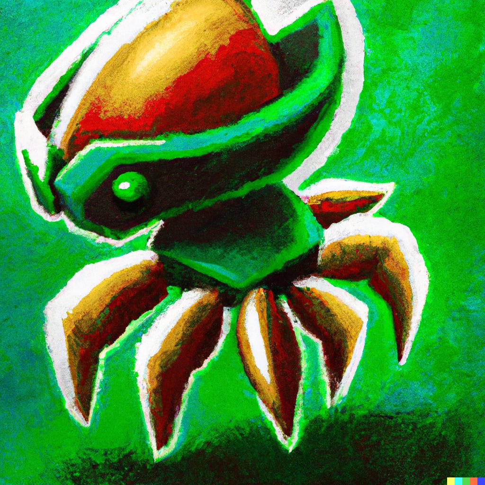

**Verder: de kannibalisatie van Game Pass en de Metroid-renaissance.**

Fijn dat je weer leest! Wat denk jij: als je game op Game Pass staat, stijgen of dalen dan de losse verkopen? De meningen hierover zijn kennelijk zelfs binnen Microsoft verdeeld.

Verder hebben we het deze week veel over Nintendo, dat een gigantische waslijst aan nieuwe games presenteerde. Waaronder een oorlogsgame die in april uitkomt, waarbij ze hun stinkende best doen om het niet over die betreffende oorlog te hebben. En het gaat uiteraard over _Metroid Prime Remastered_, wat misschien wel één van mijn favoriete games van 2023 gaat worden.

Deze editie van de nieuwsbrief telt 1.426 woorden en neemt zo'n 7 minuten van je tijd in beslag. We trappen af!

[Subscribe](#/portal/signup)

## Game Pass is slecht, nee goed, nee toch slecht voor je gameverkoop

-   De losse verkoop van games neemt af als ze aan Game Pass worden toegevoegd, aldus een bericht van Microsoft aan een marktwaakhond.
-   Met die verklaring hoopt Microsoft de situatie rond de Activision-overname te bekoelen.
-   De uitspraak staat haaks op wat eerder werd gezegd: volgens topman Phil Spencer neemt de losse gameverkoop juist toe nadat ze op Game Pass verschijnen.

In een [rapport](https://www.gamesindustry.biz/microsoft-confirms-game-pass-cannibalizes-sales?ref=gamepraat.nl) van de Britse Competitions and Market Authority staat dat "Microsoft een interne analyse heeft gedeeld, waarin staat dat gameverkoop met \[gecensureerd\]% afneemt in de twaalf maanden nadat die titel op Game Pass verscheen".

Dat klinkt logisch: als je game op een populaire abonnementsdienst staat, zullen minder mensen hem kopen. Ze hebben immers een goedkopere manier om datzelfde spel te spelen. Een film die op Netflix staat koop je ook niet zomaar los. Maar het is juist deze voor de hand liggende conclusie die Microsoft jarenlang betwist heeft.

Meerdere topmensen binnen het bedrijf, waaronder Xbox-baas Phil Spencer, [beweerden eerder](https://www.resetera.com/threads/phil-spencer-putting-aaa-games-in-game-pass-leads-to-a-significant-increase-in-sales.80711/?ref=gamepraat.nl) dat de losse verkoop van games juist toenam. Volgens hen was Game Pass een soort promotiekanaal: veel mensen zouden een game na te hebben gespeeld los kopen, zodat ze hem nog steeds hebben zodra hij van Game Pass verdwijnt.

De reden voor de afwijkende uitspraken is wat doorzichtig: bij de toezichthouder moet Microsoft zich klein en nederig opstellen, dus zullen ze ieder succes bagataliseren. Hoe kleiner ze lijken, hoe groter de kans dat een overname van Activision niet gezien wordt als machtsmisbruik. Tegelijkertijd probeerde Spencer juist gameontwikkelaars te paaien met de belofte van gouden bergen als games op hun abonnementsdienst verschenen: ze zouden Game Pass-geld én veel losse verkopen binnenslepen.

Waarschijnlijk zit de werkelijkheid ergens in het midden. Grote first-party-games als _Gears 5_ zullen amper los verkopen, omdat ze al jarenlang op Game Pass kleven en daar niet snel zullen verdwijnen. Maar multiplatformgames hebben wellicht wat aan de promotie op Game Pass. Dat merk ik ook bij mezelf: vaak zie ik iets tofs op de dienst, waarna ik het alsnog los koop om onderweg te spelen op een Switch of Steam Deck.

## Metroid Prime Remastered is haast een remake

-   Verrassing! Nintendo bracht ineens een remaster van de eerste _Metroid Prime_ uit.
-   Het is de tweede grote _Metroid_\-game voor de Switch, nadat deze reeks jarenlang werd verwaarloosd.
-   Het is een opmars naar _Metroid Prime 4_, waarover we nog steeds angstvallig weinig horen na jaren aan ontwikkeling.

Ik weet dat het februari is, maar de remaster van Metroid Prime kan wel één van mijn favoriete games dit jaar worden. Dat komt deels door de oude botten waar hij op is gebouwd: het originele _Prime_ was zijn tijd vooruit en voelt anno 2023 nog steeds als een moderne game, waarin alles draait om verkennen, verdwalen en langzaamaan sterker worden.

Maar technisch gezien is het ook een uitmuntende remaster. Naast betere textures is ook de belichting onder handen genomen, waardoor het spel spannender aanvoelt dan het origineel. Soms doet Prime denken aan de Alien-films, ooit een grote inspiratiebron voor de eerste games. In een [review op Gamer.nl](https://gamer.nl/artikelen/review/metroid-prime-remastered-is-bijna-remake-waardig/?ref=gamepraat.nl) ga ik verder de diepte in, waar ik voor het eerst in twee jaar weer eens een stukje tikte.

_Bovenstaande illustratie werd gegenereerd door kunstmatige intelligentie DALL-E._

De remaster voelt ook als de aanloop naar Metroid Prime 4, dat al jaren in een soort ontwikkelingshel lijkt te zitten. De game werd in 2017 aangekondigd, waarna in 2019 bleek dat de gehele ontwikkeling opnieuw was gestart. Sindsdien zijn vier jaar gepasseerd met nagenoeg geen nieuwe informatie.

Maar als we nu een remaster van deel 1 hebben, dan kan het zomaar dat we alvast warm worden gemaakt voor de verschijning van deel 4 in de tweede helft van 2023. Of ze in de tussentijd ook de andere twee games gaan herzien? Ik hoop het wel, maar wellicht dat ze die games ook overslaan uit angst dat spelers opgebrand raken voordat de nieuwste uitkomt.

[Bekijk ingesloten media](https://www.youtube-nocookie.com/embed/e9OQOJC1QII?rel=0&autoplay=0&showinfo=0&enablejsapi=0)

## Don't mention the (Advance War(s)!

-   De remake van Nintendo's GBA-games Advance Wars 1 en 2 verschijnt in april.
-   De game ligt al een tijdje klaar, maar werd wegens de oorlog in Oekraïne uitgesteld
-   Bij de nieuwe aankondiging was bijna iedere verwijzing naar oorlogsvoering verwijderd.

De meeste Nintendo-games gaan niet over 'echte' oorlogen. Schietgame _Splatoon_ is daar tekenend door. Waar genregenoten als _Call of Duty_ je naar het midden-oosten sturen om recente oorlogen na te spelen, speel je bij Nintendo met verfpistolen. Het bedrijf probeert zijn series zo familievriendelijk en ontdaan van politiek mogelijk te houden.

De _Advance Wars_\-games voor de Game Boy Advance en later DS schuurden misschien het meeste tegen recente oorlogen aan. De eerste titels waren zonder bloed en vrolijk gekleurd, waarin fictieve landen het tegen elkaar opnamen. Maar de gekozen esthetiek deed soms wel denken aan een strijd tussen Rusland en westerse landen als de Verenigde Staten. Bij de westerse lokalisatie veranderde het Red Star-leger ook al in het Orange Star-leger, omdat de rode ster in de Sovjet-Unie werd gebruikt.

De eerste twee games zouden een remake krijgen in het begin van 2022, maar die werd voor onbepaalde tijd uitgesteld toen de oorlog in Oekraïne begon. Het werd Nintendo te heet onder de voeten. Nu belooft het bedrijf dat de game in april dit jaar verschijnt, maar de manier waarop ze dat deden is opvallend. Kijk maar eens naar onderstaande trailer:

[Bekijk ingesloten media](https://www.youtube-nocookie.com/embed/AF6n9-bqV8g?rel=0&autoplay=0&showinfo=0&enablejsapi=0)

De voice-over doet zijn best om geen enkel moment de gewelddadige ondertoon van de game - waarin je turn-based oorlog voert - te benoemen. In plaats daarvan is het nu "kleurrijke, beurtelingse, tactische actie waarbij je jouw strategische brein moet gebruiken". Een beschrijving die ook prima bij een nieuwe _Brain Training_ zou passen. Hoofdrolspelers Andy, Max en Sami worden geframed in een vrolijke setting. Ja, ze rijden uiteindelijk weg op een tank, maar dat doen ze wegfietsen in een Spielberg-film. Dit is de meest pacifistische trailer voor een oorlogsgame ooit.

Je merkt dat ze bij Nintendo bang zijn een verkeerde snaar te raken door nu een oorlogsgame uit te brengen. Dat zal in de praktijk waarschijnlijk meevallen: buiten Nintendo hebben tientallen uitgevers het afgelopen jaar zulke spellen op de markt gebracht, met bijna nooit controverse.

## Verdere Nintendo-aankondigingen

Metroid en Advance Wars hierboven zaten in Nintendo's grote Direct-presentatie. Het volgende kwam hierin ook langs:

-   **Splatoon 3,** **Fire Emblem Engage**, **Dead Cells** en **Xenoblade Chronicles 3** krijgen nieuwe DLC.

-   **Pikmin 4** werd getoond, waarin je nu ook een soort hond kunt commanderen.

-   Nintendo Switch Online-abonnees kunnen nu **Game Boy-games** spelen. Heb je de duurdere Expansion Pack, dan heb je ook **Game Boy Advance**\-titels.

-   **Mario Kart krijgt** een nieuwe track gebaseerd op Yoshi's Island. Daarnaast wordt Birdo een speelbaar personage.

-   We kregen de eerste echt uitgebreide gameplaytrailer van **The Legend of Zelda: Tears of the Kingdom**. Een trailer van **Bayonetta Origins** liet zien hoe vechten in die game precies werkt.

    [Bekijk ingesloten media](https://www.youtube-nocookie.com/embed/fYZuiFDQwQw?rel=0&autoplay=0&showinfo=0&enablejsapi=0)

-   Er zijn demo's te downloaden van JRPG's **Octopath Traveler 2** en **Sea of Stars**. Die laatste verschijnt volledig op 26 augustus.

-   Een comeback voor de Japanse studio Level 5, die eerder het westen leek af te zweren: ze maken de nieuwe jrpg **DecaPolice**, een vervolg op lifesim **Fantasy Life** en werken aan een nieuwe **Professor Layton**\-game.

-   GameCube-JRPG's **Baten Kaitos** en **Baten Kaitos Origins** krijgen deze zomer remasters.

-   Het geplande **Kirby’s Return to Dream Land Deluxe** is een remaster van een oude Wii-game, maar krijgt ook een extra epiloog met uneieke content.

-   De oude DS-rpg's **Etrian Odyssey 1, 2** en **3** worden ook gebundeld in een collectie. Jarenlang werd geroepen dat die games alleen op de DS werken, omdat ze veel gebruikmaken van de dubbele schermen.

## Ook interessant deze week

-   Pluto, een Japanse thriller-manga gebaseerd op Astro Boy, krijgt een anime op Netflix. De eerste trailer ziet er heel mooi uit.

    [Bekijk ingesloten media](https://www.youtube-nocookie.com/embed/KuUhYOyJn78?rel=0&autoplay=0&showinfo=0&enablejsapi=0)

-   Het was valentijnsdag, dus was er een officiële (maar niet canon) datinggame gebaseerd op Overwatch. Die heet, hoe het ook anders, [LoverWatch](https://loverwatch.gg/en-us?ref=gamepraat.nl).

[Subscribe now](#/portal/signup)
