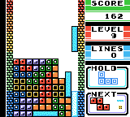

Je kan zeggen dat 2023 het jaar was van de grote games - en grote game-ontslagen. Of dat eerste in 2024 wordt geëvenaard moet nog blijken, maar we zijn al goed op weg om de ontslagrondes van afgelopen jaar in 2023 net zo hard door te zetten. Er werd afgelopen week flink gesneden in gamebedrijven.

Deze week duiken we dieper in die ontslagen en hebben we het over misschien wel de beste versie van Tetris.

_Gamepraat steunen? Dat kan met een betaald abonnement op deze nieuwsbrief of met_ [_een eenmalige donatie op Petje Af_](https://petjeaf.com/gamepraat?ref=gamepraat.nl)_._

[Subscribe](#/portal/signup)

## Massa-ontslagen bij Unity en Twitch

Unity, de maker van de gelijknamige engine die achter ontzettend veel games schuilt, wil het anders aanpakken. De CEO spreekt van een 'bedrijfsreset', waarbij 25 procent van het personeel op straat komt te staan. [Maar liefst 1.800 mensen](https://www.theverge.com/2024/1/8/24030695/unity-layoff-staff-25-percent?ref=gamepraat.nl). Het is alweer de vierde ontslagronde sinds 2022 bij het bedrijf. De vorige was in november vorig jaar, toen 265 mensen (3,8 procent van het bedrijf) werden ontslagen.

Gezien de invloed die Unity op de gamesector heeft, voelt het van buitenaf vreemd dat zulke extreme maatregelen worden getroffen om het bedrijf boven water te houden. Aan de andere kant: Unity werd ooit succesvol door zijn zeer betaalbare engine, in een tijd dat de Unreal Engine te duur was voor veel kleine indie-makers. Wellicht dat dit verdienmodel lastig te schalen is voor een bedrijf, vooral nu ook Unreal toegankelijker is geworden.

Unity was deze week niet de enige die in het personeelsbestand knipte: Amazons gamestreamsite Twitch [ontsloeg](https://www.bloomberg.com/news/articles/2024-01-09/amazon-s-twitch-to-cut-500-employees-about-35-of-staff?ref=gamepraat.nl) 500 mensen, ruim een derde van alle werknemers. De site zou te veel verlies draaien. Het nog aanwezige personeel is in paniek: zij hebben geen idee hoe ze met zo’n kleinere club de site nog goed draaiende kunnen houden.

Ook bij gamestudio [Playtika](https://www.calcalistech.com/ctechnews/article/skb6elt006?ref=gamepraat.nl) werden mensen ontslagen: 10 procent van het personeel, maar liefst 300 tot 400 werknemers. Playika is voor velen geen bekende naam, maar een grote speler in Israel waar ze vooral mobiele games bouwen.

## Dit is de beste versie van Tetris

Discussiëren over de beste versie van _Tetris_ is net zo riskant als een discussie over voetbal, politiek of het einde van _Game of Thrones_. Toch ga ik een poging doen iedereen te overtuigen van mijn gelijk: de beste versie van Tetris is één van de oudste en tegelijk nieuwste edities.

Rosy Retrospection is een romhack voor de allereerste _Tetris_ op de Game Boy die alle verbeteringen uit latere versies toevoegt. Zoals:

-   Je ziet met een schaduw waar je blokje valt.
-   Met het pijltje naar beneden laat je een blok meteen vallen.
-   Door op ‘select’ te drukken houd je een blok vast, om hem later met diezelfde knop weer te gebruiken.
-   Aan de rechterzijde zie je welke drie blokken als volgende naar beneden vallen.

Het is de versie van het spel die iedereen inmiddels gewend is, met de visuele stijl waar we allemaal nostalgische gevoelens van krijgen.

Onlangs is een nieuwe editie van die romhack verschenen: [Rosy Retrospection DX](https://www.romhacking.net/hacks/8259/?ref=gamepraat.nl). Deze geeft de game een kleurige visuele upgrade door er een Game Boy Color-titel van te maken. Het maakt het voor mij de beste manier om de game te spelen.

Hoe je hem speelt zit wat lastiger: wil je dat helemaal volgens het boekje doen, dan moet je iets zoals een Game Boy Operator gebruiken om je cartridge te dumpen op een pc en het hackbestand er overheen te patchen. Daarna kun je het spelen op een emulator of - als je net zo’n snob bent als ik - op een originele Game Boy met gemod scherm of een Analogue Pocket.

## Elders geschreven

Om niet in herhaling te vallen, hier wat korte links naar verhalen die ik elders over games schreef:

-   Ik recenseerde [_Prince of Persia: The Lost Crown_](https://gamer.nl/reviews/games/playstation/review-prince-of-persia-the-lost-crown-is-sterk-en-wat-ongebalanceerd/?ref=gamepraat.nl), een verrassend leuke metroidvania die het vooral van zijn actie moet hebben. De moeilijkheidsgraad is hier en daar wat gek gebalanceerd.
-   Onder _Final Fantasy XIV_\-spelers is al maandenlang discussie: is de game 'dood'? [Ik heb de feiten op een rij gezet](https://gamer.nl/achtergrond/achtergrond/achtergrond/is-final-fantasy-14-nou-dood-of-niet/?ref=gamepraat.nl).

## Verder interessant deze week

-   Deze week is [Games Done Quick](https://gamesdonequick.com/?ref=gamepraat.nl) weer begonnen! Een week lang spelen speedrunners hun favoriete games zo snel mogelijk uit op stream, om zo geld in te zamelen voor het goede doel. Zeg maar Serious Request voor gamers.

-   [Humble Bundle heeft een goede bundel met games voor een tientje](https://www.humblebundle.com/games/awesome-games-done-quick-2024?partner=basvroegop&ref=gamepraat.nl). Als je deze koopt gaat een deel van het bedrag naar Games Done Quick. Je krijgt _Bayonetta, Borderlands 2, Celeste, Sprawl, Bloodstained, Astalon_ en _Sonic Adventure 2_ (en _Battle_).

-   Op 17 januari komen _Golden Sun_ en _Golden Sun 2_ naar Nintendo Switch Online. Leuk extraatje: de linkfunctie van het spel wordt ondersteund, zodat je jouw savegame van de eerste kunt overzetten naar de tweede zonder lange codes over te typen.

    [Bekijk ingesloten media](https://www.youtube-nocookie.com/embed/SgrL9deh8yk?rel=0&autoplay=0&showinfo=0&enablejsapi=0)

-   _.hack//LINK_, een jrpg voor de PSP, heeft 14 jaar later eindelijk [een Engelse fanvertaling](https://dothacktranslate.wordpress.com/?ref=gamepraat.nl).

-   Mijn favoriete nieuwe serie is [Delicious in Dungeon](https://www.netflix.com/title/81564899?ref=gamepraat.nl). Over een groep RPG-avonturiers die in een diepe kerker leert hoe ze monsters kunnen opeten. Een soort nerdy kookprogramma waarbij je ook iets leert over hoe je gewoon eten bereidt.

-   Deze week verschijnt _Vertigo 2_ voor PSVR2. Dat is goed nieuws, gezien dit één van de beste PCVR-games ooit gemaakt is.

    [Bekijk ingesloten media](https://www.youtube-nocookie.com/embed/Pwq9OkJahhc?rel=0&autoplay=0&showinfo=0&enablejsapi=0)

-   Op 18 januari is een [Xbox Developer Direct](https://news.xbox.com/en-us/2024/01/09/xbox-developer-direct-2024/?ref=gamepraat.nl), waarbij geheid veel nieuwe games worden onthuld. Het gaat ook over ondermeer Indiana Jones, Hellblade 2, Avored en Ara.

Dat was ‘m weer, tot de volgende keer.

[Subscribe](#/portal/signup)
