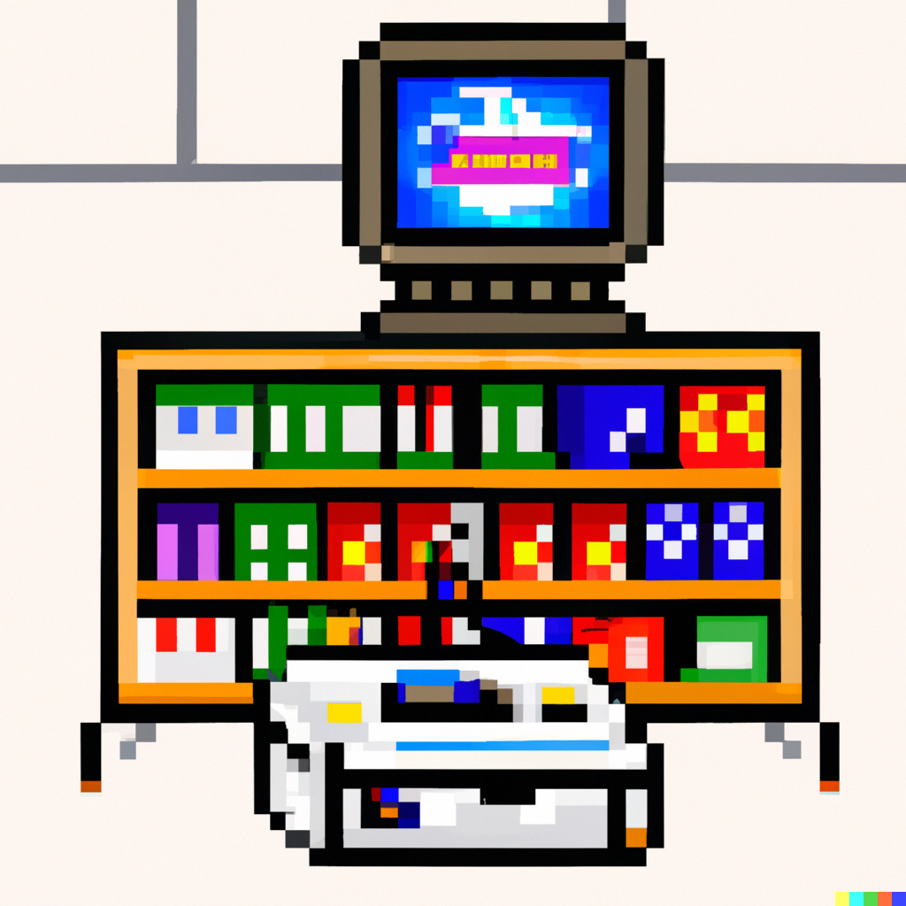
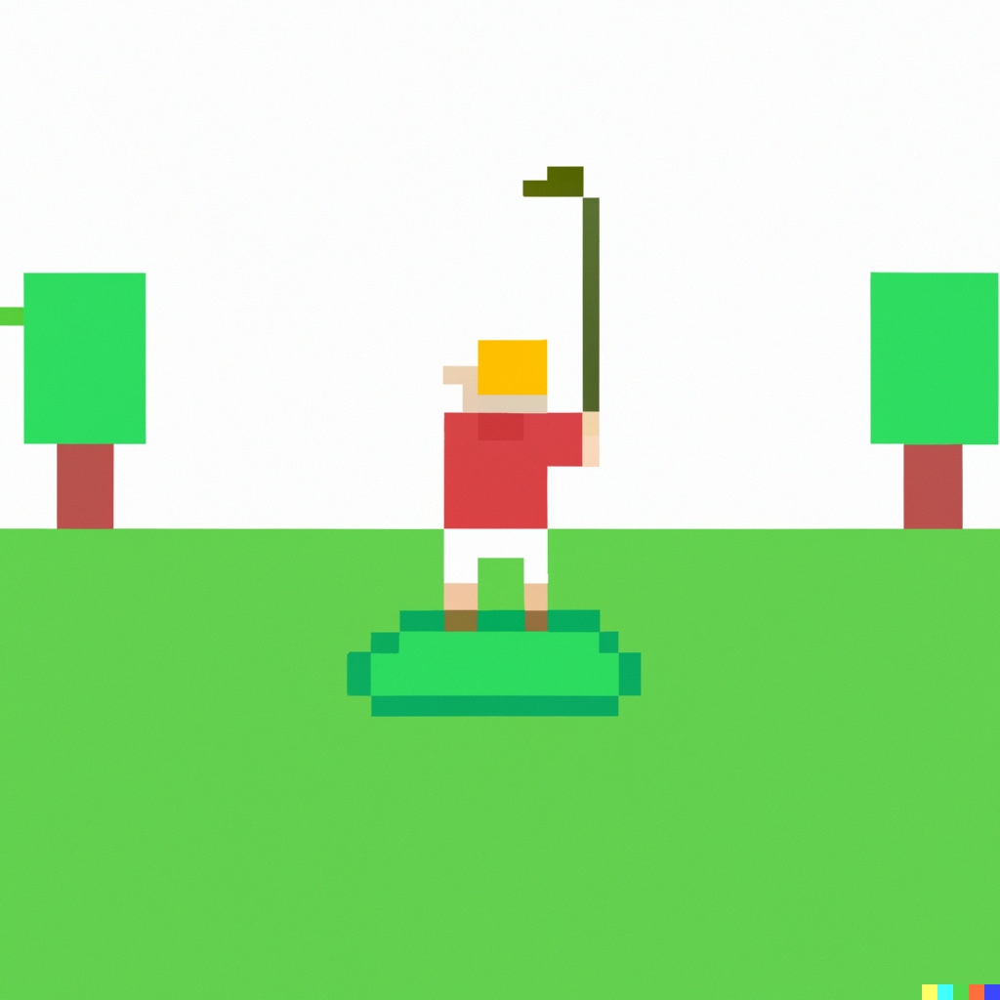

**Daarnaast: waarom willen we zo graag dat The Last of Us een goede serie krijgt en vijfduizend woorden over de Dreamcast in Nederland**

Nog de beste wensen, allemaal! Hopelijk hebben jullie tijdens de kerstvakantie allemaal een beetje de backlog weggewerkt. Zelf zit ik voor het eerst in jaren in een situatie dat ik niks hoef te reviewen, dus ben ik weer mijn comfortgame _Final Fantasy XIV_ ingedoken.

Het is eigenlijk best gek: de grootste gameblockbuster deze maand is niet een game, maar een tv-serie. We lijken als gamers allemaal een soort bewijsdrift te voelen bij een serie als _The Last of Us_, alsof die aan onze niet-gamende vrienden en familieleden moet bewijzen dat 'ons' medium echt mooie verhalen kan vertellen. Dat terwijl bij zo'n serie juist het interactieve element van zo'n verhaal verloren gaat. Ik denk dat het einde van _The Last of Us_ juist krachtig is omdat we zelf Joel mochten besturen.

Hieronder meer over de tv-serie van _The Last of Us_, waarvan ik het eerste seizoen alvast mocht kijken. Daarnaast gaat het deze week over een geweldig, uitgebreid verslag over de interne strubbelingen bij de Dreamcast-verkoop in Nederland en een geheime gamekamer die een schreeuw om hulp van de spelmakers lijkt te zijn.

Deze nieuwsbrief is 1.561 woorden, in ongeveer 8 minuten heb je hem uit. We trappen af!

[Subscribe now](#/portal/signup)

## The Last of Us is een goede serie voor ook je ouders

-   De tv-serie gebaseerd op _The Last of Us_ start op 16 januari bij HBO Max.
-   De eerste recensies zijn laaiend enthousiast.
-   Het is opvallend hoe grote delen van het originele gamescript zonder aanpassing in de serie zijn gebruikt en hoe goed dat werkt.

De tijd waarin we kunnen zeggen dat alle gameverfilmingen slecht zijn, is stiekem al een tijdje voorbij. _Detective Pikachu_, _Cyberpunk Edgerunners_, _Arcane_, _Castlevania_, _Dragon Age_ en _Sonic the Hedgehog_ hadden allemaal best prima adaptaties, die dikke voldoendes scoorden bij recensenten. Maar: de kans dat je één daarvan met je ouders zou delen als een goede kijktip, was alsnog nihil. Op dat vlak is _The Last of Us_ de eerste game-serie die écht goed genoeg is voor een universeel publiek.

Eerder deze week schreef ik [een recensie](https://www.ad.nl/games/vier-sterren-voor-hbos-the-last-of-us-spannend-gameverhaal-prachtig-omgezet-in-serie~a641406d/?ref=gamepraat.nl) van het eerste seizoen voor AD (vandaag in de krant!). De strekking: over het algemeen is het een fenomenale serie die leunt op de goede chemie tussen Joel (Pedro Pascal) en Ellie (Bella Ramsey). Af en toe zijn er wel wat game-y momenten die apart aanvoelen, zoals wanneer Ellie een omgevingspuzzel moet oplossen om Joel toegang te geven tot een kamer. Of als schutters steeds allemaal one-liners schreeuwen vanuit de verte.

Heb je de game al gespeeld, dan weet je eigenlijk al wat er in de serie gebeurt. Dat maakt het lastig om hem aan te raden bij gamers. Alleen de meest fanatieke The Last of Us-fan zal hem willen zien om de verschillen uit te vogelen en hier en daar wat extra lore op te zuigen - maar die fans gaan allang kijken, of ik hem aanraad of niet.

Maar zoals ik al zei: dit is een serie die ook goed en leuk genoeg is voor bijvoorbeeld je ouders. Het is de beste manier voor niet-gamers om dit verhaal eens te ervaren, en dat is ook wel eens leuk.

## Eindelijk weten we precies wat er met de Dreamcast in Nederland gebeurde

-   De Nederlandse gamegeschiedkundige [Wietse van Bruggen](https://www.gamegeschiedenis.nl/?ref=gamepraat.nl) heeft op rij gezet hoe de verkoop van de Dreamcast in Nederland tot stand kwam en is verlopen.
-   Het is een uitgebreid verhaal van duizenden woorden, waarvoor tientallen bronnen zijn geraadpleegd.
-   Eind jaren '90 bleek een harde strijd tussen distributeurs plaats te vinden, die streden voor het recht om Sega's nieuwste console te mogen verkopen.

De geschiedenis van de Amerikaanse en Japanse gamesectors is met de jaren goed in kaart gebracht: zoek je naar de levensloop van een obscure rpg-ontwikkelaar of een oud Nintendo-tijdschrift, dan staat het internet vol met artikelen en video's die het voor je uitleggen. Maar als je hetzelfde bij Nederlandse clubs doet, dan vang je bot.

Logisch ook, want er zijn maar weinig bronnen over wat er in Nederland gebeurde met games. Wie de archieven induikt vindt een paar vakbladen en de _Power Unlimited_, en die zijn moeilijk terug te vinden. Dat maakt het werk van Wietse zo gaaf om te zien: hij zat dagenlang bij de Koninklijke Bibliotheek, waar hij al die oude bladen heeft uitgeplozen om de onderhandelingen over de Nederlandse Dreamcast-verkoop bij retailers in kaart te brengen. In de [Spelkost-Discord](https://discord.gg/5uzfmXdwsG?ref=gamepraat.nl) deelde hij ook steeds foto's en screenshots van oude dingen die hij tegenkwam.

_Illustratie gemaakt door de kunstmatige intelligentie DALL-E._

Zijn grote Dreamcast-navertelling is inmiddels af en online te lezen. Het is een sage, waarin twee distributiereuzen vochten voor het recht om de grote nieuwe console te mogen verkopen en mogelijk een miljoenenwinst te boeken. Maar tegelijkertijd voelt iedereen de hete adem van Sony, die met zijn PlayStation 2 dreigt de markt weg te kapen voordat de investeringen terugverdiend kunnen worden. Een verhaal dat je vooral zal boeien als je in die tijd gamer was - maar ik vermoed dat veel nieuwsbrieflezers dat wel waren.

Ik had Wietse gevraagd of het verhaal volledig in de nieuwsbrief kon, wat hij helemaal prima vond, maar gezien de lengte van ruim vijfduizend woorden is het denk ik handiger om alles op zijn site terug te lezen. [Geniet er van!](https://www.gamegeschiedenis.nl/2023/01/hoe-de-sega-dreamcast-bijna-aan-nederland-voorbij-ging/?ref=gamepraat.nl)

## Sports Story bevat een geheime kamer vol ontevreden gameontwikkelaars

-   In de nieuwe Switch-game Sports Story zit een geheime kamer met gameontwikkelaars.
-   Het is een vaker terugkerend fenomeen: in de Pokémon-games vind je bijvoorbeeld vaak een huisje waar ontwikkelaar Game Freak vertelt over hoe ze de game hebben gebouwd.
-   De geheime studio van Sports Story is echter grimmig gestemd: personeel moppert tegen elkaar en vertelt hoe allerlei functies geschrapt moesten worden nadat het spel meermaals was uitgesteld.
-   Het dialoog kan wel eens een kern van waarheid bevatten: de game is na verschijning bekritiseerd om alle punten die in de geheime gamekamer aan bod komen.

Zet een paar dozen op de juiste plek, loop een deur in en uit en je kunt ineens naar de geheime kamer van _Sports Story_. Daar vind je de fictieve gameontwikkelaar Cold Cartridge, die noest werkt aan een nieuwe game.

Goed gaat dat niet, want bij binnenkomst loopt een gesprek over de ontwikkeling van die game al snel uit de hand. "Onze game kan ieder moment uitkomen" zegt één van de personages. "Dat zei je vorig jaar ook al", antwoordt een ander vals. "Je zou kunnen zeggen dat ons ontwikkelproces van stroef verloopt".

_Illustratie gemaakt door de kunstmatige intelligentie DALL-E._

Het fictieve team van Cold Cartridge raakt al snel beland in gekissebis. Ze mopperen hoe de game teveel functies heeft om het ontwikkelproces goed te doen verlopen, dat bugs maar niet worden opgelost en dat bijvoorbeeld de schrijver niet met zijn werk verder kan omdat het cutscene-systeem maar niet wordt afgemaakt. Het is een ruimte met mensen vol afgunst naar elkaar.

Cold Cartridge bestaat niet echt, maar het is makkelijk om je voor te stellen dat het dialoog op de makers van _Sports Story_ zelf slaat. Dat zie je alleen al terug in hun fictieve game _GALF_. Vermoedelijk is dat een golfgame, en SideBar Games is zelf juist groot geworden met _Golf Story_.

Ook als je _Sports Story_ speelt, zie je dat veel van de klachten van de NPC's toe te schrijven aan deze game. Met een gemiddelde score van 57 van de 100 is het spel slecht ontvangen. Recensenten klagen onder andere over een te breed scala aan half uitgewerkte dingen om te doen, iets waar personeel van Cold Cartridge ook over begint.

Je kunt het simpelweg fictie noemen en de gelijkenissen met de echte game toeval noemen, maar de kamer valt te veel uit de toon met de rest van de game om zomaar een grapje te zijn. De Cold Cartridge-kamer voelt als een guerrilla-actie van personeel, dat het moeizame ontwikkelproces op één of andere manier wilde vastleggen. Een schreeuw om hulp verstopt in de code.

## Dingen die ik ook tof vond deze week

-   De anime-serie Trigun was eind jaren '90 een grote hit die ik zelf eigenlijk nooit heb gezien. Wel heb ik de eerste aflevering gekeken van de reboot **Trigun Stampede**. En jemig, die is prachtig. De gehele serie is CGI, wat bij anime normaliter zelden goed afloopt. Maar de studio hierachter weet dit medium perfect toe te passen. De trucs die ze gebruiken doen ook een beetje denken aan Dragon Ball FighterZ, dat op slimme wijze 3D gebruikte om een 2D-stijl na te bootsen. [Hier een Twitter-draadje met de coolste animatie in aflevering één](https://twitter.com/BasVroegop/status/1612446154880327680?ref=gamepraat.nl).
-   [Op een stream](https://www.twitch.tv/videos/1697360283?ref=gamepraat.nl) zag ik deze week een SNES-game die ik nog helemaal niet kende: **Super Back to the Future II**. Filmgames stonden toen al bekend als rampprojecten, maar dit spel zag er onwijs mooi uit.
-   Er zou een nieuwe Sony-game [zijn gelekt](https://icon-era.com/threads/exclusive-new-sony-game-ip-leak-scifi-rpg-game-through-xdev.1810/?ref=gamepraat.nl). Details zijn schaars, maar volgens data van een gebruikte ontwikkeltool wordt het een scifi rpg. De game bevindt zich nog in een megavroege fase en de eerste screenshot oogt daarom niet bepaald mooi.
-   Niet per se leuk, wel interessant: _negen_ jaar nadat GamerGate een ding werd ging het weer even over de extremistische gamersbeweging. Een medewerker van gameconventie MAGFest had een [hondenfluitje](https://twitter.com/jbu3/status/1611028655257407488?ref=gamepraat.nl) voor GamerGaters op een bord gezet, waarbij de ethiek van gamesite Kotaku in twijfel werd getrokken.

[Subscribe](#/portal/signup)
