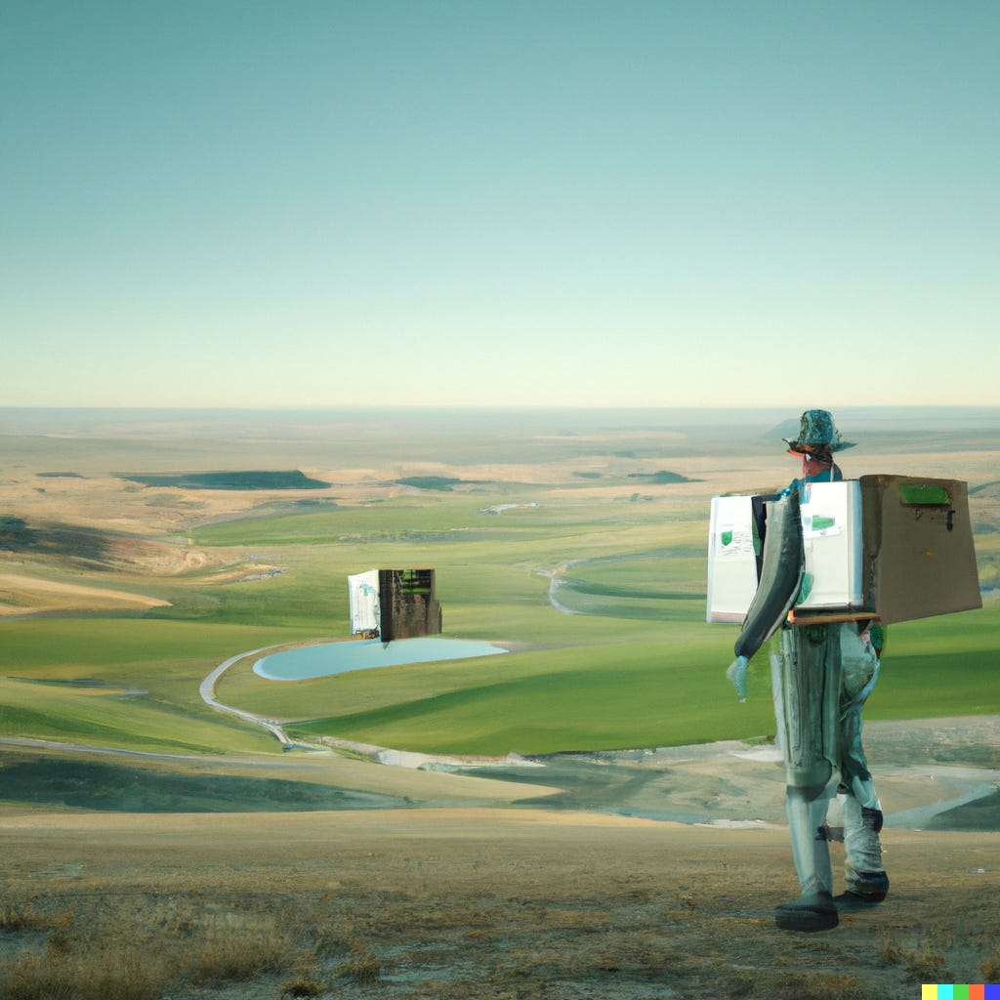
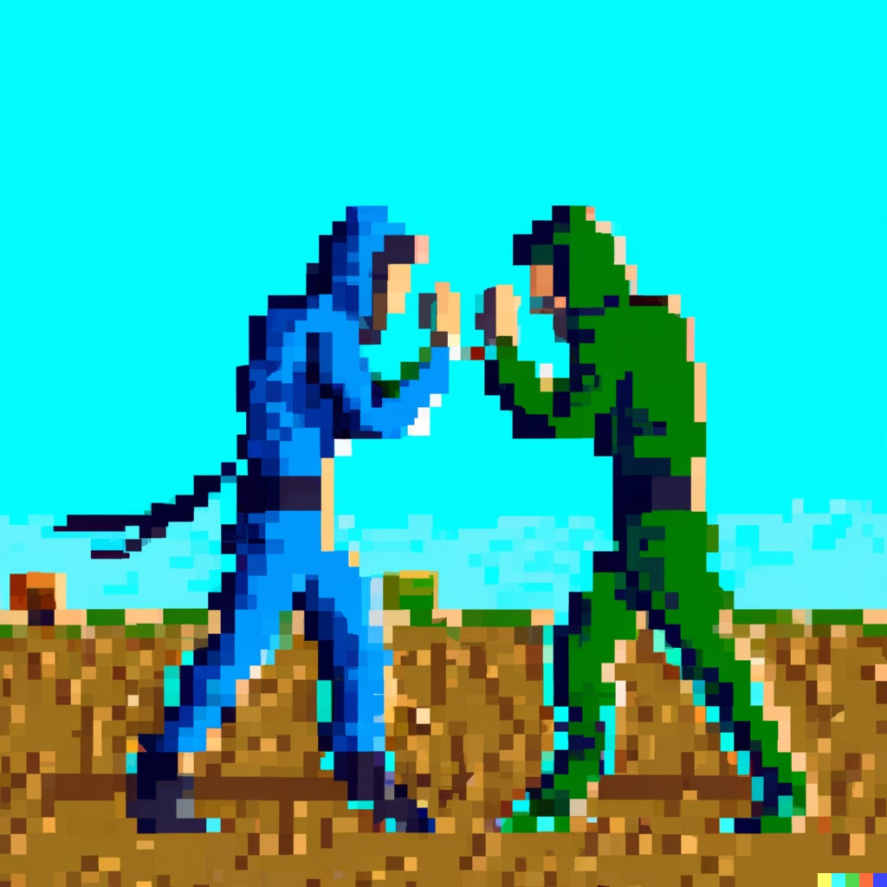
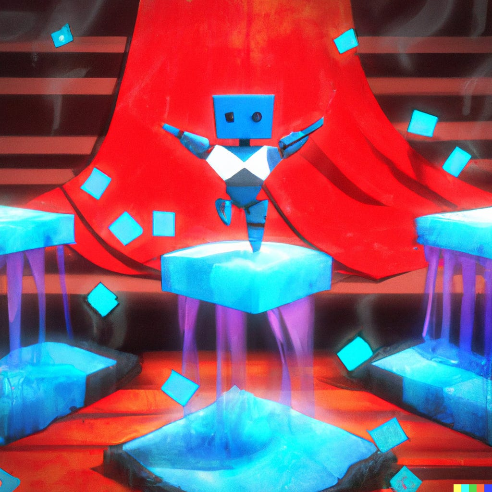

Hopelijk hebben jullie een fijne kerst achter de rug! De mijne kon dankzij jullie niet meer stuk: echt gaaf om te zien hoeveel mensen zich op deze nieuwsbrief hebben geabonneerd. Het is een passieprojectje dat ik ook met twee abonnees had voortgezet, maar het motiveert ontzettend om te zien dat jullie allemaal meelezen.

Het is de week van het grote geld. Microsoft en Sony blijven vechten over de grootste overname uit de gamehistorie en Epic stunt weer in een poging Steam voorbij te schieten. Het is een wat vreemde manier om het jaar af te sluiten: terwijl er een recessie lijkt te naderen, laten gamebedrijven vooral zien wie de meeste miljoenen kan uitgeven.

[Subscribe now](#/portal/signup)

## Hoe Epic met Fortnite-geld Steam wil verslaan

-   _Death Stranding_ was afgelopen weekend een paar dagen gratis in de Epic Games Store.
-   Het is misschien wel de grootste game die Epic gratis heeft weggegeven.
-   De servers van de gamewinkel bezweken het toen de freebie in de winkel kwam te staan.

Wie de Epic Games Store bezoekt, ziet altijd wel één of twee games op de voorpagina staan die gratis worden weggegeven. Het is een slimme manier van Epic Games om klanten aan zich te binden. Zelfs gamers die zweren bij een ander gamesplatform, claimen die freebies bij Epic tussendoor toch maar even snel. En dat kunnen ooit vaste klanten worden, hoopt het bedrijf.

Epic concurreert op pc met Valve's Steam, wat met 120 miljoen maandelijks actieve gebruikers gigantisch is. Valve is niet beursgenoteerd en heeft veel goodwill bij gamers. Epic kan op zijn beurt wat schimmiger aanvoelen. Ze hebben met _Fortnite_ een gigahit in handen, maar het free-to-play-model daarachter heeft een slechte reputatie.

_Illustratie gegenereerd met kunstmatige intelligentie DALL-E,_ [_geïnspireerd door Rutger Otto_](https://www.rutgerotto.nl/post/hoogtepunten-van-2022?ref=gamepraat.nl)_._

Afgelopen jaren kocht Epic Games meermaals de exclusiviteitsrechten voor een game, waardoor deze alleen op hun platform gespeeld kon worden. Dat is, in combinatie met gratis games als Death Stranding, een duidelijke strategie: Epic gooit geld tegen het probleem aan. Ze subsidiëren gameontwikkelaars om hun spellen gratis op het platform aan te bieden en bieden op exclusiviteitsrechten, in de hoop dat gamers mettertijd naar hun platform toekomen. Met al dat _Fortnite_\-geld kunnen ze dat ook prima veroorleven.

Maar of het werkt? Zolang Steam gigantisch is, blijven de meeste makers hun spellen gewoon daar uitbrengen. Daar zijn immers meer potentiële klanten. En naarmate Valves Steam Deck-handheld populariteit wint, hebben gamers er ook een reden bij om hun games bij Valve te kopen. Want hoewel je Epic Games-spellen best op je Deck kunt spelen, is het wel zo makkelijk als ze in je Steam-bibliotheek zitten.

## Sony doet waar ze Microsoft van beschuldigen

-   Sony zei eerder te vrezen voor oneerlijke concurrentie als Microsoft zijn overname van Activision Blizzard mag voortzetten.
-   Microsoft vint dat maar vreemd, vertellen ze de Britse marktwaakhond. Sony zou namelijk al jaren doen waar ze bij Microsoft bang voor zijn.
-   Games als Final Fantasy VII Remake, Bloodborne en Silent Hill verschenen volgens Microsoft niet op Xbox, omdat de makers een deal sloten met Sony die ze verbood het spel op andere platformen uit te brengen.

Mijn tweede nieuwsbrief, en meteen ook de tweede keer dat we het hebben over Sony vs. Microsoft! Ik vermoed dat dit onderwerp nog wel vaker aan bod komt terwijl de strijd rond de grote Activision-overname blijft woeden.

Sony's grootste angst blijft exclusiviteit. Als Microsoft de makers van _Call of Duty_ in handen krijgt, wat houdt ze dan tegen om zo'n grote game exclusief te maken voor de Xbox? Microsoft kan er met een grote smak geld voor zorgen dat één van de belangrijkste games ieder jaar niet meer bij de concurrent verschijnt.

Microsoft beloofde al om het anders aan te pakken. Ze willen _Call of Duty_ behandelen zoals ze ook met _Minecraft_ doen en de game juist op zoveel mogelijk platformen uitbrengen. Toch blijven zorgen bestaan en lopen er meerdere rechtszaken tegen de overname, waaronder van de Amerikaanse marktwaakhond FTC.

_Illustratie gegenereerd met kunstmatige intelligentie DALL-E._

Een [document ingediend](https://assets.publishing.service.gov.uk/media/637cec9dd3bf7f5a0b33f881/MICROSOFT_S_RESPONSE.pdf?ref=gamepraat.nl) door Microsoft bij de Britse marktwaakhond is wat feller tegen de kritiek van vooral Sony. Dit bedrijf zou al jarenlang exclusiviteit wegkopen bij Microsoft, waardoor grote games zoals _Final Fantasy VII_ Remake niet eens op hun platform mogen verschijnen. Het schetst een gek beeld: eigenlijk wil Sony voorkomen dat Microsoft kan doen wat zij al jarenlang zelf doen.

Exclusieve games zijn een lastige kwestie. Want ja, Sony heeft ontwikkelaars verboden hun games uit te brengen op de Xbox. Maar daar stond tegenover dat Sony heeft geholpen diezelfde games te subsidiëren. Dat voelt ergens redelijk: als ik jou geld geef voor ingrediënten om een taart te bakken, dan mag ik best meedenken over wie er allemaal een stukje mag.

Maar is het dan ineens oneerlijke concurrentie als Microsoft een bedrijf koopt om hetzelfde te doen? Marktwaakhonden kijken vaak naar de grootte van bedrijven, en in dit geval is Microsoft verreweg de grootste speler. Ze zouden al het geld dat ze verdienen met Windows en Office kunnen investeren om de gamesmarkt te veroveren, is de angst.

Maar tegelijkertijd heeft Sony een ander soort marktdominantie. De PlayStation 4 is nog steeds de best verkochte gameconsole ooit waarvoor nog steeds actief spellen worden gemaakt, met tegen de 120 miljoen verkochte exemplaren. De Xbox One uit diezelfde generatie ging voor minder dan de helft over de toonbank. Cijfers van de nieuwe PS5 en Series-consoles zijn lastiger te vergelijken, deels omdat chipproblemen voor tekorten zorgden, maar één ding is duidelijk: Sony heeft verreweg de grootste afzetmarkt qua gamers.

Microsoft kan dan wel een zak geld bieden om je bedrijf te kopen of misschien je spellen exclusief te maken, maar Sony heeft daar een goed weerwoord voor: maak je een game exclusief bij hun voor een (wellicht wat kleinere) zak geld, dan zijn er veel meer gamers waar je een game aan kunt verkopen. En verdien je onder de streep daar alsnog meer aan.

Of dat in de FTC-rechtszaak wordt meegewogen? Dat moet blijken. Maar het voelt voor mij niet als een zaak waarbij je domweg kan kijken naar welk bedrijf de hoogste omzetcijfers heeft.

## Tunic gaat over hoe games ons Engels leerden

Het is eind december, en bij het overpeinzen van de [beste games dit jaar](https://spelko.st/009-favoriete-games-2022-gotys/?ref=gamepraat.nl) denk ik steeds weer terug aan _Tunic_. Het is een spel dat me wist te pakken met zijn esthetiek - één blik en je waant je achter een Super Nintendo. Wel meer indiegames spelen in op nostalgie, maar Tunic is de enige die tegelijkertijd gaat over hoe wij als gamers rond die leeftijd iets hebben geleerd door te gamen.

Mijn eerste game was _Mega Man 3_, en dat was op 6-jarige leeftijd buitengewoon verwarrend. Het introductiefilmpje liet allemaal coole robots zien, maar die begeleidende Engelse tekst begreep ik geen woord van. Ik had dus geen idee dat dit je vijanden waren - ik dacht dat je zoals bij de Power Rangers één kon kiezen, zodat die wat generiek ogende Mega Man daar later in zou transformeren. De waarheid zou ik pas jaren later leren - ik speelde toen altijd het Shadow Man-level (die was cool) en kwam nooit voorbij Proto Man.

_Illustratie gegenereerd met kunstmatige intelligentie DALL-E._

Naarmate ik meer games speelde, leerde ik langzamerhand Engels. Veel van de taal was te ontcijferen aan de hand van wat in beeld stond: bij het vinden van een zwaard in Zelda staat de naam 'Master Sword' immers in beeld. Voor verwarrende dingen kon ik handleidingen er op naspitten, die vaak Nederlandse woorden koppelden aan die engelse gameteksten. Hoe meer games ik speelde, hoe beter mijn Engels werd. Ik was niet de enige: iedereen uit mijn generatie (ik ben 34) die ik spreek, zegt pakweg dezelfde ervaring te hebben.

Daar haakt _Tunic_ op geniale wijze op aan. De game hanteert zijn eigen brabbeltaaltje, waar je aan het begin geen touw aan kunt vastknopen. De handleiding ingebakken in het spel - die er uitziet als een papieren handleiding uit de jaren '90 - gebruikt datzelfde taaltje, maar heeft ook illustraties die je helpen om de betekenis te ontcijferen.

Hoe verder je in de game komt, hoe meer pagina's je van die handleiding vindt - en hoe beter je begrijpt wat het spel probeert te communiceren. Je leert de taalbarrière te navigeren, zoals je ooit ook moest leren om rond het jou onbekende Engels te navigeren. Dat maakt de game niet alleen nostalgisch, maar zorgt ook dat je je slim voelt. Een gevoel dat dit jaar enkel werd geëvenaard door _Elden Ring_.

## Dingen die ik deze week tof vond

-   Een beetje laat, maar ik heb de Disney-film **Strange World** gezien. Qua verhaalopzet niet de bijzonderste film, maar het voelt als de uitlaatklep van een groep gelijkgestemde nerds. Een hoofdrolspeler die graag bordspellen speelt, een wereld die voelt alsof hij in _No Man's Sky_ is gegenereerd en worldbuilding zoals je die vooral in games ziet. Ik heb daarom ondanks de vele gebreken genoten.
-   **Wingspan** is inmiddels thuis ons favoriete bordspel tijdens de feestdagen. Vrienden raden hem al maandenlang aan, maar we hebben hem pas relatief laat gekocht. Een 'bordspel over vogels spotten' voelde nogal zouteloos. Maar het daadwerkelijke spelen is superleuk!
-   Tijdens de Steam Winter Sale heb ik **Bloodstained: Curse of the Moon 1 en 2** voor een prikkie gekocht. Dit zijn spin-offs van de game die de bedenker van Castlevania met Kickstarter maakte, maar stiekem vind ik deze leuker. Het zijn net NES-games, die dankzij ontwikkelaar Inti Creates (Gunvolt, Mega Man Zero) uitstekend spelen.
-   Ik heb gelachen om Ron Vorstermans zijn Elden Ring-eindejaarsverhaal op Gamer.nl: [**Een bezoekje aan de Elden Ring-fanclub**](https://gamer.nl/artikelen/favorieten-van-de-redactie/een-bezoekje-aan-de-elden-ring-fanclub/?ref=gamepraat.nl).

Tot volgende week weer!

[Subscribe now](#/portal/signup)
