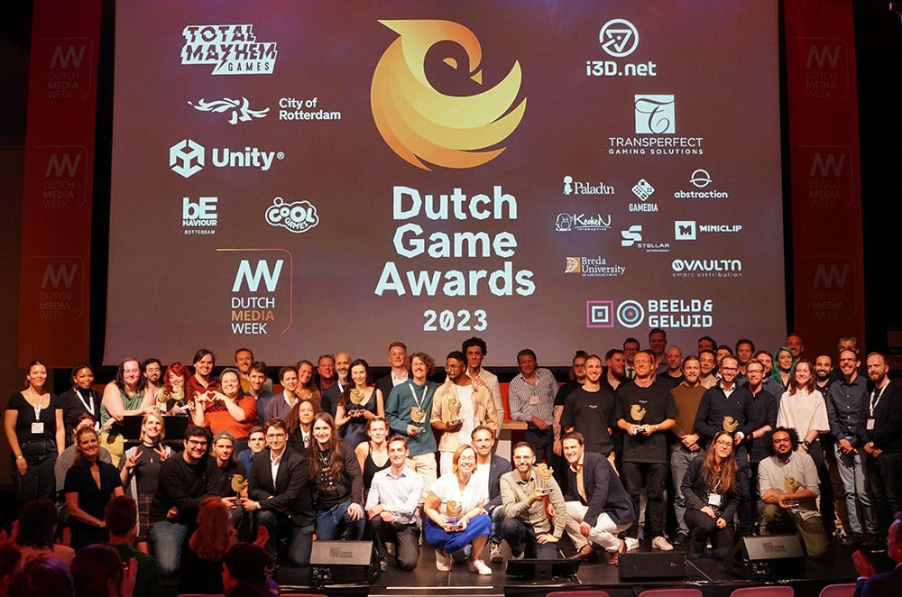
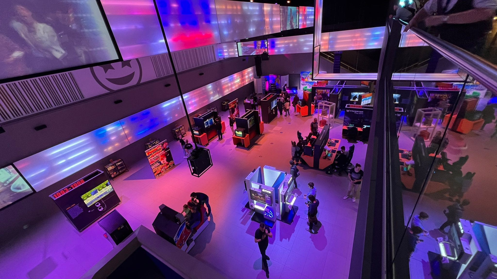

Deze week stond vrijwel iedere hoek van de Nederlandse game-industrie in de schijnwerpers. Dat begon op woensdag met de Dutch Game Day en Game Awards, waarna dit weekend de gamejournalistiek vierde dat Power Unlimited dertig jaar oud is.

Daarom wil ik het deze week even alleen hebben over wat er in ons eigen land speelt - en hoe jammer het is dat bijna niemand daar echt op lijkt te letten. We trappen af.

[Subscribe](#/portal/signup)

## Age of Wonders 4 is de game van het jaar

Na een korte intermezzo zijn de Dutch Game Awards inmiddels alweer drie jaar terug. Het begin een stabiel feestje te worden, met een uitreiking tijdens de Dutch Media Week in Hilversum en een roulerende jury om het perspectief fris te houden. De winnaars dit jaar zijn als volgt:

-   **Best Game:** Age of Wonders 4 – Triumph Studios
-   **Best Art:** Mail Time – appelmoes games
-   **Best Audio:**Isonzo – BlackMill Games
-   **Best Innovation:** Secret Shuffle – Adriaan de Jongh & Friends
-   **Best Technology:** Marvel's Spider-Man Remastered PC – Nixxes
-   **Software Best Game Design:** Secret Shuffle - Adriaan de Jongh & Friends
-   **Best Applied Game:** Klankkr8 – Game Tailors
-   **Best Debut Game:** Kayak VR: Mirage – Better Than Life
-   **Best** **Student Game:** Iron Line – Team Trainwreck (BUas)

Mijn persoonlijke favoriet in dit lijstje is de prijs voor Spider-Man Remastered. Hij vat namelijk precies samen wat er hier in Nederland speelt: Nixxes heeft een megaproductie op geraffineerde wijze naar de pc geport, waarmee ze verantwoordelijk waren voor één van de grootste mediafranchises op aarde. Maar dat dit juist in Nederland gebeurde, hoor je eigenlijk weinig mensen voor nodig. Juist dan is een prijs een mooie manier om daar de aandacht op te vestigen.

## Grote media moeten meer over de Dutch Game Awards schrijven

Toen ik deze week bij de Dutch Media Week voor een diner aan tafel zat, ging het al snel over games. Het was een gesprek dat ik inmiddels haast maandelijks voer met andere mediamakers. Dan vertel ik dat games niet langer primair door tieners worden gespeeld, er ook veel vrouwen gamen en dat Nederland recent een internationaal gigantische mediaproductie heeft gemaakt met Horizon: Forbidden West. Mensen zijn dan meestal verrast en verbaasd, want ze kennen games toch vooral als iets dat jonge pubers bezighoudt. Dat is ook het voornaamste dat ze met de jaren in kranten en op tv meekregen.

Een dag later werden in diezelfde kamer de Dutch Game Awards uitgereikt - de belangrijkste gameprijzen in ons land. Age of Wonders 4 werd uitgeroepen tot game van het jaar, de pc-port van Spider-Man door Nixxes werd uitgeroepen tot de beste technologische prestatie. De prijsuitreiking dook op bij meerdere technologie- en gamesites - maar bereikte bij de algemene media alleen de Volkskrant en BNR Nieuwsradio (waar Gamer-collega Joe van Burik het onderwerp behandelde).

Zo gaat het al een paar jaar. De Dutch Game Awards worden doorgaans door een handjevol grote Nederlandse media behandeld, maar het gros besteedt er geen aandacht aan. Als je zoekt, vind je op de website van de NOS zelfs geen enkel verhaal erover. Dat zit me al enige tijd dwars - waar ik deze week een column op Gamer.nl over heb geschreven. [**De volledige column lees je hier.**](https://gamer.nl/achtergrond/achtergrond/achtergrond/de-nederlandse-media-moeten-de-dutch-game-awards-serieuzer-nemen/?ref=gamepraat.nl)

## De PU-expositie en verkoop van mijn boek zijn gestart in Beeld en Geluid

Dit weekend opent een grote expositie in Beeld en Geluid in Hilversum, over het inmidels alweer dertig jaar oude Power Unlimited. Daar vind je oude goodies, werk uit het blad en meer relieken uit die tijd. Oh, en je vindt er ook mijn koffietafelboek, waar ik deze week het eerste exemplaar van heb mogen ontvangen. Leuk! Je kunt ‘m kopen bij de balie beneden.

_(Thanks voor de foto, Daan!)_

Power Unlimited-redacteur Tjeerd Lindeboom maakte afgelopen weken een podcastreeks waarin hij met oude redactieleden van het blad sprak over hun tijd. De afleveringen zitten vol met leuke anekdotes en weetjes - en schetsen ook een perfect beeld van hoe het blad ooit is ontstaan. Eindredacteur Ed Wiggemans vertelt bijvoorbeeld dat ze in het begin helemaal niet op zoek waren naar game-experts, maar vooral coole figuren uit de Amsterdamse hiphopscene rekruteerden om het blad een eigen smoel te geven. Het was een tijd dat er eigenlijk ook helemaal geen gamejournalistiek bestond - die zou pas vormen toen het blad populair werd en lezers hetzelfde wilden doen als de PU-redactie.

Hieronder vind je alle afleveringen:

-   [Jan](https://pu.nl/artikelen/podcast/en-ineens-waren-we-concurrenten-van-elkaar-jan-in-pu-30-powerpraat-special/?ref=gamepraat.nl)
-   [Ward en Florian](https://pu.nl/artikelen/podcast/zou-instant-weer-voor-pu-gaan-werken-ward-florian-in-pu-30-powerpraat-special/?ref=gamepraat.nl)
-   [Ed en Jurjen](https://pu.nl/artikelen/podcast/in-het-begin-was-het-een-enorm-zootje-ed-jurjen-in-pu-30-powerpraat-special/?ref=gamepraat.nl)
-   [Skate en JJ](https://pu.nl/artikelen/podcast/pu-en-gamekings-hadden-bij-elkaar-moeten-blijven-skate-jj-in-pu-30-powerpraat-special/?ref=gamepraat.nl)

Er komt geloof ik nog eentje met Wouter en Maarten aan. Daar heb ik stiekem het meest zin in - zij waren in 2009 mijn stagebegeleiders bij Power Unlimited.

Je kunt vanaf dit weekend in elk geval [de expositie bezoeken](https://pu.nl/artikelen/nieuws/pu-presenteert-30-jaar-gamegeschiedenis-expositie-in-beeld-en-geluid/?ref=gamepraat.nl). Hij loopt tot en met eind oktober.

[Subscribe now](#/portal/signup)

Volgende week weer een Gamepraat gericht op de bredere game-industrie!
