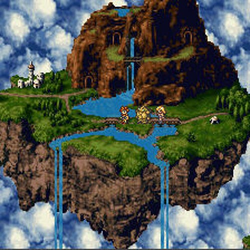
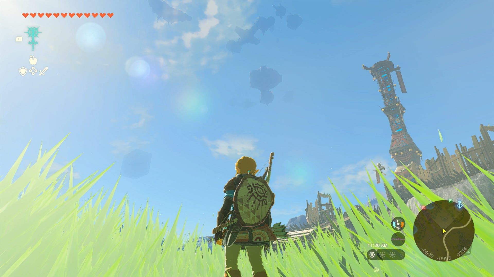

**En waarom de eilanden van Tears of the Kingdom zo belangrijk zijn.**

Ik had het mis. Afgelopen weken schreef ik al een paar keer te verwachten dat Microsofts overname van Activision Blizzard gewoon door kon gaan, maar op woensdag besloot de Britse marktwaakhond dwars te liggen. Over een totaal onverwacht punt.

Daarnaast speelde ik afgelopen week de nieuwste Zelda-game naar huis. Misschien wel de belangrijkste game van dit jaar, die me ineens deed terugdenken aan _Chrono Trigger_ en _Skies of Arcadia_.

Deze editie van Gamepraat telt 1.158 woorden en neemt zes minuten van je tijd in beslag. Vind je hem tof? Deel deze nieuwsbrief dan vooral met vrienden! Vind ik tof. We trappen af!

[Subscribe](#/portal/signup)

## De grootste angst bij Microsoft en Activsion? Cloudgaming

-   De Britse waakhond Consumer Marker Authority (CMA) heeft de overname van Activision Blizzard door Microsoft afgewezen.
-   De CMA vreest dat Microsoft een te grote speler op de cloudgamingmarkt wordt.
-   Microsoft gaat in beroep, hopend de overname alsnog rond te krijgen.

Al een jaar lang speculeren we over Microsofts overname van Activision Blizzard. De ene marktwaakhond na de ander startte een onderzoek, er werden rechtszaken gestart. Sony uitte zijn ongenoegen over de plannen, vrezend dat Microsoft een monopolist zou worden door de maker van 's werelds grootste games op te slokken.

Tegelijkertijd deed Microsoft alles om alles in goede banen te leiden. Er werd beloofd dat _Call of Duty_ gewoon naar alle platformen zou komen en er zelfs een Switch-versie werd uitgebracht. Het bedrijf zou juist graag met een multiplatformstrategie geld verdienen.

Het mocht niet baten bij de CMA. Die vreest niet eens voor verstoring van de consolemarkt - daar hebben Nintendo en Sony een groot aandeel en is Microsoft een relatief kleine speler. Maar er wordt geanticipeerd dat de markt voor cloudgaming wordt verstoord.

Uit onderzoek van de CMA blijkt dat Microsoft zo'n 60 procent van de cloudgamingmarkt in handen heeft met Game Pass. En als _Call of Duty_, _Overwatch_ en _World of Warcraft_ exclusief daarbij worden aangeboden, zou het bedrijf kunnen uitgroeien tot een cloudmonopolist.

De CMA bestaat om dat soort situaties te voorkomen. Ze zorgen ervoor dat een bedrijf na een overname niet te groot wordt en concurreren onmogelijk wordt. Maar wat bij Microsoft gebeurt is opmerkelijk: ze vrezen voor een verstoring van een markt die zich nog aan het vormen is. Cloudgaming is op dit moment namelijk nog experimenteel, ook voor Microsoft.

Cloudgamingbedrijven schieten als paddestoelen uit de grond, terwijl gevestigde partijen met durfkapitaal aan het groeien zijn. Microsoft staat als grootste te boek, maar dat komt deels door de aard van Game Pass: cloudgaming is onderdeel van het abonnement, maar games kunnen ook offline gedownload worden. Het is gokken hoeveel mensen bij Game Pass cloudgamen, wat het lastig maakt hun exacte aandeel op die markt in te schatten.

Het voelt alsof de CMA een nog niet helemaal uitgegroeide, haast hypothetische markt probeert te beschermen. Dat blijkt ook uit hun argumentatie: de CMA vindt samenwerkingen met alleen Nvidia, Boosteroid en Ubitus niet voldoende om de cloudmarkt te beschermen - maar heel veel andere bedrijven zijn er überhaupt niet.

Het is afwachten wat er nu gaat gebeuren. Microsoft gaat in beroep, waarna ze vermoedelijk consessies doen om de deal alsnog rond te krijgen. Wellicht dat ze kunnen beloven om _Call of Duty_ niet als cloudgame aan te bieden in het Verenigd Koninkrijk.

Maar het is nu van essentieel belang om de CMA te overtuigen. Zonder Engeland is het lastig de deal helemaal rond te maken, en toezichthouders in andere landen kijken waarschijnlijk naar het Britse oordeel om te zien wat zij wellicht kunnen doen.

## De luchteilanden in Zelda hebben een reden

-   Afgelopen week speelde ik een uurtje The Legend of Zelda: Tears of the Kingdom.
-   De demo vond vooral plaats in de lucht, waar je van eiland naar eiland moet vliegen.
-   Hoe je dat doet, is half de game.

_Baten Kaitos_, _Chrono Trigger_, _Skies of Arcadia_: er zijn ontzettend veel games met zwevende eilanden. Ze zijn ook hartstikke mooi. Watervallen druppelen door de lucht naar beneden, de landmassa onderaan is bezaaid met stalactieten. Het zijn onverstoorbare, idyllische plekjes, die aanvoelen alsof er geen enkel conflict bovenop plaatsvindt. Plekken waar de mensheid iets dichterbij de hemel is gekomen.

Hoewel die eilandjes in veel games te vinden zijn, hebben ze doorgaans alleen een nut in het achterliggende schrijfwerk van de game. In _Chrono Trigger_ zijn ze bijvoorbeeld onderdeel van een oud koninkrijk dat met magie en technologie landmassa's de lucht in had gestuurd om boven de eeuwige wolken van een ijstijd te leven. Ze schetsten hoe geavanceerd dit land was, terwijl ook de kloof tussen de eilandbewoners en overblijvers op de benedenwereld in beeld werd gebracht.

Maar qua gameplay gebeurt er eigenlijk weinig mee. Bij _Chrono Trigger_ kun je via speciale kamers naar het luchtkoninkrijk teleporteren, in _Skies of Arcadia_ heb je een vliegende boot die eigenlijk hetzelfde werkt als op water. Bij _Baten Kaitos_ is de wereld min of meer hetzelfde als in de gemiddelde rpg, maar is gras vervangen met een wolkendek. Leuk voor de ‘world building’, maar tijdens het spelen merk je geen verschil.

Dat maakt _Tears of the Kingdom_ uniek. Ook deze game heeft zwevende eilanden, maar het spel draait ook om hoe je daar op terechtkomt. Door objecten aan elkaar te plakken bouw je helikopters, ballonnen, raketten en vliegtuigen. Op ieder eiland is wel een puzzel of schat te vinden, maar half de lol bestaat uit het uitvogelen hoe je daar überhaupt terechtkomt.

In het uurtje dat ik speelde was dat hartstikke leuk, al moet nog blijken hoe lang dat zo blijft. Misschien dat je na een tijdje constant dezelfde voertuigen sleutelt om in de lucht te komen. Maar het voelt als een systeem bedacht om je creativiteit te prikkelen. Waar je in andere games op de automatische piloot ergens naartoe rent, moet je in Tears of the Kingdom nadenken hoe je dat voor elkaar krijgt.

[Voor Bright](https://www.bright.nl/nieuws/1134204/legend-zelda-tears-kingdom-preview-nintendo-game.html) schreef ik deze week mijn eerste indrukken met Tears of the Kingdom op. Daarnaast hadden we het er uitgebreid over in zowel de Bright Podcast als [in Spelkost](https://spelko.st/?ref=gamepraat.nl). In mei volgt een review!

## Verder interessant deze week

-   Wat veel games deze lente! Naast _Zelda_ [speelde ik ook](https://www.bright.nl/nieuws/1134205/review-star-wars-jedi-survivor-grootser-leuker-en-met-meer-foutjes.html) [**_Jedi Survivor_**](https://www.bright.nl/nieuws/1134205/review-star-wars-jedi-survivor-grootser-leuker-en-met-meer-foutjes.html), het vervolg op _Fallen Order_. Een mooi voorbeeld van hoe je een Uncharted-achtige game vrijer kunt maken, met een meer verkenbare wereld. En voor Star Wars-gekkies als ik een geweldige deepdive in lore-dingetjes.
-   De **Asus Ally** is officieel aangekondigd - een Steam Deck-concurrent met veel meer processorkracht, maar met misschien ook wel een dubbel zo hoge prijs.
-   Nintendo gaat dit jaar naar GamesCom. Interessant, want het bedrijf komt daar lang niet altijd. Misschien dat ze met het verdwijnen van E3 zoeken naar een nieuwe beurs om groot bij uit te pakken?
-   Sega of America heeft een vakbond gevormd. Vakbonden zijn zeldzaam bij gamebedrijven, en de paar die er zijn bestaan vaak uit alleen bijvoorbeeld testteams. Die bij Sega is voor al het personeel, wat een bijzondere ontwikkeling is.

[Subscribe now](#/portal/signup)
