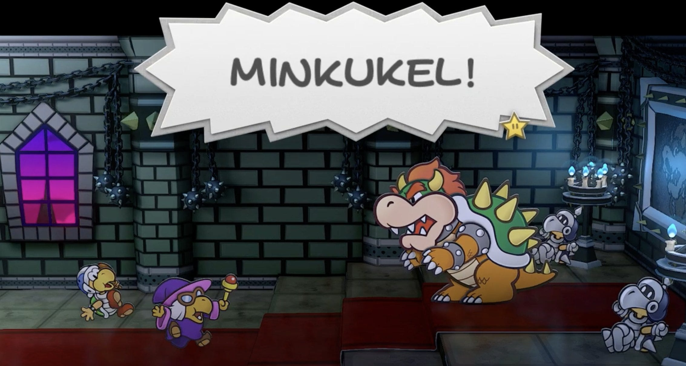

**Daarnaast: je iPhone is je volgende gameconsole en Wario spreekt nu Nederlands**

Gameontwikkelaars zijn het niet vaak met elkaar eens, maar deze week was het anders: nagenoeg iedere studio, groot of klein, vond de plannen van softwaregigant Unity een buitengewoon dom idee. Alle neuzen stonden dezelfde kant op - waardoor Unity nu vreest een deel van de markt te verliezen.

Deze week duiken we in de oorzaak van dat Unity-debacle, maar hebben we het ook over optimistische dingen. Zoals hoe de iPhone misschien wel de volgende grote gameconsole wordt en hoe Nintendo's Nederlandse lokalisaties steeds grootser worden en het respect van gamers lijken te winnen.

Deze editie van Gamepraat telt 1.164 woorden en neemt zes minuten van je tijd in beslag. We trappen af!

[Subscribe](#/portal/signup)

## Iedereen is boos op Unity

Spelmotor Unity was jarenlang een publieksfavoriet binnen de gamesector. Waar software zoals Unreal werd gebruikt om grootse, dure games te bouwen, leende het gebruiksvriendelijkere Unity zich met zijn bescheiden prijs juist goed voor kleine gamebouwers. Onder andere _Hollow_ _Knight_, één van mijn favoriete games aller tijden, werd gebouwd met Unity (al hoorde ik dat ze de grenzen van de software dreigen te bereiken met hun vervolg _Silksong_).

In de afgelopen jaren wankelt de reputatie van Unity. Dat begon al in 2014, toen voormalig EA-baas John Riccitiello de CEO werd van het softwarebedrijf - vlak nadat hij EA had gepusht om agressieve verdienmodellen vaker in games te implementeren.

Alle goodwill lijkt in de afgelopen week te zijn verloren met de introductie van de zogeheten '[Unity Runtime Fee](https://unity.com/runtime-fee?ref=gamepraat.nl)'. In het kort: als een game gebouwd in Unity een aantal keer verkocht is, moeten ontwikkelaars aan het bedrijf geld betalen voor iedere keer dat de game wordt geïnstalleerd. Op die manier wil Unity extra verdienen aan succesvolle games gebouwd met hun software.

Het is een regel die haaks staat op de indie-ontwikkelaars die vooral Unity-software gebruiken. Zij weten vaak niet of hun game een hit wordt. En als het gebeurt, kan het soms nog maanden duren tot het geld hun bereikt waarmee ze de Runtime Fee moeten betalen. Daarnaast was er veel onduidelijk over de regels. Want wat gebeurt er bij games geïnstalleerd via abonnementsdiensten als Game Pass of in liefdadigheidsbundels zoals van Humble Bundle? En als je een gratis game bouwt die weinig omzet maakt, moet je dan ook betalen?

Inmiddels claimt Unity dat de nieuwe regels slaan op slechts 10 procent van hun klanten. De meeste games worden te weinig verkocht om in aanmerking te komen voor de Runtime Fee. Daarnaast worden de kosten doorgerekend naar distributeurs als games op niet-traditionele wijze worden verkocht - bij een Game Pass-game betaalt Microsoft dit dus.

Die uitleg lijkt onvoldoende te zijn voor veel ontwikkelaars, die aankondigen over te stappen naar alternatieve software. Het hek lijkt namelijk van de dam: als Unity nu ineens onverwachte kosten kan doorrekenen aan gamebouwers, wat houdt ze dan tegen om in de toekomst nog meer kosten op te leggen? Ontwikkelaars vertrouwen het bedrijf niet meer - en vertrouwen is van essentieel belang bij een engine-bouwer. Op die engine leunt immers je hele game, wat het product is waar je als ontwikkelaar je hele bedrijf op baseert.

## Mario wordt steeds Nederlandser

Nintendo vertaalde in de afgelopen jaren steeds meer games naar het Nederlands. Logisch ook: hun spellen zijn gemaakt voor jong en oud, dus je wil dan dat die jonge, niet Engels sprekende groep gamers er ook goed mee aan de slag kan gaan. Bij een Nintendo Direct deze week bleek dat twee games aan het Nederlandstalige arsenaal werden toegevoegd: een remake van _Paper Mario: The Thousand Year Door_ en een nieuwe _Wario_\-game voor de Nintendo Switch.

Ik ben ontzettend benieuwd naar hoe dat bij _Paper Mario_ uitpakt. Het is een game die leunt op een fantastisch geschreven script, vol met verwijzingen naar films en andere popcultuur. Het is tot vandaag misschien wel mijn favoriete _Mario_\-game, die afgelopen decennia nooit is geëvenaard door zijn vervolgen.

De _Wario_\-game heeft daarnaast (voor zover ik weet) een primeurtje: voor het eerst wordt in een _Mario_\-game Nederlands gesproken. In de trailer was enkele seconden te horen hoe Wario in het Nederlands spelers toesprak. We zagen Mario eerder dit wel al Nederlands spreken in de nieuwe _Mario_\-film, maar gezien dat optreden was gebaseerd op de niet-typische Chris Pratt uit de Amerikaanse film, voelt dat toch minder trouw dan nu bij de Wario-stem. Je hoort het in de eerste seconden hieronder:

[Bekijk ingesloten media](https://www.youtube-nocookie.com/embed/hd8hqd1VhL4?rel=0&autoplay=0&showinfo=0&enablejsapi=0)

Nu Charles Martinet is gestopt als de stem van Mario, ben ik benieuwd of zijn opvolger ook wat meer woorden en volzinnen zal uitspreken. En zo ja, zouden die dan ook naar het Nederlands worden gelokaliseerd?

Trouwens: in het verleden deelde ik op Twitter vaak clips uit gelokaliseerde Nintendo-games. Ik kreeg dan reacties van mopperende gamers die het suf vonden om de spellen in hun moerstaal te zien. "ik speel hem wel op Engels", was het meest gehoorde commentaar. Dat was bij de _Paper Mario_\-onthulling afgelopen week anders.

Zou Nintendo zich de afgelopen paar games hebben bewezen met zijn lokalisaties, waardoor we de Nederlandse teksten helemaal niet zo erg meer vinden? Of zouden alle haters toevallig net Twitter hebben verlaten nu Musk aan de macht is? Het schijnt immers dat 40 procent van de Nederlandse gebruikers het platform heeft verlaten.

## Ray-tracing op iPhones

Afgelopen week was ik in San Francisco om de onthulling van de nieuwe iPhones bij te wonen. Het ging daarbij veel over de nieuwe USB-C-poort, waarmee Apple eindelijk voldoet aan Europese wetgeving. Maar voor gamers zat er stiekem iets veel interessanters in de presentatie: de iPhone 15 Pro ondersteunt ray-tracing.

_Assassin's Creed Mirage_, _Resident Evil Village_ en _Resident Evil 4 Remake_ komen met die technologie allemaal naar de iPhone, waardoor console-games ineens wel heel snel naar een smartphone komen. Eerder experimenteerden ontwikkelaars hier ook al mee, bijvoorbeeld met de iPad-versie van _XCOM_. Maar nog nooit eerder zal ik games van zo'n hoog kaliber zo snel naar iOS komen.

[Bekijk ingesloten media](https://www.youtube-nocookie.com/embed/BA-NDCWvpOQ?rel=0&autoplay=0&showinfo=0&enablejsapi=0)

Combineer dat met de steeds robuustere gamepad-ondersteuning en handige telefooncontrollers als de [Backbone One](https://playbackbone.com/nl/products/backbone-one/?ref=gamepraat.nl), en ik vraag me stiekem af of Apple nu dan toch eindelijk de gamemarkt serieus probeert te betreden. Een iPhone zal misschien niet snel concurreren met een PlayStation 5 aan een 4K-tv, maar met een Steam Deck? Daar kan een serieuze Apple-chip prima tegenop boksen.

Komende weken hoop ik m'n tanden te zetten in de iPhone 15 Pro, ik zal dan mijn ervaringen ook met jullie delen.

## Verder interessant deze week

-   Naast de Nederlandse Mario-games in de Direct deze week ook veel ander leuks, zoals de remake van _Mario vs. Donkey Kong_, beelden van de _Princess Peach_\-game (minder seksistisch dan die op de DS!) en _Detective Pikachu 2_, dat in oktober verschijnt.

[Bekijk ingesloten media](https://www.youtube-nocookie.com/embed/8HJCO0xidoo?rel=0&autoplay=0&showinfo=0&enablejsapi=0)

-   _F-Zero 99_ is daarnaast wel een hoogtepuntje. Je moet samen met 99 anderen de klassieke racegame spelen en elkaar uit het level beuken. _Fortnite_, maar dan racend met scifi-auto's.
-   Sony's State of Play was iets minder spannend, maar de trailer voor Final Fantasy VII Rebirth was spectaculair.

[Bekijk ingesloten media](https://www.youtube-nocookie.com/embed/5ZXqcymx0CI?rel=0&autoplay=0&showinfo=0&enablejsapi=0)

Tot volgende week!

[Subscribe now](#/portal/signup)
