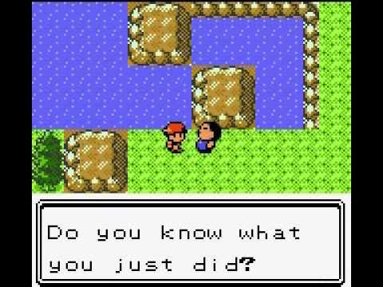
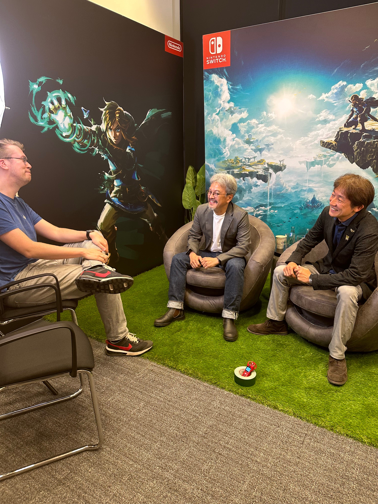

**Het is Zelda-week!**

Gefeliciteerd met een nieuwe Zelda, allemaal! Vanaf vandaag ligt Tears of the Kingdom in de winkels. Het is een game die diep in mijn brein is gekropen en waar ik het deze week heel graag met jullie over wil hebben. Dat doen we zonder ook maar iets te spoilen.

Een nieuwe Zelda betekent ook weer jaren aan games die zijn geïnspireerd hierdoor, waardoor vandaag voelt als meer dan 'gewoon' het verschijningsmoment van een nieuw spel. Zonder _Ocarina of Time_ hadden we geen _Okami_ of _Darksiders_, zonder _Breath of the Wild_ geen _Elden Ring_. Vandaag wordt (hopelijk) een nieuwe standaard voor bepaalde types games gezet.

Deze editie van Gamepraat telt 1.365 woorden en neemt zeven minuten van je tijd in beslag. Vond je ‘m leuk? Abonneer dan vooral, of tip hem bij je vrienden. We trappen af!

[Subscribe](#/portal/signup)

## Tears of the Kingdom is misschien wel mijn favoriete game

[Bekijk ingesloten media](https://www.youtube-nocookie.com/embed/uHGShqcAHlQ?rel=0&autoplay=0&showinfo=0&enablejsapi=0)

De afgelopen twee weken speelde ik _Tears of the Kingdom_ [ter recensie voor NRC](https://www.nrc.nl/nieuws/2023/05/11/nieuwe-zelda-game-doet-het-bijna-onmogelijke-de-speler-alle-vrijheid-geven-a4164439?ref=gamepraat.nl). Leuk feitje: die recensie is ook mijn officiële comeback bij de krant. Naast dat ik hier en daar help bij gameverhalen, zit ik vanaf eind mei daar twee dagen per week op de redactie.

Het is één van de meest bijzondere, creatieve games die ik ooit speelde. _Breath of the Wild_ was al uniek, Door voort te bouwen op dat spel weet Nintendo de grootste kritiekpunten van die game weg te nemen. Hij krijgt bij mijn recensie een score van vijf ballen. Dat mag je van mij prima doorvertalen naar een tien, vertelde ik deze week in de Bonuslevel-podcast waar ik samen met collega-journalist Ron Vorstermans te gast was.

Het is tegelijkertijd een onwijs moeilijke game om over te praten. Tears of the Kingdom draait namelijk om geheimen. Meermaals zette het spel mijn verwachtingen compleet op zijn kop, maar deel van de lol was de manier waarop dat gebeurde. Ik vertel graag hoe, maar deel van de lol is om juist verrast te worden. Producent Eiji Aonuma zei in ongesprek (meer daarover hieronder) dat je het beste zo blanco mogelijk aan het spel kunt beginnen.

Tijdens het spelen dacht ik vaak terug aan Pokémon Gold en Silver. Net toen je dacht die spellen uit te spelen, bleek dat een volledig tweede gebied aan de Game Boy-cartridge was toegevoegd. Dat dit technisch kon was een wonder - decennia later gaat het nog steeds over hoe Satoru Iwata dit als wonderprogrammeur voor elkaar kreeg. Maar het legde de lat ook hoog: als een spel stiekem een compleet tweede game kan bevatten, wat is er dan nog meer mogelijk? Voor mij voelt het alsof ik sindsdien op zoek ben naar spellen die diezelfde ‘high’ bieden. Dat zijn er maar weinig, maar _Tears of the Kingdom_ weet dat gevoel meermaals te repliceren.

Maar hoe bespreek je zoiets veilig? Mijn WhatsApp bestond twee weken lang uit voorzichtig aftastende gesprekken met collega-recensenten. "Ben je al op die ene plek daar geweest?" vroeg ik Ron toen we allebei nog maar een paar uur op de teller hadden, wetende dat hij op die plek vermoedelijk een gave twist zou zien. Je probeert er omheen te praten, hopend dat de ander een subtiel signaal van bevestiging geeft.

Het was een dilemma bij de verhalen die ik rond de game heb gemaakt deze week. Moet je de kerngameplay wel of niet beschrijven in een recensie, als Nintendo dat al die tijd een mysterie heeft gehouden? Voor de één is het een spoiler, de ander wil het weten om te besluiten of ze de game kopen. En hoe praat je met de ontwikkelaars over de game zonder teveel in detail te treden?

Mijn advies aan iedereen: als je al overtuigd was Zelda te halen, weersta vandaag de verleiding om alle recensies en interviews te lezen. Wacht tot je een uurtje of, zeg, vijf hebt gespeeld. Gun jezelf die blanco start, raak geïntrigeerd en duik dán het internet op om te zien wat anderen er van vonden. Je hebt de tijd. Dit is namelijk een game waar we nog jarenlang over kunnen praten. Wil je toch over de game praten? In de [Discord van Spelkost](https://t.co/U2P3tlncJM?ref=gamepraat.nl) hebben we een speciaal kanaal waar we dankzij speciale spoilertags risicoloos kunnen discussiëren.

Het is hoe dan ook mijn favoriete game. Dat voelt beladen om te zeggen - ik wil even zien of het ook zo voelt als ik hem straks een paar maanden niet heb gespeeld en meer afstand heb ervan. Maar op dit moment kan ik nergens anders aan denken.

## Ik sprak de makers van Zelda over vaderschap

Afgelopen dinsdag zat ik in Frankfurt om te praten met Eiji Aonuma en Hidemaro Fujibayashi, respectievelijk de producent en regisseur van Tears of the Kingdom. Beide wilde ik al langere tijd ontzettend graag spreken. Aonuma had een hand in _Ocarina of Time_, _Majora's Mask_ en _The Wind Waker_, en is daarmee grotendeels verantwoordelijk voor hoe moderne Zelda-games in elkaar zitten. Fujibayashi bouwde op zijn beurt een paar van mijn favoriete handheld-Zelda's en neemt het stokje steeds meer van Aonuma over.

**[Het volledige interview kun je lezen op Bright](https://www.bright.nl/nieuws/1134304/the-legend-of-zelda-tears-of-the-kingdom.html)**. Verhaalspoilers zitten er niet in, maar ik bespreek een paar kernsystemen van de nieuwste game die ook leuk zijn om eerst zelf te ontdekken.

We hadden het veel over ouderschap. Dat onderwerp spookte in mijn hoofd als vader van twee zoontjes, en zij zijn allebei ook vader. Een paar fragmenten die ik interessant vond:

-   Aonuma werd met het verschijnen van Wind Waker voor het eerst vader. Hij denkt dat het ouderschap zijn perspectief als gamedesigner eigenlijk niet heeft veranderd - het grootste verschil is vooral dat hij niet meer kan overwerken.

-   Hij vertelde nog eens zijn anekdote over de pratende boot in The Wind Waker. Dat was een vaderfiguur, en hij heeft zelf het dialoog daarvoor geschreven. Daarbij schreef hij teksten waarmee hij zijn eigen kind wilde toespreken.

-   Zijn kinderen spelen Zelda maar praten daar liever niet met hun vader over. Logisch ook als je terugrekent hoe oud ze zijn - het zijn pubers, die sowieso niet zo snel intieme gesprekken met hun ouders voeren.

-   Fujibayashi denkt dat zijn vaderschap invloed had op het scenario van Tears of the Kingdom. Omdat hij vader is, verwerkt hij graag een les in het gameverhaal.

-   Elden Ring zou zijn geïnspireerd door Breath of the Wild, maar die inspiratie is niet wederzijds. Beide heren hebben die game niet gespeeld. "We hadden geen tijd om te gamen, we moesten ons spel afmaken."

-   Inspiratie lijken ze ook te zien als een zwaktebod. Aonuma zegt "te trots te zijn om andermans ideeën in een game te gebruiken". Hij bedenkt liever dingen die niemand ooit heeft gedaan. Dat staat haaks op hoe iteratief andere gamestudio’s juist lijken te werken. Ieder spel inspireert daar weer de ander.

-   Een klassieke Zelda willen ze nooit meer maken. Liever kijken ze naar hoe ze nieuwe soorten games kunnen bouwen. Slecht nieuws voor wie alleen rehashes van Ocarina of Time en Link to the Past wil spelen.

-   Het lijkt ze ook prima als ze de rest van hun levens Zelda moeten maken. Want: "je kunt van ieder idee wel een Zelda-game maken". Aonuma noemde het een ‘comfortabele gevangenis’.

## Verder interessant deze week

-   Iemand vond deze week een [nieuw trucje in Breath of the Wild](https://twitter.com/BasVroegop/status/1655834830783893505?ref=gamepraat.nl). Je kunt monsters laten struikelen met een speciaal voorwerp. Zes jaar later ontdekken we nog steeds nieuwe dingetjes!

-   We bewaren bij Spelkost de Zelda-discussie tot Harry en Erwin ook hebben gespeeld, maar we hebben wel [onze favoriete games in de serie](http://spelko.st/026-beste-slechtste-zeldas/?ref=gamepraat.nl) besproken.

    [Bekijk ingesloten media](https://open.spotify.com/embed/show/2HUk7Gg1ZeR4hh6gevfZZY)

-   Radio 1 had het vanmorgen over Zelda. Dat was best een leuk gesprek! [Al ging het wéér over verslaving](https://twitter.com/BasVroegop/status/1656903628374917120?ref=gamepraat.nl).

-   De Volkskrant had wat dat betreft een [leukere insteek](https://www.volkskrant.nl/cultuur-media/lessen-van-je-kind-samen-gamen~b7da1605/?ref=gamepraat.nl): ‘Gaat je kind Zelda spelen? Doe eens mee’.

-   [Power Unlimited verkoopt een usb-stick](https://pu.nl/30/?ref=gamepraat.nl) met daarop alle nummers van de afgelopen dertig jaar. Dat is ontzettend gaaf, want het blad is al sinds de jaren '90 een begrip. Bijna iedereen die nu games speelt of in de industrie werkt, kwam daarmee voor het eerst mee in aanraking via PU. Maar die oude nummers waren nooit zomaar terug te lezen, tot nu.

-   [Ik mocht voor Bright alvast de ROG Ally testen](https://www.bright.nl/nieuws/1134318/asus-rog-ally-steam-deck-handheld.html). Een Steam Deck-concurrent die krachtiger is, maar ook razendsnel leeggaat als je er het maximale uit haalt.

-   Hollow Knight: Silksong is uitgesteld naar een niet nader genoemd moment.

-   Het internet met Phil Spencer afgelopen week was bizar. Redfall was de zoveelste matig ontvangen Xbox-exclusive en de topman leek zichzelf dat heel persoonlijk aan te rekenen. Nooit gedacht dat ik iemand als hem in een interview dingen als "ik krijg teveel betaald" zou horen zeggen.

[Bekijk ingesloten media](https://www.youtube-nocookie.com/embed/yKwfEQ1eEyM?rel=0&autoplay=0&showinfo=0&enablejsapi=0)

Volgende week ben ik er weer!

[Subscribe](#/portal/signup)
