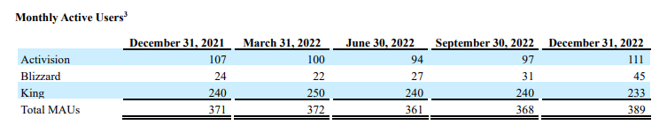

**Verder: wat te doen nu de eShop sluit en wat schuilt er achter de beta van Diablo 4?**

Sony en Microsoft liggen nog steeds overhoop met elkaar, omdat die laatste Activision wil kopen. Microsoft heeft daarom een nieuwe oplossing: wat als Sony gewoon zelf een Call of Duty-killer laat maken? Dat is vast hartstikke makkelijk.

Daarnaast blikken we deze week vooruit op het sluiten van de eShop, waardoor veel digitale 3DS- en Wii U-games verdwijnen. En we hebben het over de bèta van Diablo 4, die stiekem meer een marketingdemo is.

Deze editie van Gamepraat telt 1.398 woorden en neemt zeven minuten van je tijd in beslag. Vind je hem leuk? Abonneer hieronder of tip hem bij een vriend, dat helpt mij enorm. We trappen af!

[Subscribe now](#/portal/signup)

## De eShop gaat dicht, is het slim om nu nog snel games te kopen?

-   Op maandag 27 maart sluit Nintendo de eShop voor Nintendo 3DS en Wii U, waardoor je hier geen games meer kunt kopen.
-   Op sociale media deelt iedereen gametips, nu je ze nog kunt krijgen.
-   Het offline halen van de eShop is een klap voor gamepreservatie - veel spellen zijn hierdoor niet meer legaal te koop.

Op het moment van schrijven heb je nog een dag of vijf om je meest gewilde games voor de Nintendo 3DS te downloaden. Uitgevers stunten in aanloop naar de winkelsluiting met prijzen, waardoor je veel klassiekers nu voor een prikkie kunt downloaden voor de oude consoles.

Het sluiten van de eShop treft bijna iedere noemenswaardige game. Sommige spellen waren alleen digitaal beschikbaar en zullen vanaf 27 maart helemaal niet meer te krijgen zijn. Andere games verschenen op cartridge en zijn te vinden op de tweedehandsmarkt, maar hadden vaak extra downloadbare content die je niet langer via de eShop kunt downloaden. Het is een aderlating voor de oude consoles.

Online stikt het van de lijstjes met game-aanraders voor de Nintendo 3DS - collegajournalist Ron Vorstermans raadt hieronder een paar aan:

> ‼️ Mijn grote 'wat moet ik halen nu de eShop sluit?'-3DS lijst ‼️
>
> Geen objectieve lijst, maar mijn lijst.
>
> Succes ermee! 🫡
>
> — Ron (@RonVorstermans) [6:52 AM ∙ Mar 22, 2023](https://twitter.com/RonVorstermans/status/1638433338808586240?ref=gamepraat.nl)

Daarnaast stuntte YouTuber Jirard Khalil door iedere game die ooit verscheen in de eShop te kopen. Dat bleek best een uitdaging: de achterliggende betaalmethoden worden stilletjes al verwijderd, waardoor hij eShop-kaarten in gamewinkels moest kopen. Maar winkels willen slechts een beperkte hoeveelheid aan je verkopen, waarna anti-fraudesystemen van Nintendo ervoor zorgen dat je niet in één keer alles kunt verzilveren.

[Bekijk ingesloten media](https://www.youtube-nocookie.com/embed/ujHUMG0Uovs?rel=0&autoplay=0&showinfo=0&enablejsapi=0)

Het is verleidelijk om bovenstaande tips en voorbeelden te volgen en nu nog even snel je meest gewilde games te downloaden - het kan nog! Volgens Nintendo blijven de servers na 27 maart nog even draaien, zodat je eerder gekochte games kunt blijven downloaden.

Maar dat is nu. De kans bestaat dat de servers mettertijd helemaal offline gaan. Games die je hebt gedownload kun je dan blijven spelen - totdat het SD-kaartje waar je alles op hebt gezet op een dag kapotgaat. Omdat het winkelplatform niet meer wordt ondersteund, kun je dan niet bij Nintendo aankloppen voor hulp.

De aankopen die je nu doet zullen mettertijd dus niet meer werken. Dat is een pijnlijke realiteit voor bijna alles dat je digitaal koopt, want niemand kan garanderen dat Nintendo, Sony of Microsoft over vijftig jaar nog overeind staan en je aankopen honoreren. Maar bij Nintendo is dat moment nu héél dichtbij en voelt het riskant om nu voor een download te betalen.

Anderzijds heb je weinig andere opties. Het alternatief is games illegaal downloaden, maar op die manier steun je de originele makers niet. Door nu een paar euro te betalen, weet je in elk geval dat de ontwikkelaars iets aan je hebben verdiend.

## Is de Diablo 4-bèta wel echt een bèta?

-   Afgelopen weekend begon de bèta van Diablo 4.
-   Spelers konden voor het eerst de game op grote schaal uitproberen.
-   Blizzard zegt dat de bèta wordt gebruikt om feedback te verzamelen, maar tegelijkertijd lijkt hij vooral bedoeld om de game te verkopen.

Afgelopen weekend was de bèta van _Diablo 4_. Wie de game had gepreorderd, kon alvast een weekendje het eerste hoofdstuk spelen. Datzelfde feestje herhaalt zich volgend weekend nog eens, maar dan worden de servers voor iedereen opengesteld.

Ze noemen het een bèta, dus strikt gezien is het allemaal nog wat experimenteel: Blizzard legt de game in zijn huidige staat voor, zodat spelers kunnen pielen aan de knoppen terwijl de ontwikkelaar kijkt hoe de servers zich gedragen. Feedback uit de bèta kan nog worden gebruikt om de game aan te passen - iets dat volgens Blizzard [ook de bedoeling is](https://www.nme.com/news/gaming-news/diablo-4-beta-server-issues-will-lead-to-better-launch-3416835?ref=gamepraat.nl).

Maar tegelijkertijd wringt het: de bèta wordt wat hijgerig ingezet als een marketingtruc, deels door alleen spelers die vooraf geld betalen afgelopen weekend binnen te laten. Online wordt [gestunt](https://www.polygon.com/23650772/diablo-4-beta-giveaway-thumbtack-cleaning-services?ref=gamepraat.nl) met marketingacties om het testweekend bij spelers te slijten - spelers in de VS maken kans om hun huis te laten schoonmaken terwijl ze spelen. En omdat Blizzards uitspraken over verbetering vooral gaan over de achterliggende servers, lijkt de kans klein dat de game onder handen genomen zal worden.

Daarnaast kun je afvragen of er echt nog tijd is om de game op basis van de testperiode nog aan te passen. Het is nu maart, het spel staat gepland voor juni dit jaar. Dat geeft de ontwikkelaars drie maanden om de feedback te verwerken. Dat is vast genoeg tijd voor kleine veranderingen, maar aan de kern kan niet meer worden getornd.

## Sony's eigen Call of Duty

-   Het conflict tussen Microsoft en Sony rond de Activision-overname woedt voort.
-   Sony vreest dat _Call of Duty_ mettertijd een exclusieve Xbox-game zal worden, terwijl Microsoft eerder beloofde dat de reeks multiplatform blijft.
-   De nieuwste ontwikkeling: Microsoft denkt dat Sony best wel zelf een _Call of Duty_\-alternatief kan maken.

Marktwaakhonden onderzoeken nog steeds of Microsoft de overname van Activision-Blizzard mag voortzetten. Het is een langzaam proces, waarbij ik zelf vermoed dat alles straks gewoon mag doorgaan. Maar zolang nog niks zeker is, blijven Microsoft en Sony kibbelen - die laatste wil de overname tegenhouden.

De grote angst bij Sony: als _Call of Duty_ in handen komt van Microsoft, dan zou die game mettertijd exclusief voor de Xbox kunnen worden. Daarmee zou de PlayStation één van de grootste games op aarde kwijtraken, wat ervoor kan zorgen dat bijvoorbeeld de toekomstige PlayStation 6 slechter verkoopt. Er is immers een grote groep gamers die alleen _Call of Duty_ en soms ook _FIFA_ speelt, voor wie exclusiviteit een grote rol zal spelen bij de keuze voor een nieuwe console.

Op het moment ligt er een exclusiviteitsdeal voor tien jaar, waardoor _Call of Duty_ niet zomaar van de PlayStation zal verdwijnen. Daarnaast zegt Microsoft dat ze hun games juist breed willen uitgeven - _Minecraft_ is jaren na de Microsoft-overname ook nog op de PlayStation te vinden. Als je kijkt naar eerdere deals, dan is Sony juist degene die game exclusief maakt na een overname. Na een diepte-investering in Bungie werd _Destiny 2_ bijvoorbeeld van Game Pass gehaalt.

En als Microsoft op zijn belofte terugkomt? Dan denkt het bedrijf dat Sony genoeg tijd heeft om zich hier op voor te bereiden: "Microsoft vindt een periode van tien jaar voldoende voor Sony, een grote uitgever en consoleplatform, om alternatieven voor Call of Duty te maken”, [leest](https://kotaku.com/call-duty-activision-ps5-black-ops-mwii-sony-xbox-1850249481?ref=gamepraat.nl) een verklaring van de techreus.

Of Sony dat ook vindt, is de vraag. Jaren geleden probeerden ze dit immers al: _Killzone_ en _SOCOM_ haakten in op hetzelfde publiek, maar konden zich qua verkoopcijfers nooit met Call of Duty meten.

Overigens is Sony wel prima in staat om goed verkopende games te maken. _Spider-Man_ bleek in 2020 ruim 20 miljoen keer te zijn verkocht, een cijfer dat inmiddels geheid hoger ligt door de recente pc-ports. Dat is alsnog minder dan de vaak torenhoge Call of Duty-cijfers, maar uit [kwartaalcijfers](https://investor.activision.com/static-files/31e11337-d1ea-4d3c-8483-5eeee8acf8e3?ref=gamepraat.nl) van Activision blijkt dat Call of Duty niet echt meer significant groeit.

## Toffe Steam-deals

Op het moment van schrijven is er nog een Steam Sale! Daarom in plaats van de gebruikelijke allerhande dingetjes nog mijn tips qua leuke koopjes:

-   **Sunset Overdrive**, van Insomniac Games, kost op het moment [slechts 4 euro](https://store.steampowered.com/app/847370/Sunset_Overdrive/?ref=gamepraat.nl). Hoewel hij officieel unsupported is, draait hij vlekkeloos op de Steam Deck.
-   Borderlands-spinoff **Tiny Tina's Assault on Dragon Keep** is zelfs [helemaal gratis](https://store.steampowered.com/app/1712840/Tiny_Tinas_Assault_on_Dragon_Keep_A_Wonderlands_Oneshot_Adventure/?ref=gamepraat.nl) te downloaden. Alweer wat ouder inmiddels, maar alsnog best leuk.
-   Ter voorbereiding op Jedi Survivor kun je **Jedi Fallen Order** halen [voor 4 euro](https://store.steampowered.com/app/1172380/STAR_WARS_Jedi_Fallen_Order/?ref=gamepraat.nl), of 5 euro voor de luxere editie.
-   3,12 euro voor **Dicey Dungeons** is [een koopje](https://store.steampowered.com/app/861540/Dicey_Dungeons/?ref=gamepraat.nl). Deze roguelike-puzzelgame met dobbelstenen is gemaakt door Terry Cavanagh, bekend van VVVVVV en Super Hexagon.

[Subscribe now](#/portal/signup)
