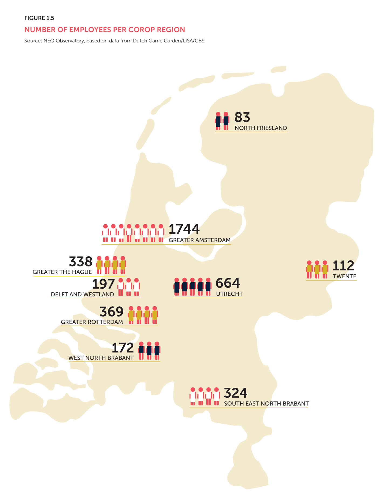

Eerder vandaag werd bekend dat uitgever Embracer op het punt staat ontwikkelstudio Gearbox te verkopen aan Take-Two. Die overname heeft grote gevolgen voor het Amsterdamse kantoor van Gearbox, dat één derde van al het personeel heeft ontslagen.

_Deze editie van Gamepraat telt 1.094 woorden en neemt vijf minuten van je tijd in beslag. Vind je dit leuk om te lezen? Neem een betaald abonnement, doneer eenmalig iets op_ [_Petje Af_](https://petjeaf.com/gamepraat?ref=gamepraat.nl) _of stuur de nieuwsbrief door naar een vriend! Dat helpt allemaal ontzettend._

## Wat we weten over de ontslagen bij Gearbox Amsterdam

Embracer heeft nog niks over de reorganisatie bij Gearbox Amsterdam bekendgemaakt, maar verschillende bronnen vertellen mij dat een groot deel van het personeelsbestand is ontslagen. Het zou gaan om 33 procent alle medewerkers. Op het moment van schrijven werken er 24 mensen bij de Amsterdamse tak van het bedrijf, wat betekent dat acht mensen op straat komen te staan.

Enkele maanden geleden kondigde de Nederlandse general manager zijn vertrek aan bij Gearbox Amsterdam. Een reden werd toen niet gegeven, volgens ingewijden wordt de Amsterdamse tak sindsdien aangestuurd door een manager van een ander land.

Gearbox Amsterdam is vooral een uitgeverij. Bij het bedrijf werken ondermeer mensen die helpen bij de distributie, marketing en promotie op sociale media van Gearbox-producties. Omdat Take-Two zelf een uitgeefdivisie heeft, zal veel van dit personeel vermoedelijk boventallig zijn.

De ontslagen bij Gearbox Amsterdam zullen collega’s bij de Gearbox-tak in het Amerikaanse Dallas in elk geval nerveus maken: ook daar zijn ze voornamelijk bezig met het uitgeven van games.

### Derde ontslagronde in Nederland dit jaar

De ontslagronde in Amsterdam is de zoveelste die onder het bewind van huidige eigenaar Embracer wordt uitgevoerd. De Europese mega-uitgever probeerde met een reeks overnames een dominante positie op de gamesmarkt te verwerven, maar is sindsdien vooral bezig om gekochte bedrijven weer af te ketsen en bij de overblijvende studio’s veel mensen te ontslaan.

Het is ook de derde keer in korte tijd dat een significant aandeel van een Nederlands gamebedrijf is weggesneden. Een maand geleden reorganiseerde PlayStation, waarbij ook Guerrilla Games werd getroffen. Anonieme medewerkers vertelden mij dat [tien procent van het bedrijf daarmee op straat kwam te staan](/ook-het-nederlandse-guerrilla-ontkomt-niet-aan-de-ontslaggolf), omgerekend circa. 40 mensen.

Daarnaast kondigde ontwikkelstudio KeokeN aan een deel van zijn kernteam te ontslaan. Het ging daarbij om vier mensen - een klein kwart van het 19-koppige team.

## We weten eindelijk hoe de Nederlandse gamesector het in 2021 deed

Er zijn weinig gegevens over hoe de gehele Nederlandse gamesector presteert. De Dutch Game Garden doet er onderzoek naar, maar het was jaren geleden sinds er voor het laatst cijfers waren gepubliceerd.

Deze week is dan toch eindelijk de Dutch Game Monitor 2022 gepubliceerd, een onderzoek met cijfers over de industrie tot en met 2021. Die data is inmiddels best wel oud, wat het lastig maakt om bijvoorbeeld een volledig beeld te krijgen van de gamesector in Nederland na de coronapandemie.

Toch is het boeiende info om eens in te duiken. Hieronder een paar dingen die mij opvielen:

-   Gemiddeld werkten er 7,2 medewerkers in 2021 bij een Nederlands gamebedrijf. Een groot deel daarvan is ZZP’er of werkt bij een kleine studio.
-   De meeste gamebanen bevinden zich in de regio Amsterdam, op plek twee staat Utrecht. De top vijf wordt afgemaakt door de regio Rotterdam, zuid-oost-Noord Brabant en de regio Den Haag. Hieronder een kaartje van waar iedereen werkte.

-   Het aantal game-opleidingen in Nederland is gekrompen. In 2021 waren er 44 studies en minoren. Ook studeren er minder mensen af bij die opleidingen, 700 in 2020 versus ongeveer 900 in 2018.
-   Een kwart van de Nederlandse gamebedrijven werkt aan serious games - spellen die bijvoorbeeld helpen bij het trainen of opleiden van personeel. Het aantal bedrijven in deze sector is gegroeid, van 114 in 2018 naar 151 in 2021.
-   Driekwart van het personeel bij Nederlandse gamebedrijven was in 2021 man. 23 procent was vrouw, één procent anders of non-binair.
-   Het is ook een industrie met vooral jonge mensen: 60 procent van het personeel is jonger dan 35.

[Je leest alle onderzoeksresultaten hier](https://drive.google.com/file/d/1CaiogwOdQz2Navb5sK3qRG2NqIx0ErN_/view?ref=gamepraat.nl).

## We hebben meer producenten als Final Fantasy XIV’s Yoshida nodig

Afgelopen weekend onthulde _Final Fantasy XIV_\-producent Naoki Yoshida de verkoopdatum voor het nieuwste uitbreidingspakket _Dawntrail_: spelers kunnen vanaf 2 juli aan de slag, of op 28 juni als ze pre-orderen en toegang tot de Early Access hebben.

Dat is leuk, maar interessanter vond ik de toon waarop Yoshida de datum deelde: hij vertelde dat _Dawntrail_ eerst een week eerder moest verschijnen, maar dat ze dan in de knoop zouden komen met het verschijnen van de DLC van _Elden Ring_. En "die wilde hij ook nog even spelen", grapte hij.

[Bekijk ingesloten media](https://www.youtube.com/embed/kgiuQwzB6aU?feature=oembed)

Uitgevers proberen doorgaans uit elkaars vaarwater te blijven, zodat ze niet hoeven te vechten om de aandacht van gamers. Dat is een publiek geheim, maar Yoshida is één van de weinigen die daar openbaar heel ontspannen over praat. Hij zei bij een persevenement van _Final Fantasy XVI_ vorig jaar iets vergelijkbaars: die game kwam volgens hem ver na _The Legend of Zelda: Tears of the Kingdom_ uit, zodat gamers beide rustig aan konden spelen. Hij had zelf ook best zin in _Zelda_.

In een wereld vol mediagetrainde AAA-ontwikkelaars is Yoshida een frisse wind. Tijdens een interview vertelde hij me eens heel eerlijk dat hij zijn werk in de Raad van Bestuur bij Square Enix [verschrikkelijk vond](/final-fantasy-xvi-is-fantastisch) - een uitspraak waar je geen enkel persoon in zijn positie ooit op zal betrappen.

Hij zinspeelde tijdens de Dawntrail-onthulling ook op iets anders interessants: volgens hem zit de uitbreiding vol met verwijzingen naar _Final Fantasy IX,_ maar "het is een geheim waarom dat zo is". Een gedurfde uitspraak, want het stikt online van de geruchten over een remake van die game.

## Verder interessant deze week

-   Ze zitten bij Blizzard denk ik te zweten deze week. _Marvel Rivals_ is een _Overwatch_\-game met superhelden, die in de eerste trailer er best leuk uitziet.

[Bekijk ingesloten media](https://www.youtube.com/embed/DA4iVv4MARE?feature=oembed)

-   [_Starship Simulator_](https://www.kickstarter.com/projects/fleetyard/starship-simulator?ref=gamepraat.nl) op Kickstarter ziet er fascinerend uit. Een ruimteschipsimulator waarin je samen met vrienden _Star Trek_ kunt naspelen.
-   Remedy zou werken aan een [live-service-spinoff van Control](https://www.videogameschronicle.com/news/remedy-has-shared-new-details-about-condor-its-live-service-control-spin-off/?ref=gamepraat.nl).
-   Er is een pallet met Playdate-spelcomputers gestolen. Volgens de maker gaat het om [400.000 dollar aan hardware](https://www.gamedeveloper.com/business/two-pallets-of-playdates-worth-400-000-have-been-stolen-from-panic?ref=gamepraat.nl).
-   Er komt [geen DLC voor Baldur’s Gate 3](https://www.ign.com/articles/larian-studios-wont-make-baldurs-gate-3-dlc-expansions-or-baldurs-gate-4?ref=gamepraat.nl) van Larian, en ook geen Baldur’s Gate 4 van de studio.

Tot volgende week!
