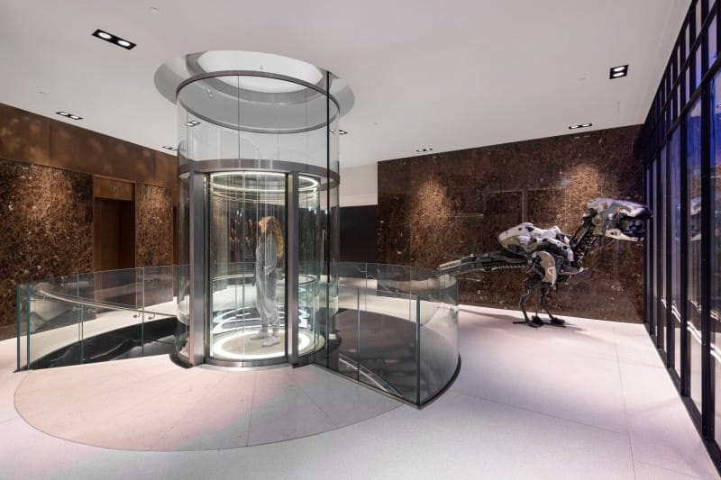

Al maanden zitten we in een onnoemelijk grote ontslaggolf binnen de game-industrie. Dat was meestal een ver-van-ons-bed-show, maar afgelopen week bereikte hij dan toch ongenadig ons eigen land: Guerrilla, onze grootste gamemaker, moest tientallen mensen op straat zetten. En zij waren niet de enigen die een ontslagronde aankondigden.

Het totaalaantal ontslagen bij gamebedrijven is deze week weer flink toegenomen: ruim 8.000 mensen verloren dit jaar tot nu toe hun baan, aldus cijfers verzameld door [VideoGameLayoffs.com](https://videogamelayoffs.com/?ref=gamepraat.nl). Deze week wil ik inzoomen op twee partijen waarbij dit in Nederland gebeurde: Guerrilla en KeokeN.

_Deze editie van Gamepraat telt 936 woorden en neemt vier minuten van je tijd in beslag. Vind je dit leuk om te lezen? Neem een betaald abonnement, doneer eenmalig iets op_ [_Petje Af_](https://petjeaf.com/gamepraat?ref=gamepraat.nl) _of stuur de nieuwsbrief door naar een vriend! Dat helpt allemaal ontzettend._

## Eén op de tien Guerrilla-medewerkers op straat

De ontslaggolf bij Guerrilla Games is onderdeel van een bredere beweging bij PlayStation. De gamereus kondigde aan ongeveer acht procent van het personeel te ontslaan tijdens een 'moeilijke, maar noodzakelijke reorganisatie'. Exacte cijfers voor Guerrilla Games werden niet gedeeld, maar [bronnen vertelden mij](https://www.ad.nl/games/ontslagronde-bij-nederlandse-gamemaker-guerrilla-tientallen-medewerkers-op-straat~a492e6fb/?ref=gamepraat.nl) dat het gaat om tien procent van het personeel. Volgens de laatst gepubliceerde cijfers werkten er 400 mensen bij het bedrijf, wat zou neerkomen op veertig ontslagen.

Het gaat om werknemers binnen alle lagen van het bedrijf: van communitymanagement tot aan design, van juniors tot aan seniors. Binnen een half uur na de aankondiging hoorden mensen of zij waren getroffen. Het zorgt inmiddels voor een rouwsfeer binnen het bedrijf, waar mensen hun jarenlange collega’s ineens noodgedwongen zagen verdwijnen.

In 2020 verhuisde Guerrilla naar een nieuw, groter kantoor in het oude Telegraaf-gebouw, omdat ze niet genoeg plek meer hadden voor de toen 350 medewerkers.

Het deed mij denken aan [dit interview met game director Mathijs de Jonge](https://www.nu.nl/tech/6184689/nieuwe-horizon-game-had-eerder-kunnen-uitkomen-we-wilden-niet-overwerken.html?ref=gamepraat.nl) in 2022. Ik sprak hem toen voor [NU.nl](https://nu.nl/?ref=gamepraat.nl) omdat _Horizon Forbidden West_ net was verschenen, een game die later de grootste Nederlandse mediaproductie ooit bleek te zijn. Wat hij me toen vertelde voelde op dat moment niet relevant voor het artikel en schreef ik niet op, maar gonst nu wel in mijn hoofd: hij benadrukte dat erg veel Guerrilla-personeel er jarenlang werkt en niet de neiging heeft snel te vertrekken.

Gamedesigner Rami Ismail [zei laatst](/nieuwsbrief-optrommelen-hideo-kojima) dat de ontslagrondes slecht nieuws zijn voor de algehele kwaliteit voor games. Het zorgt ervoor dat bedrijven minder senioren hebben en niet kunnen voortbouwen op wat ze bij eerdere games hebben geleerd. De uitspraak van De Jonge deed mij eerder vermoeden dat Guerrilla hier wellicht geen last van had.

## Bij KeokeN haten ze deze manier van werken

Ook het Nederlandse KeokeN Interactive - wat ambieert ooit zo groot als Guerrilla te worden - kondigde een ontslagronde aan. Vier medewerkers uit het kernteam van de studio zijn ontslagen. Bij een team van 19 mensen een best groot aantal.

In de aankondiging benadrukken CEO Koen Deetman en managing direct Paul Deetman wat ze hebben gedaan om dit tegen te gaan: ze hadden allebei al hun salaris gekort en en afgelopen maanden zelfs geen salaris geïnd, zodat er genoeg geld was het bedrijf met zijn oude capaciteit draaiende te houden. Dat bleek op de lange termijn echter niet houdbaar.

[Bekijk ingesloten media](https://www.linkedin.com/embed/feed/update/urn:li:share:7168942073633579011)

Deetman was in een interview afgelopen herfst ook al kritisch over hoe AAA-studio’s functioneren door steeds weer personeel te ontslaan. Toen had het kernteam nog 19 medewerkers, maar zei hij het volgende:

> Momenteel werken we met een kernteam van vijftien man, met daar bovenop nog eens vijftien mensen die je meestal kwijtraakt als het project af is. Die manier van werken is helemaal niet prettig. Als een subsidie dit kan opvangen, hoeven we niet op een superhit te hopen om mensen vast te kunnen houden.

Die subsidie wordt in Nederland [druk voor gelobby’d](https://www.ad.nl/games/gamemakers-in-nederland-luiden-noodklok-talent-vertrekt-naar-buitenland-br-br~ad30875b/?ref=gamepraat.nl) door de Dutch Games Association. Of die er komt is nog afwachten: de staatssecretaris die zich daarmee bezig hield stapte recent op - en er wordt nu net een kabinet geformeerd waarbij de grootste partij liever niet teveel in cultuur investeert.

## Elders geschreven

-   [In NRC Handelsblad mijn recensie van Final Fantasy VII Rebirth](https://www.nrc.nl/nieuws/2024/02/22/in-fenomenale-game-remake-final-fantasy-vii-rebirth-dwaal-je-van-de-gebaande-paden-af-a4190948?ref=gamepraat.nl), één van de meest ambitieuze remakes die ik ooit heb gespeeld.
-   Het was laatst twee jaar geleden dat in de Apple Store in Amsterdam een gijzeldrama plaatsvond. Ik [sprak met de Europese baas van de Apple-winkels](https://www.ad.nl/tech/apple-na-gijzeling-in-amsterdam-ving-personeel-wel-op-en-boekte-een-week-lang-een-hotel-voor-nazorg~a75760e5/?ref=gamepraat.nl) over hoe zij personeel daarna hebben opgevangen, iets waar het bedrijf tot dusver niks over kwijt wilde.
-   Hierboven al kort genoemd, maar [ik sprak met bronnen over de ontslagen bij Guerrilla](https://www.ad.nl/games/ontslagronde-bij-nederlandse-gamemaker-guerrilla-tientallen-medewerkers-op-straat~a492e6fb/?ref=gamepraat.nl).
-   Voor Kidsweek recenseerde ik [Garden Life: A Cozy Simulator](https://www.kidsweek.nl/entertainment/games/recensie-garden-life-gamen-met-groene-vingers?ref=gamepraat.nl). Mijn recensie daar van [Mario vs. Donkey Kong](https://www.kidsweek.nl/entertainment/games/recensie-mario-vs-donkey-kong?ref=gamepraat.nl) is nu ook online te lezen.
-   Nintendo klaagde deze week de makers van Switch-emulator Yuzu aan. Reden om bij NU.nl nog eens te vragen: [is het eigenlijk illegaal om roms te spelen?](https://www.nu.nl/slimmer-leven/6303384/is-het-illegaal-om-nintendo-switch-games-op-je-telefoon-te-spelen.html?ref=gamepraat.nl) Met dank aan gamejurist René Otto.

## Verder interessant deze week

-   Nog één ontslagronde dan: bij EA is [vijf procent van het personeel ontslagen](https://www.gamesindustry.biz/ea-cutting-5-of-workforce?ref=gamepraat.nl). Een onaangekondigde Star Wars-game is daar [geschrapt](https://www.bright.nl/nieuws/1183754/ea-trekt-stekker-uit-star-wars-game-na-ontslaggolf-meer-titels-op-het-spel.html?ref=gamepraat.nl) en ze gaan minder licentiegames maken.
-   Een [witte Xbox Series X](https://exputer.com/exputer/all-digital-white-xbox-series-x-development/?ref=gamepraat.nl) zonder discdrive zou er bijna aankomen.
-   Oh, en de [PlayStation 5 Pro](https://tweakers.net/nieuws/216690/ps5-pro-verschijnt-september-2024-gebruikt-sonys-eigen-upscalingtechnologie.html?ref=gamepraat.nl) zou rond september op de planning staan.
-   Activision-Blizzard-studio Toys for Bob, bekend van o.a. de remakes van Crash Bandicoot en Spyro, [wordt een indiebedrijf](https://open.substack.com/pub/stephentotilo/p/toys-for-bob-independent).
-   Heel gek: Balatro is [uit online winkels gehaald](https://kotaku.com/balatro-nintendo-switch-eshop-removed-gambling-1851301756?ref=gamepraat.nl) omdat er gokelementen in zouden zitten. Het spel gebruikt traditionele speelkaarten, maar is juist niet gemaakt om te gokken. Het is een roguelike deckbuilder.
-   Ook Octopath Traveler is [uit de eShop verdwenen](https://twitter.com/Wario64/status/1763600660573098491?ref=gamepraat.nl) - vermoedelijk omdat Nintendo hem uitgaf en de rechten terug zijn naar Square Enix.

Tot de volgende keer!
