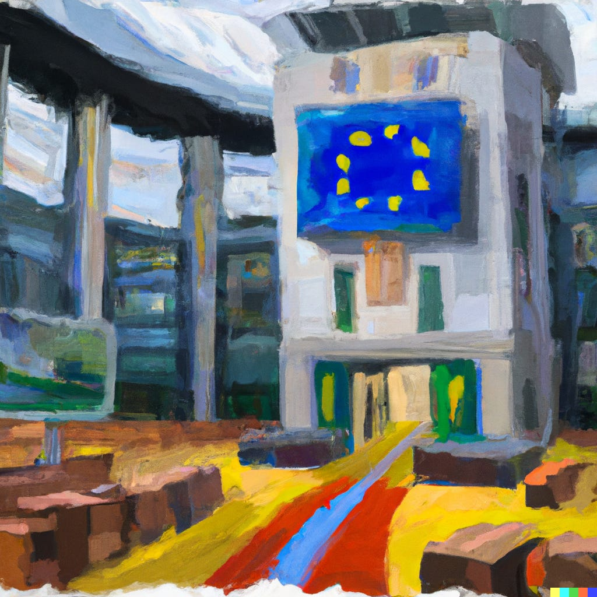

Afgelopen dinsdag was ik in Hilversum voor iets bijzonders: de podcast Gamebites, die ik een decennium lang samen met collega-journalisten Erwin Vogelaar en Harry Hol maakte, werd formeel opgenomen in het archief van Beeld en Geluid. Een primeur van hun, want gamepodcasts archiveren deden ze tot nu toe niet. Dat is voor ons natuurlijk leuk, maar het is denk ik ook de zoveelste goede stap die zij nemen om onze gamegeschiedenis in Nederland te waarborgen. Dat gebeurde tot voor kort maar amper.

Verder was dit ook de week waarin Googles streamingdienst Stadia het loodje legde en Europa een (kleine) stap zette in de strijd tegen lootboxen. Het komt allemaal aan bod in deze nieuwsbrief van 1.711 woorden, die zo'n 8 minuten van je tijd neemt.

Trouwens: deze nieuwsbrief verschijnt iets eerder, om 4:30. Dat is het moment waarop we bekendmaken dat het Beeld en Geluid-nieuws bekend wordt, en ik vind het leuk dit ook zo snel mogelijk met jullie te delen. Maar ik ben nu wel benieuwd: wat vinden jullie een perfect moment voor een nieuwsbrief? Heb je hem graag vroeg in de ochtend, of liever tijdens de lunch zoals eerder het geval was? Laat het me weten in de comments hieronder of door op de mail te reageren. Thanks!

[Subscribe now](#/portal/signup)

## Gamebites en Spelkost in Beeld en Geluid

-   Gamebites en Spelkost zijn de eerste gamepodcasts in het archief van Beeld en Geluid.
-   De organisatie heeft inmiddels ook Nederlandse games in hun archief.
-   Volgende maand opent het vernieuwde museum bij Beeld en Geluid, waarbij games een permanente plek krijgen in de expositie.

[Vorige week](/een-geheime-kamer-vol-woedende-gameontwikkelaars) had ik het er al even over: de Nederlandse gamegeschiedenis is bar slecht gedocumenteerd. Wil je weten wat iemand vond van een oude Mario-game of van een verkoopverbod voor een gewelddadig spel, dan is er slechts een handjevol tijdschriften dat je er op kunt naslaan. De meeste daarvan zijn niet goed gedigitaliseerd door hun (soms zelfs verdwenen) uitgevers, waardoor je afhankelijk bent van het papieren archief bij de Koninklijke Bibliotheek. Of, als je geluk hebt, die oude stapel Power Unlimiteds die nog bij je ouders op zolder ligt.

_Ter viering van de archivering namen we een aflevering van Spelkost op locatie op,_ [_je kunt hem hier luisteren_](https://spelko.st/011-te-vinden-naast-de-ark-of-the-covenant?ref=gamepraat.nl)_._

Beeld en Geluid documenteert geen geschreven journalistiek werk, maar biedt toch een soort tijdcapsules door Nederlandse gamepodcasts te archiveren. Nu lijkt dat misschien een beetje gek. Nederlandse gamepodcasts bestaan bijna allemaal uit kletsende journalisten, die nog eens de actualiteit of hun bevindingen in recente games nabespreken. En meningen zijn online genoeg te vinden.

Maar zo'n archief is niet voor vandaag: dit zijn podcasts die ook over vijftig, honderd of misschien zelfs duizend jaar geraadpleegd kunnen worden. De servers waar ze op stonden zijn tegen die tijd allang offline, maar door het archief zijn afleveringen toch nog te beluisteren. Onze achterkleinkinderen kunnen straks horen hoe gamejournalisten reageerden op de komst van nieuwe titels en spelcomputers, of op grote ontwikkelingen in het nieuws. Dat gaat dan zo ouderwets klinken als de polygoonjournaals nu.

Dat is een schaal waar we bij games eigenlijk nooit over nadenken. Middelen zoals emulatie houden oude consoles nog in leven, maar worden nog steeds vaak naar de achtergrond gedrukt uit angst dat het [niet altijd legaal is](/hij-werd-ooit-wereldberoemd-met-sonic). Omdat het medium afhankelijk is van steeds weer nieuwe computergeneraties, is het speelbaar houden van oude titels ook een stuk lastiger dan bijvoorbeeld het archiveren van een film of radio-uitzending. Een oude Game Boy bij het archief stoppen is ook geen oplossing, want ooit zullen de transistors en chips kapotgaan en zijn die games alsnog niet speelbaar.

Beeld en Geluid probeert daar in elk geval bij Nederlandse games iets aan de toen, wat heel gaaf is om te zien. Het heeft overigens ook een keerzijde: mijn familie zal nog generaties later kunnen horen dat ik de Ouya een goed idee vond.

## Stadia ging op de best mogelijke manier ten onder

-   Google Stadia is vanaf 18 januari niet meer te gebruiken.
-   Op het laatste moment kwam Google met een speciale webapp, waarmee je oude controllers met bluetooth laat werken.
-   Games gekocht bij Stadia zijn ook terugbetaald aan klanten.

De dood van Stadia was eigenlijk voor niemand een verrassing. Google staat er om bekend de stekker uit slecht lopende projecten te trekken, een categorie waar de gamestreamingdienst zich na maanden zonder noemenswaardige games onder kon scharen. Het bedrijf had simpelweg niet genoeg slagkracht om op te boksen tegen de lobby van Microsoft, Sony en Nintendo, die met z'n drieën de markt voor grote, exclusieve games in handen hebben.

Zelf was ik fan van het eerste uur. Gezien mijn liefde voor ook de Ouya zou je van een patroon kunnen spreken - kennelijk steun ik graag gedoemde projecten. Al jaren voor Stadia had ik netjes door mijn huis ethernetkabels gelegd zodat het scherm van mijn game-pc naar iedere kamer met een tv gestreamd kon worden, een technologie die ooit magisch aanvoelde. Stadia deed feitelijk hetzelfde, maar dan met een server-pc in plaats van mijn eigen bak. Ze deden dat niet als enige, maar hun streamingtechnologie was wel de beste. Die tech wil Google nu verpanden aan andere bedrijven, dus hopelijk hebben we straks nog iets gehad aan dit gestrande project.

Het staken van de dienst werd vorig jaar al aangekondigd, maar deze woensdag werd de stekker er formeel uitgetrokken. Voor fans was het pijnlijk, maar er is ook één positieve noot: nooit eerder zag ik een online dienst op zo gracieuze wijze tot een einde komen.

Dat begon al bij de compensatie voor klanten. Iedere game en ieder gekocht hardwareproduct is door Google terugbetaald, soms voor honderden of zelfs duizenden euro's per klant. Bedrijven als Ubisoft gaven kopers van Stadia-games zelfs een kopie van de pc-variant. Stadia-kopers van _Assassin's Creed Valhalla_ hebben hierdoor bijvoorbeeld hun aankoopbedrag terug én kunnen de game vrolijk verder spelen op een game-pc.

Het pijnpunt leek heel even de gamecontroller: die werkte op speciale wijze met wifi, wat alleen op Stadia kon. Bij het offline gaan van de dienst zouden die dus alleen bekabeld nog werken, in een tijd dat bijna iedereen alleen nog maar draadloze gamepads in huis heeft. Maar op het laatste moment kwam Google ook met een oplossing hiervoor. Speciale software laat je iedere Stadia-controller veranderen in een bluetooth-apparaat.

Al dat zorgt ervoor dat spelers bijna niks zijn verloren aan hun tijd met Stadia. Dat is zeer consumentvriendelijk, maar eigenlijk ook een noodzaak van Google. Want zoals ik hierboven al schreef: de techreus heeft een reputatie.

Het ene na het andere project sneuvelt bij het bedrijf. Meestal zijn dat gratis diensten zoals een chatapp, waardoor het verlies voor gebruikers klein is. Maar een dienst waar je geld in moest steken? Dat is dan al snel verloren geld. Als Google nu niet Stadia-klanten compenseert, dan is dat een gigantische klap voor het vertrouwen van het bedrijf. En dan is de kans dat niemand nog geld wil betalen voor toekomstige Google-plannetjes.

Kortgezegd: door nu Stadia-klanten te compenseren, verzekert het bedrijf dat latere initiatieven niet meteen sneuvelen.

## Weer een stap in de Europese strijd tegen lootboxen

-   Het Europees Parlement wil een onderzoek naar de impact naar lootboxen.
-   Het is geen oproep tot een verbod - maar dat kan hieruit voortvloeien als het rapport kritisch is.
-   Ook wordt gekeken of bij goldfarmbedrijven in online games mensenrechten worden geschonden.
-   Het kan nog jaren duren tot er echt wordt ingegrepen.

Europa beweegt traag: al jaren gaat het over maatregelen tegen lootboxen, waarvan kansspelautoriteiten in meerdere landen zeiden dat het goksystemen vergelijkbaar met fruitmachines zijn. Critici vrezen dat gamers hierdoor gokverslaafd kunnen worden en willen dat dit aan banden wordt gelegd.

Deze week werd in dit proces [weer gestemd](https://tweakers.net/nieuws/205736/europarlement-wil-onderzoek-naar-impact-lootboxes-en-eventuele-maatregelen.html?ref=gamepraat.nl), maar het ging daarbij niet om een stemming voor een verbod of strengere regulering. Nee: er is bepaald dat een onderzoek naar de impact van lootboxen gestart moet worden. Daarbij wordt gekeken of ze inderdaad zo schadelijk zijn als de critici beweren en of er maatregelen getroffen moeten worden. Is dat het geval, dan zal er geheid weer gestemd worden.

_Illustratie gegenereerd met kunstmatige intelligentie DALL-E._

Met dit tempo kan het zeker nog een paar jaar duren totdat Europa ingrijpt bij lootboxgames. Goed dat het gebeurt, maar je kunt afvragen of het tegen die tijd nog nodig is: steeds meer grote games bewegen weg van lootboxen, om in plaats daarvan een Battle Pass te introduceren. Misschien dat de lootbox een obscuur systeem is tegen de tijd dat Europese wetgeving is ingevoerd.

Aan de andere kant: zouden gamebedrijven massaal op de Battle Pass zijn overgestapt als de Europese lootboxwetgeving niet dreigde? Wellicht dat uitgevers zijn geschrokken van Europa en dit een stok achter de deur is. Dan maakt het niet uit hoe langzaam het loopt: de dreiging was eigenlijk al genoeg.

Overigens beweegt Europa nóg langzamer als het gaat om goldfarmers. Daarbij wordt gevreesd dat mensenrechten worden geschonden: in arme landen zouden arbeiders nepgeld in games verdienen, dat aan westerse spelers verkocht kan worden voor echte centen. Een fenomeen waar het bij de start van World of Warcraft en zelfs Everquest al over ging - zo'n twintig jaar.

## Ook interessant deze week

-   Op vrijdag verschijnt **Fire Emblem Engage**. De strategiegame is een stap terug van Three Houses van een paar jaar terug, dat Persona nadeed. Dit nieuwe deel is meer 'ouderwets' vechten. Na een tijdje spelen voelt dat goed: liever dat een Fire Emblem-game zich richt op de grootste kracht van voorgangers, dan dat hij andere games probeert na te doen.
-   Ubisoft heeft de stekker getrokken uit drie onaangekondigde games. Daarnaast is hun piratengame **Skull & Bones** voor de zoveelste keer uitgesteld, ditmaal naar 'begin 2023-2024'.
-   Over Ubisoft gesproken: de Franse vakbond [moedigt](https://twitter.com/SolInfoJeuVideo/status/1615263954955116546?ref=gamepraat.nl) personeel bij het gamebedrijf aan om te staken, omdat in een e-mail van de topman wordt gesuggereerd dat er een ontslagronde komt en salarissen zullen dalen.
-   Microsoft ontsloeg deze week [10.000 mensen](https://blogs.microsoft.com/blog/2023/01/18/subject-focusing-on-our-short-and-long-term-opportunity/?ref=gamepraat.nl) - waaronder geheid ook Xbox-personeel. De recessie is steeds meer merkbaar in de gamesector.
-   Al wat ouder, maar ik tip hem graag nog eens: gamejournalist Mark Brown heeft een [YouTube-reeks](https://www.youtube.com/watch?v=4Q7eU3VUi14&embeds_euri=https://mail.vroe.gop/&ref=gamepraat.nl) waarin hij live documenteert hoe hij leert om een game te maken en vervolgens zijn eerste project bouwt. Misschien wel de slimste, meest hands-on kijk op gamedevelopment die je online kunt vinden.

[Subscribe](#/portal/signup)
