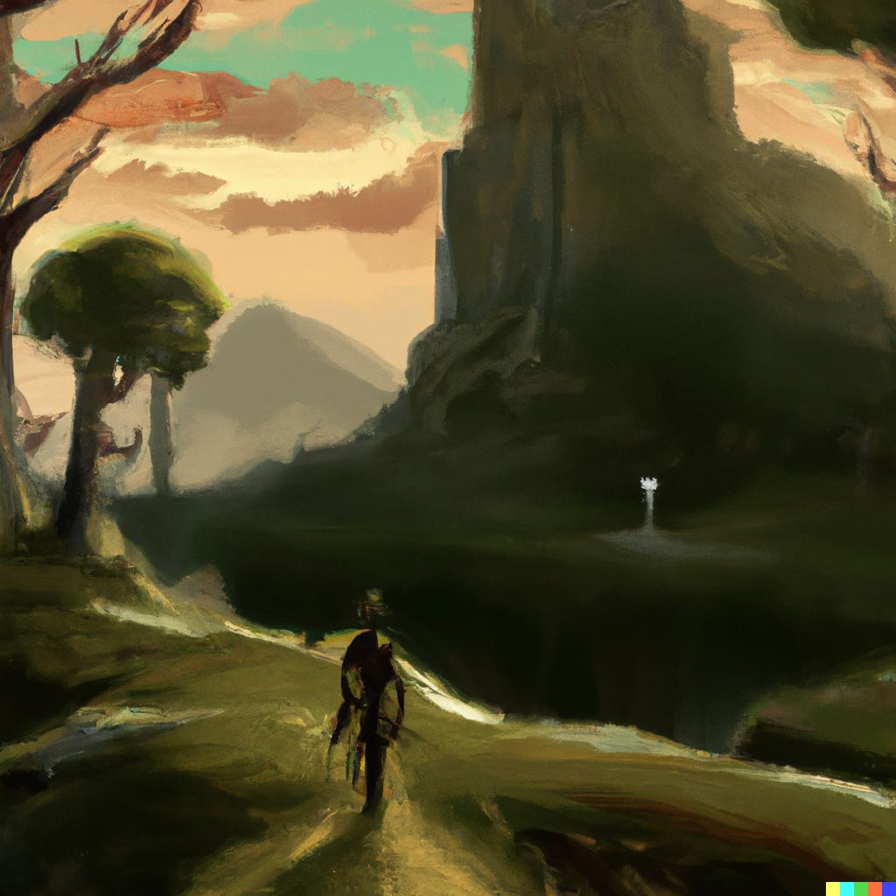

**En verder: hoe een beoordelingssysteem bij Blizzard tot wereldwijde ophef leidde.**

Heb jij al een mening over Forspoken? En zo ja, is dat op basis van grappige online filmpjes, een recensie of omdat je de game hebt gespeeld? Het ging er deze week online wild aan toe rond de nieuwe Square Enix-game, waarbij vaak hard werd geoordeeld op basis van slechts een paar seconden aan gameplay.

Verder heb ik het deze week over de laatste strubbelingen bij Blizzard, waar een beoordelingssysteem voor personeel het internationale nieuws haalde. Deze nieuwsbrief is 1.565 woorden en neemt zo'n 8 minuten van je tijd. We trappen af!

[Subscribe now](#/portal/signup)

## Forspoken kreeg nooit een kans

-   Deze week verschijnt Forspoken, een nieuwe actie-rpg van het team achter Final Fantasy XV.
-   Online wordt de game nu al gefileerd, want dialoog in de game zou 'cringy' zijn.
-   Ondertussen reageert het PR-team achter de game onhandig, door bijvoorbeeld te claimen dat kritische influencers geen testexemplaren ontvangen.

Ik denk dat Square Enix niet eerder een AAA-project had dat zo raar in elkaar zat als Forspoken. De game begon als een soort techdemo onder de naam Project Athia, om te demonstreren wat het bedrijf met ray-tracing en andere grafische innovaties kon neerzetten.

Het werd een bijzonder soort samenwerking tussen oost en west. Voor Square Enix is dat extra bijzonder, want ze hebben net hun westerse uitgeeftak afgestoten. De game wordt gemaakt door een Japans team, maar het achterliggende schrijfwerk is van onder andere Amy Hennig (Uncharted) en Gary Whitta (Star Wars: Rogue One). Muziek is voor de verandering niet van een populaire Japanse componist, maar van de mannen achter God of War en BioShock.

Of de game goed is houd ik graag even in het midden - er zijn inmiddels genoeg recensies die helpen die vraag te beantwoorden, waaronder op [Gamer.nl](https://gamer.nl/artikelen/review/forspoken-struikelt-over-eigen-ambities/?ref=gamepraat.nl) en [IGN Benelux](https://nl.ign.com/forspoken/141720/review/forspoken-review-mooie-intrigerende-wereld?ref=gamepraat.nl). Wat ik vooral bijzonder vind is hoe de game in de afgelopen weken online is opgepakt. Nog ver voordat er recensies waren, leek de game al te zijn afgeschreven. De voornaamste reden: dialoog is 'cringy'.

> I present to you \*actual\* dialogue from Forspoken
>
> — MrMattyPlays (@G27Status) [4:30 PM ∙ Jan 23, 2023](https://twitter.com/g27status/status/1617560414635556865?s=61&t=mhzY92fvx65nIZBDe78D7g&ref=gamepraat.nl)

> Played about 4 hours of Forspoken. It took a little while to get going, but the game is going okay. I have to adjust to its systems a little bit. Fast paced parkour and casting magic spells? There is a lot to take in. Forspoken has the open world tropes like heaving collecting...
>
> — Daan Koopman (@NintenDaan) [2:39 AM ∙ Jan 22, 2023](https://twitter.com/nintendaan/status/1616988999419035648?s=61&t=mhzY92fvx65nIZBDe78D7g&ref=gamepraat.nl)

Hoewel ik het schrijfwerk ook niet bijster goed vind, valt het eigenlijk ook best wel mee. Het zit op het niveau van de gemiddelde Marvel-film en maakt zich schuldig aan flauwigheidjes die je eigenlijk soms ook wel terugziet in games als God of War of Cyberpunk. In Duke Nukem werden zulke one-liners zelfs gevierd, omdat het de game zo 'lekker flauw' maakte.

Bij Forspoken wordt daar veel kritischer naar gekeken. Het lijkt alsof dialoog zich meteen moet meten met grote titels als The Last of Us. Maar waarom zou dat moeten? We verwachten ook niet dat iedere nieuwe film net zo goed is geschreven als The Godfather, of dat elke nieuwe serie een script waardig aan Aaron Sorkin heeft. Films en series van Marvel kunnen prima in hun eigen bubbel bestaan.

Ik denk dat de reden hiervoor tweeledig is. Ten eerste: bij games wordt al snel de aanname gemaakt dat jij altijd de doelgroep bent, vooral als je fan bent van een bedrijf. Alleen als het verschil héél duidelijk is, bijvoorbeeld bij een koddig ogende F2P-game op je telefoon, accepteren fans dat het niet voor hun is.

Forspoken is van Square Enix, het bedrijf achter blockbusters als Final Fantasy, een reeks die is meegegroeid met zijn spelersgroep van inmiddels 30-plussers. Dus dan wordt er van uitgegaan dat Forspoken ook voor hun bedoeld is, terwijl het meer een game voor tieners is. Een vader die ik ken liet de dialogen uit Forspoken aan een tienerdochter horen, en die vond het eigenlijk helemaal niet zo slecht.

_Illustratie gemaakt door kunstmatige intelligentie DALL-E._

Daarnaast lijkt Square Enix de introductie van deze game onhandig te hebben aangepakt. Journalisten kregen wisselend toegang tot vroege testexemplaren - hier in Nederland was het spel in handen van een aantal hobbysites, terwijl grote mainstreammedia hem pas ontvingen op de dag dat recensies live zouden gaan. Vaak is dat slecht nieuws, omdat het betekent dat de uitgever slechte publiciteit hoopt te beperken.

Maar tegelijkertijd ging er iets mis bij gamewinkels. Die ontvingen het spel wél heel vroeg, en besloten hem op sommige locaties al eerder te verkopen. Hierdoor kwam het spel in handen van fans, die na wat trailers met matig dialoog volledig de focus legden op het schrijfwerk. Daarmee was Square Enix de controle volledig kwijt en is alles online een eigen leven gaan leiden.

De paniek lijkt bij het bedrijf ook een beetje te zijn toegeslagen. In een (inmiddels verwijderde) tweet schreef een influencermanager dat er geen testexemplaren worden uitgedeeld aan influencers die vooraf het spel al hadden afgekraakt, omdat ze het geen eerlijke kans hadden gegeven. Niet eens een heel rare houding om te hebben, maar bij een game die al beperkt met journalisten was gedeeld schoot dat in het verkeerde keelgat. Ik ben benieuwd hoe Forspoken het de komende maand gaat doen qua verkoopcijfers.

## Bij Blizzard krijg je ook een slechte beoordeling als je het 'slechts' heel goed doet

-   Een manager bij gamestudio Blizzard weigerde een goed presterende medewerker een slechte beoordeling te geven om aan een quotum te voldoen.
-   Hij schreef een mail waarin hij het beleid bekritiseerde en dreigde ontslag te nemen, maar werd voor dit kon ontslagen.
-   Het schuurt al sinds 2008 bij Blizzard, sinds de overname door Activision.

Bij Blizzard wordt sinds 2021 gebruikgemaakt van zogeheten 'stack racking' bij beoordelingsgesprekken. Personeel wordt relatief van elkaar beoordeeld, waarbij dus altijd een bepaald aantal mensen een goede of een slechte beoordeling krijgt. Ben je de slechtst presterende in de groep, dan krijg je dus een slechte beoordeling - zelfs als je chef vindt dat je goed werk hebt geleverd. Je collega's kunnen het immers nóg beter hebben gedaan.

Personeel met een slechte beoordeling krijgt minder grote bonussen en maakt in de toekomst minder kans op promoties, terwijl hun eigen inzet daar niet altijd de reden voor is.n. Briam Birmingham, één van de topmensen bij World of Warcraft Classic, wist de afgelopen twee jaar het systeem te omzeilen, maar werd in 2023 gedwongen het toch toe te passen in een beoordelingsgesprek. Dat weigerde hij, waarna hij een kritische e-mail ingezien door Bloomberg stuurde naar de bedrijfstop en collega's. In gesprekken met collega's zei hij op te stappen als het beleid niet werd aangepast, waarna hij werd geïnformeerd te zijn ontslagen.

> I wasn't intending to make this public, but apparently its in the news already, so I'd at least like to set the record straight. I am no longer an employee of Blizzard Entertainment, though I would return if allowed to, so that I could fight the stack-ranking policy from inside.
>
> — Brian Birmingham💙 (@BrianBirming) [12:59 AM ∙ Jan 24, 2023](https://twitter.com/BrianBirming/status/1617688536983175168?ref=gamepraat.nl)

Op Twitter zegt hij dat het niet de bedoeling was dat zijn protest publiek bekend zou worden, en dat hij graag zou terugkeren bij zijn werkgever om zich verder te verzetten tegen het beleid. Hij geeft de schuld vooral aan moederbedrijf ABK, dat boven de dochters Activision, Blizzard en King zweeft.

Dat er wrijving bestaat met ABK, is geen nieuws. Al sinds de overname van Blizzard in 2008 zijn er zulke geluiden. Vroeger stond Blizzard bekend om zijn rustige tempo, met hooguit één nieuwe game in de zoveel jaar die dan wel zeer goed werd ontvangen. Maar nu ze onderdeel zijn van een gigantische uitgeefmachine met veel aandeelhouders, wordt verwacht dat ze meer produceren en ook hogere omzetcijfers neerzetten. Wat ooit begon als creatieve studio, wordt nu steeds meer gedwongen om een bedrijf met targets te worden.

Dat zien we ook terug in de games die ze maken: Overwatch 2 was niet een echt vervolg, maar min of meer dezelfde game met een gehaaider verdienmodel. Diablo Immortal was op smartphones vooral een manier om flink wat geld binnen te halen.

De vraag is nu of dat za; veranderen als ze onderdeel worden van Microsoft. Die zijn druk bezig om Activision Blizzard te kopen, al moet nog blijken of die overname wordt goedgekeurd. Er werd even gehoopt dat het een temperende factor kon worden - Microsoft verzet zich bijvoorbeeld niet tegen initiatieven om vakbonden op te zetten en zou beter omgaan met personeel dan het crunchende en met seksisme-klachten gevulde Activision. Maar nu ook bij Microsoft duizenden mensen zijn ontslagen, lijkt ook dat bedrijf de broekriem aan te trekken. En dan stijgen de targets bij Blizzard misschien nog wel meer.

## Ook interessant deze week

-   Wizards of the Coast blijft maar terugkrabbelen, nadat hun plannen voor striktere licentieregels voor **Dungeons & Dragons** hebben geleid tot flinke protesten en boycots van spelers. Nadat ze in een eerder statement zeiden dat "iedereen wint", hebben ze nu erkend dat de plannen een grote fout waren.
-   The Washington Post had drie jaar lang een eigen gamesectie getiteld **Launcher,** die in een bezuinigingsronde [nu wordt gesloten](https://www.ign.com/articles/washington-post-is-closing-launcher-its-highly-regarded-video-game-website?ref=gamepraat.nl). Het gros van de redacteuren is ontslagen, de krant houdt nog wel twee gamejournalisten in huis. Het is de zoveelste gamejournalistieke redactie die wordt gesloten - juist nu de gamesector zelf groeit, wat het allemaal raar maakt. Overigens was Launcher jaloersmakend voor Nederlandse journalisten: geen Nederlandse krant die zo durft te investeren in gamejournalistiek.
-   Resetera, het meest invloedrijke gamesforum op aarde, [verbiedt](https://www.resetera.com/threads/concerning-hogwarts-legacy-and-jk-rowling.678517/?ref=gamepraat.nl) alle promotionele berichten over **Hogwarts Legacy**. De beheerders willen de transfobie van Harry Potter-maker J.K. Rowling niet steunen.
-   Na lange tijd stilte is er eindelijk weer een trailer verschenen voor jrpg **Granblue Fantasy: Relink**. Die ziet er prachtig uit. De game verschijnt ergens dit jaar.

[Bekijk ingesloten media](https://www.youtube-nocookie.com/embed/0pWpCGy5yHs?rel=0&autoplay=0&showinfo=0&enablejsapi=0)

-   Mass Effect-schrijver **Mac Walters** is [na bijna twintig jaar](https://www.eurogamer.net/mass-effect-veteran-mac-walters-leaves-bioware-after-19-years?ref=gamepraat.nl) weg bij BioWare. Hij stopt even met werken, terwijl hij aan "iets persoonlijks" sleutelt.
-   Ik zit steeds meer op sociaal netwerk **Mastodon**, [dus kom me vooral volgen!](https://mastodon.social/@BasVroegop?ref=gamepraat.nl)

[Subscribe now](#/portal/signup)
