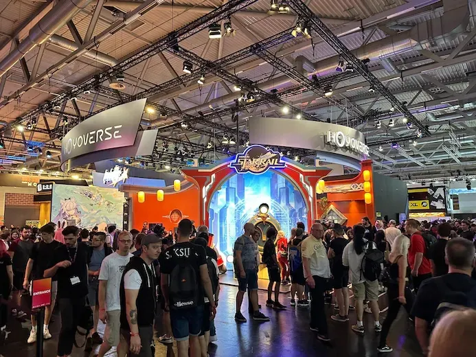
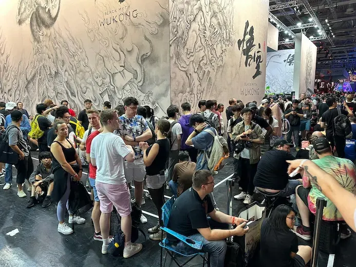

"Wil je Assassin's Creed Jade spelen? Dan moet je even naar de booth van Tencent gaan." Bovenstaande hoorden we tijdens een korte afspraak bij Ubisoft op Gamescom in Keulen deze week. Op zichzelf een kleine uitspraak, maar wel één die een bredere trend illustreert: China is dit jaar gigantisch groot aanwezig op de Duitse gamebeurs.

> [!NOTE]
>
> Dit artikel verscheen eerder op [Gamer.nl](https://gamer.nl/achtergrond/opinie/columns/nog-nooit-was-china-zo-groot-op-gamescom/).

Het valt al op bij binnenkomst. Wie via de noordingang arriveert, stuit op een gigantisch groot standbeeld van een draak uit Genshin Impact. Loop je naar binnen, dan bereik je al snel een fikse stand van Genshin-maker Mihoyo, die daar ook zijn games Honkai Star Rail en het nieuwe Zenless Zone Zero laat zien. De zaal is gevuld met (veelal betaalde) cosplayers als personages van de game en Mihoyo adverteert op grote banners tussen de zalen in. En als je naar de bezoekers kijkt, spot je ook binnen de kortste keren Mihoyo-tassen die worden weggegeven.

Loop je naar de booth van Black Myth Wukong, dan is het net zo'n groot feest. Het is een grote locatie voor Gamescom-begrippen, met aan de voorzijde bovengemiddeld lange rijen van gamers die naar binnen willen om 'm uit te proberen. Het moge duidelijk zijn: Chinese games zijn dit jaar buitengewoon populair op Gamescom.

Het duidt in de eerste plaatst op een flinke investering uit Chinese hoek. Want weet wel: het is niet alsof de grootste games op magische wijze de grootste stands toegewezen krijgen. Mihoyo en Wukong-maker Game Science hebben grof geld betaald om zo opvallend aanwezig te zijn op de beursvloer. In het geval van Mihoyo is dat ook hartstikke logisch: zowel Honkai Star Rail als Genshin Impact zijn commercieel gigantisch grote successen, wat ruimte geeft om te investeren.

Maar de bredere aanwezigheid van Chinese bedrijven laat ook zien dat China's ambities om de westerse gamemarkt te betreden langzaamaan steeds beter lukken. Tencent investeert al jaren in spellen en heeft dit jaar ineens grootse internationale namen in huis dankzij samenwerkingen met onder meer Ubisoft. Daarnaast heeft datzelfde Tencent een aandeel van 40 procent in Epic Games, waarmee het stilletjes deels verantwoordelijk is voor onder andere de Unreal Engine. Op die manier is de Chinese invloed eigenlijk terug te leiden naar het gros van de games die op Gamescom aanwezig is.

Dat mes snijdt aan twee kanten. Aan de ene kant helpt China op dit moment de internationale game-industrie op weg. Ze investeren grote bedragen die nodig zijn om de markt nog verder te laten groeien. Zulke investeringen zorgen ervoor dat bedrijven rechtop blijven staan: volgens ingewijden ging het Nederlandse Ronimo Games eerder deze week failliet simpelweg omdat een investering niet doorging. Je kunt dan mopperen over Chinese invloed, maar bij een Chinese geldpot zou een Nederlands bedrijf hebben voortbestaan. Nu zijn ze er simpelweg niet meer.

## Steeds meer Chinese invloed

Tegelijkertijd kun je niet ontkennen dat het geopolitieke landschap van de gamesector verandert. Chinese bedrijven krijgen steeds meer invloed. Internationaal wordt al jaren gevreesd dat de Chinese overheid rechtstreeks nationale bedrijven beïnvloedt, wat betekent dat ministeries via bedrijven als Mihoyo en Tencent dat wellicht in de game-industrie doen.

Bovendien is het een land waar wetgeving over games constant een discussiepunt is. Er is een kans dat China straks gevoelige onderwerpen niet meer in games wil zien - wat dan internationaal wordt uitgevoerd omdat zoveel games Chinese steun hebben. Wil China geen geweld en seks meer in games? Dan gebeurt dat sowieso bij games die in het land verschijnen - maar kan dat beleid wellicht ook doorsijpelen bij titels die hier verschijnen, als wetshervormingen negatief uitpakken.

Al kan dit ook andersom uitpakken: zolang het overheidsbeleid zich vooral richt op censuur van games in het binnenland, kunnen Chinese makers voor het westen spellen maken waarin ze dingen kwijt kunnen die anders niet zouden mogen. Het helpt Chinese gameontwerpers om zich vrij te vechten van overheidsbeleid en internationaal door te breken - en zo meer mooie games te maken.

Want laten we niet vergeten: die games van Chinese makelij zijn geen boze overheidsproducten. Ja, de overheid in dat land kan bovengemiddeld veel druk uitoefenen. Maar studio's zelf bestaan veelal uit geame-ontwerpers die - net als westerse tegenhangers - gewoon iets vets willen maken. En dat ze dat kunnen, lieten ze op Gamescom zien.
