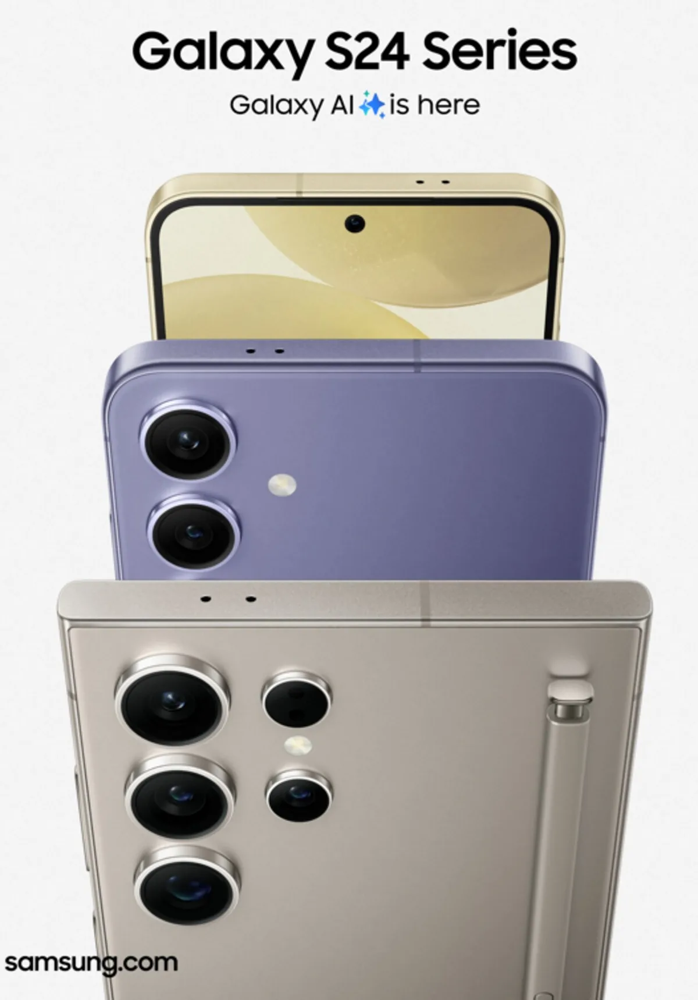

Samsungs nieuwste telefoons hebben traditiegetrouw kersverse chips en camera’s, maar belangrijker is wat er op softwaregebied in schuilgaat: ze draaien op een nieuwe kunstmatige intelligentie genaamd Galaxy AI.

> [!NOTE]
> Dit artikel verscheen eerder op [AD](https://www.ad.nl/tech/ook-smartphonegiganten-mengen-zich-nu-in-de-grote-ai-oorlog~a943fb44/).

Met de AI gooit Samsung het bij de nieuwe telefoons over een andere boeg: het gaat dit jaar niet over snellere chips en krachtigere hardware, maar over wat voor dingen de telefoon allemaal kan. Het is de manier waarop Apple zijn nieuwe telefoons ook altijd uit de doeken doet. Hiermee mengt Samsung zich in de grote AI-strijd die al langere tijd gaande is in techland. En ze zijn niet de enige telefoonmaker die zich daar dit jaar aan wil wagen.

## Snel genoeg

Verhalen over processorkracht zijn anno 2024 allang niet meer interessant voor telefoonkopers: hun huidige toestel is vaak snel zat. Wellicht hoopt Samsung dat Galaxy AI de verkoopcijfers net als bij de concurrent zal stuwen: uit recente marktcijfers blijkt dat Apple net Samsung van de troon heeft gestoten als marktleider.

De Galaxy AI zit ingebakken in het besturingssysteem van de nieuwe Galaxy S24, S24+ en S24 Ultra. De telefoon kan bijvoorbeeld live meeluisteren tijdens een telefoongesprek en de gesproken talen meteen vertalen naar iets anders, of hij kan helpen om de toon van een WhatsApp-bericht voor je te veranderen. Heb je een recept in je notities staan, dan kan de AI dit opmaken met bulletpoints, een grotere titel en witruimte tussen alinea’s. De AI wordt een eindredacteur die zorgt dat je teksten er zo mooi mogelijk uitzien.

## Foto en video

Bij het aanpassen van foto’s kan een onderwerp in het beeld worden verplaatst en wordt het achtergebleven gat automatisch gevuld, zodat je kunt bewerken zonder uitgebreide Photoshop-ervaring te hebben. Daarnaast kan iedere video nu in slow-motion worden afgespeeld, want de AI verzint de missende videoframes die daarvoor nodig zijn.

Samsung heeft samen met Google een nieuwe zoekfunctie bedacht. Zie je iets interessants op het scherm, dan kun je de thuisknop ingedrukt houden en een cirkel tekenen om het object in kwestie. Vervolgens wordt in Google gezocht naar deze afbeelding. Combineer dat met de camera achterop en je kunt bijvoorbeeld foto’s van schoenen maken om te vinden waar je ze kunt kopen.

## Alles draait om AI

Tijdens een persbijeenkomst benadrukt Samsung dat de Galaxy AI het belangrijkste onderdeel is van de nieuwe telefoons. Overal waar je de nieuwe S24-telefoons straks geadverteerd ziet worden, zal worden benadrukt dat hij gebruikmaakt van de nieuwe kunstmatige intelligentie. Binnen de software-interface van de telefoon worden alle AI-functies gemarkeerd met vier sterretjes, zodat je weet wanneer je er gebruik van maakt.

AI is ook het nieuwe goud voor andere techgiganten. Google-baas Sundar Pichai noemde het recent ‘de meest diepgaande technologie waar de mensheid ooit aan heeft gesleuteld. Diepgaander dan vuur, elektriciteit en al het andere waar we ooit aan werkten.’ De zoekreus werkt al jaren aan de technologie, maar deed dat voorzichtig: alle ethische problemen werden uitgebreid afgewogen, om ervoor te zorgen dat hun software geen negatieve impact op de wereld zou hebben.

Galaxy AI is de nieuwste software waarmee Samsung-telefoons worden uitgerust © Samsung

AI-bedrijf OpenAI nam het minder nauw en kwam daardoor sneller met een kunstmatige intelligentie die tot ontzettend veel in staat is. Ze bouwden ChatGPT, dat al je vragen kon beantwoorden, en de digitale kunstenaar DALL-E, die op verzoek alles voor je kan illustreren. Hier startte de huidige AI-revolutie: in één keer werd duidelijk tot hoeveel de technologie in staat is.

Tegelijkertijd ontstond veel discussie. Bijvoorbeeld door artiesten, wiens werk op grote schaal door AI’s is bekeken zodat die kon leren om hen na te doen. AI’s die nu een goedkoper alternatief zijn voor hun handwerk. Silicon Valley en overheidsinstanties steggelen over hoe AI ethisch verantwoord in apparatuur kan worden geïntegreerd.

## In het gros van de smartphones

Google integreerde al veel AI-functies in zijn Pixel-telefoons, maar met Galaxy AI komt de technologie naar het gros van de telefoongebruikers. Afgelopen jaar had 43 procent van de Nederlanders een Samsung-telefoon, terwijl slechts 2 procent een Pixel op zak heeft.

Samsung is niet de enige smartphone-maker die zich aan AI wil wagen: volgens geruchten sleutelt Apple (36 procent marktaandeel in Nederland) aan SiriGPT, een kunstmatige intelligentie die in het iOS-besturingssysteem geïntegreerd moet worden. Deze Apple-AI wordt mogelijk in juni dit jaar onthuld, als de nieuwe iOS 18-update uit de doeken wordt gedaan. Officieel heeft Apple nog niks gezegd over deze SiriGPT-plannen, het bedrijf onthult pas plannen vlak voordat nieuwe producten beschikbaar zijn.

Maar eind 2023 publiceerde het bedrijf wel stilletjes een taalmodel genaamd Ferret. Taalmodellen zijn de achterliggende software voor AI’s – ze bepalen hoe de computer informatie doorgrondt en er iets nieuws mee kan doen. Daarmee lijkt de achterliggende software voor een slimmere Siri al te bestaan.

Maar eerst is Samsung aan zet: de nieuwe Galaxy S24-telefoons zijn vanaf 31 januari te koop in Nederland. Het goedkoopste model is 899 euro, 50 euro minder dan de S23 vorig jaar. Bij het duurste model, de S24 Ultra, is de vanafprijs (1449 euro) wel met 50 euro gestegen ten opzichte van het model van afgelopen jaar.
