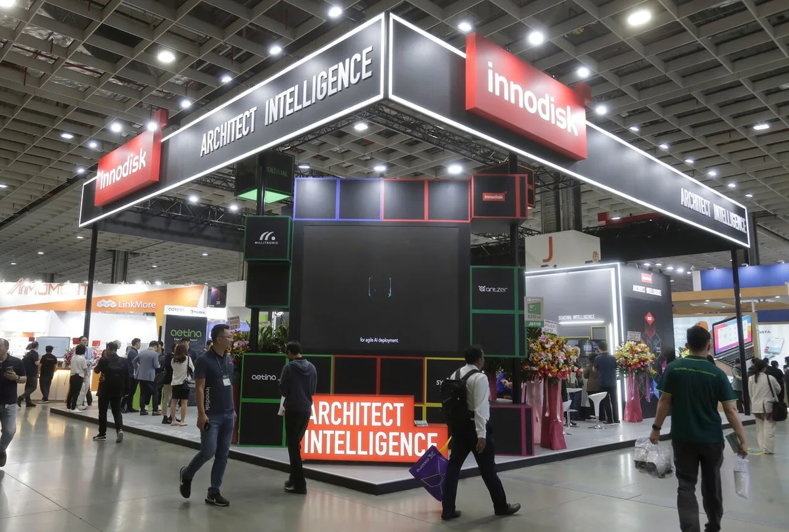

Wie deze week techbeurs Computex binnenliep, zag één term overal groot op de borden staan: AI. De grootste hardwarebedrijven van de wereld zijn hard bezig om zichzelf als AI-bedrijven te profileren. Maar wie er daadwerkelijk in een AI-bedrijf transformeert, moet blijken.

> [!NOTE]
> Dit artikel verscheen eerder op [AD](https://www.ad.nl/tech/op-de-grootste-techbeurs-van-azie-gaat-het-alleen-maar-over-ai~aeb2bc83/).

Computex is de grootste technologieconferentie van Azië. In het Taiwanese Taipei komen fabrikanten zoals ASUS en AMD samen om de nieuwste laptops, chips en plannen voor dit jaar te presenteren. Het is een belangrijk moment voor fabrikanten, die zich grotendeels in Azië bevinden.

Het thema van dit jaar is duidelijk AI, ofwel kunstmatige intelligentie. De nieuwe, snellere laptops bij bedrijven zijn nu AI-laptops, cloudbedrijven verkopen toegang tot speciale AI-servers. Alle nieuwe chips voor toekomstige computers hebben dit jaar speciale processorkernen voor AI-berekeningen, om de technologie in de toekomst nog beter te ondersteunen.

## In de voetsporen van Silicon Valley

Hardwarefabrikanten volgen daarmee in de voetsporen van bedrijven in Silicon Valley, die kunstmatige intelligentie steeds serieuzer zijn gaan nemen. Sinds de komst van ChatGPT lijkt iedereen overtuigd te zijn van de kracht achter kunstmatige intelligentie. Deze ‘generatieve AI’ kan grote hoeveelheden data verwerken om bijvoorbeeld te leren te tekenen.

© AP

,,Vroeger moest jij leren hoe je een computer moest gebruiken, maar dankzij AI zal een computer over een paar jaar leren hoe hij met jou moet omgaan”, vertelt ASUS-topman Paul Ju in een gesprek met deze site. ,,Mensen vragen zich nu nog af waarom ze AI nodig hebben, maar dat zeiden ze ooit ook over de komst van wifi.”

## AI-laptops

De fabrikant heeft zijn laptops omgedoopt tot AI-laptops, net als iedere laptopmaker op de beurs. De belofte van AI zie je over de hele reeks, van zakelijke laptops tot gamingmachines. Dat is deels te danken aan Microsoft, dat met Windows 11 investeerde in nieuwe AI-technologie.

De Windows-knop op het toetsenbord is vervangen met een toets om de AI mee aan te spreken. Daarin zitten allerlei handigheidjes verwerkt: je kunt de AI bijvoorbeeld vragen te zoeken naar dingen in het verleden, waarbij hij kijkt naar alles dat je afgelopen dagen op je computer hebt gedaan.

## ‘AI gaat banen vervangen’

Daarmee wordt geïnvesteerd in een veelbelovende technologie, waar ook veel discussie over bestaat. Critici vrezen bijvoorbeeld dat AI in komende jaren banen zal afnemen van mensen. Volgens Ju is dat niks nieuws: “vroeger had ik een secretaresse die alles voor mij uitschreef op een typemachine, wiens werk later werd vervangen omdat ik een computer kreeg.”

De overdaad aan AI op Computex is ook een marketingtruc. Nvidia werkt al jaren aan de technologie maar gebruikte daarbij termen zoals DLSS, maar wisselde die afkorting tijdens een presentatie op de beurs ineens om voor AI. De functie is onveranderd, maar het bedrijf wil meevaren op de huidige AI-rage.

## Hype of blijvertje?

Het is afwachten of AI volgend jaar weer zo’n grote rol speelt op Computex. Ju lijkt te geloven dat dit de grote technologische ontwikkeling van deze generatie is, iets dat topmannen bij Google en Microsoft ook hebben gezegd. Maar de techindustrie staat er ook om bekend heilig te geloven in nieuwe technologie die jaren later een hype bleek te zijn.

Eerdere jaren investeerden chipmakers bijvoorbeeld in nieuwe hardware voor cryptovaluta en de blockchain, technologie die nu nog amper op de beurs te zien is. Nu bedrijven op AI hebben voorgesorteerd, moet gaan blijken of deze technologie echt een blijvertje is.
