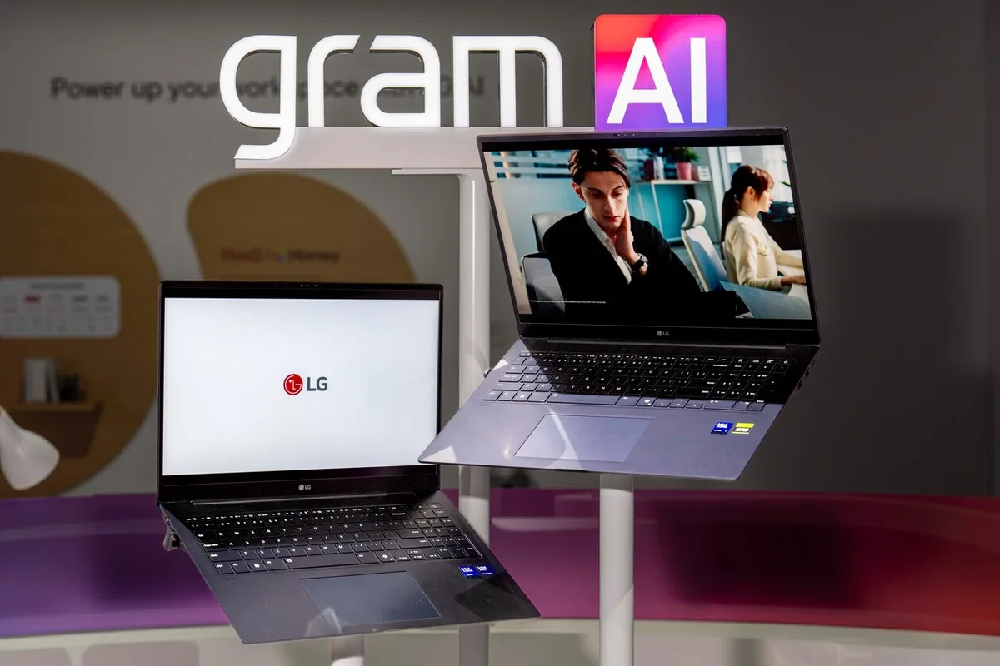
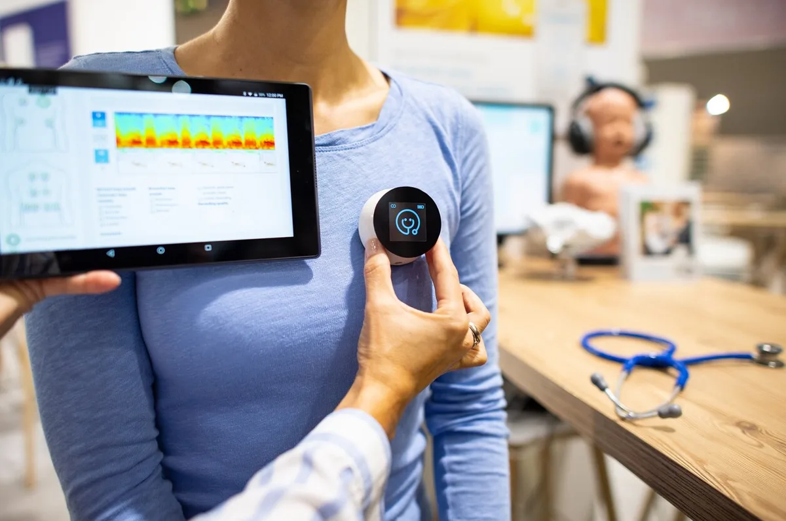
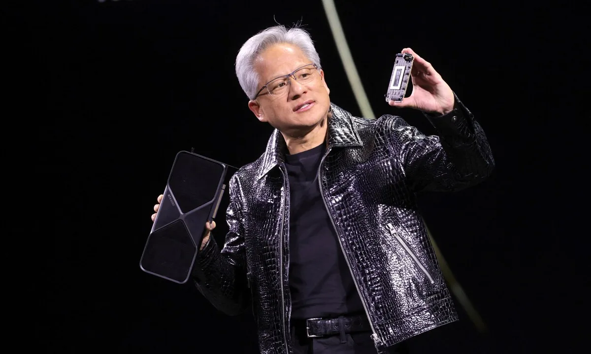

Op 's werelds grootste technologiebeurs is er dit jaar één woord dat het meest genoemd wordt: AI. Zowel techreuzen als kleine startups staan klaar om de wereld te veroveren met hun AI-toepassingen. Maar of alles ook in de praktijk zo mooi zal uitpakken, is maar de vraag.

> [!NOTE]
> Dit artikel verscheen eerder op [AD](https://www.ad.nl/tech/op-s-werelds-grootste-techbeurs-wordt-een-ai-revolutie-beloofd-toch-is-de-werkelijke-impact-nog-een-vraagteken~a6c4f0d6/).

Al sinds de jaren 60 reist de gehele technologiewereld af naar de Consumer Electronics Show (CES) om zijn nieuwste producten te laten zien. Daarmee geeft de beurs een goed overzicht van de volgende grote techtrends: in de jaren 80 stond Apple met zijn eerste Mac op de gigantische beursvloer, in de jaren 90 zag je hier de eerste mobiele telefoons.

In 2025 is het kunstmatige intelligentie (artificial intelligence, AI) dat de klok slaat op de techbeurs in Las Vegas. Nieuwe laptops zijn nu AI-computers, en bij televisies druk je niet meer op de volumeknop, maar vraag je de digitale assistent dat te doen.

Bij moderne AI-apparaten gaat het om zogeheten generatieve AI. Speciale software heeft geleerd om gigantische hoeveelheden data te doorgronden, om zo te leren zelf iets te doen. Zo kunnen computers bijvoorbeeld miljoenen afbeeldingen bekijken om te leren zelf een illustratie te maken, of talloze teksten op het internet lezen om zelf iets zinnigs te schrijven.

Die AI begint nu in alle nieuwe gadgets te zitten. De grote techbedrijven beloven in hun persconferenties slimme, assertieve assistenten die je dagelijks leven gaan begeleiden. Samsung demonstreerde bijvoorbeeld hoe hun televisies nu ook AI gebruiken om films voor je te vertalen. ,,Wil je een film zien en heeft die net geen ondertitels, dan kan de AI die ter plekke voor je genereren”, vertelde Samsung-topman Yongsu Kim tijdens een persconferentie.

## Vage AI-beloftes

In veel gevallen is de AI-belofte een stuk vager. Zo demonstreerde het Zuid-Koreaanse LG een AI die je gehele leven eenvoudiger moet maken. Met sensoren in je smart home, auto, televisie en andere gadgets voorspelt de AI wat je kunt doen. Heb je een hoge hartslag en koffie besteld? Dan stelt hij voor om toch even die bestelling te annuleren.

De AI-laptops van LG. © AP

In een demonstratie was te zien hoe die AI werkt, maar een concreet product was er niet. Het was meer een toneelstukje met vooraf ingesproken dialogen, om te laten zien wat LG ooit eens zou willen maken. Iets dat techbedrijven vaker doen als een nieuwe trend opkomt, maar zij eigenlijk nog niets concreets hebben om te laten zien.

## Kleinere, concrete gadgets

Producten van kleinere bedrijven zijn vaak weer wel wat concreter. De Poolse StethoMe is bijvoorbeeld een slimme stethoscoop die je op de borst van je kind kunt leggen, waarna de AI luistert en vertelt wat er zoal aan de hand is met je hoestende kind. ,,Dan hoef je niet meer een dag later naar de dokter om te beschrijven wat je gehoord hebt”, claimt medeoprichter Paweł Elbanowski.

De StethoMe. © picture alliance via Getty Image

De Britse WeWalk is een blindengeleidestok met ingebouwde sensoren, die de AI gebruikt om obstakels te herkennen en je te waarschuwen. Bovenin zit ook een microfoon waarmee je de kunstmatige intelligentie vragen kunt stellen. Dat zulke AI-beeldherkenning ook joliger gebruikt kan worden bewijst de Birdfy Feeder: een vogelhuisje met een camera, die automatisch herkent welke vogel erop zit.

## Nvidia en Microsoft de grote winnaars

De AI-gekte schuilt ook achter de meest besproken persconferentie van videokaartmaker Nvidia. Jarenlang waren hun apparaten alleen interessant voor gamers, maar toepassingen voor cryptovaluta en kunstmatige intelligentie hebben de fabrikant één van de meest waardevolle bedrijven op aarde gemaakt. Nieuw van het bedrijf is een videokaart van maar liefst 2000 euro. Om op te gamen, maar ook voor zware AI-taken.

Nvidia-directeur Jensen Huang houdt een nieuwe Nvidia videokaart vast. © REUTERS

De tweede grote winnaar naast Nvidia op AI-gebied is misschien wel Microsoft. Het bedrijf was zelf niet groots aanwezig op de beurs, maar de AI-toepassingen van Samsung, LG en tal van andere bedrijven worden allemaal gevoed door Microsofts AI-assistent Copilot. Daarmee lijkt de Windows-maker terrein te winnen op concurrent Google, wiens Gemini-assistent minder breed op de CES was vertegenwoordigd.

## AI nog niet vanzelfsprekend

Het is makkelijk te geloven dat AI alomvattend wordt, maar het is afwachten hoe de nieuwe golf aan nieuwe gadgets het gaat doen. Een eerste golf aan AI-gadgets zoals de Humane Pin, een Star Trek-achtige badge waarmee je met een slimme assistent praat, bleek afgelopen jaar helemaal niet zo goed te werken. Daarnaast staat AI-software zoals Google Gemini, Copilot en OpenAI’s ChatGPT erom bekend soms foute informatie te tonen.

Op softwaregebied is AI nog in opmars, wat betekent dat techbedrijven een gok nemen: ze hopen dat de software in komende jaren betrouwbaar genoeg wordt. Die gok namen ze eerder ook bij de succesvolle smartphone, maar ook bij de geflopte 3D-televisie. Het is afwachten of AI onder de eerste of tweede categorie valt.
