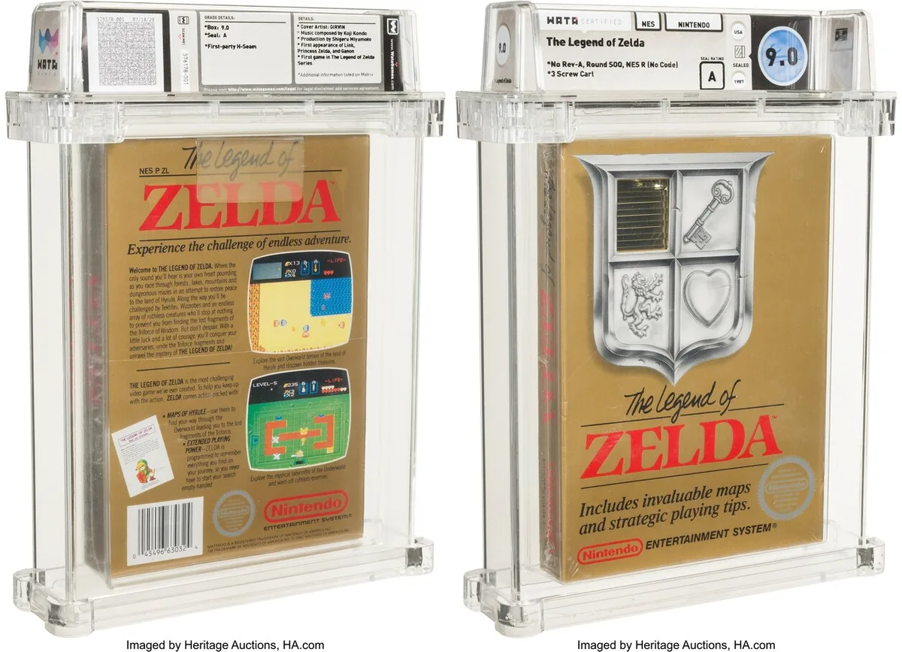

Een feilloos exemplaar van de allereerste _The Legend of Zelda_\-game wordt geveild, waarbij het hoogste bod nu al op 115.000 dollar ligt.

> [!NOTE]
> Dit artikel verscheen eerder op [AD](https://www.ad.nl/tech/oude-zelda-game-levert-nu-al-een-ton-op-maar-mario-is-nog-meer-waard~ae485ac1/).

Het spel is [volgens](https://comics.ha.com/itm/video-games/nintendo/the-legend-of-zelda-wata-90-a-sealed-no-rev-a-round-soq-early-production-nes-nintendo-1987-usa/a/7261-28030.s) veilingsite Heritage Auctions in piekfijne staat. ,,Het is een harde waarheid: geen van de kopieën die we eerder verkochten was van dit hoge niveau”, luidt de beschrijving. Heritage Auctions is gespecialiseerd in het veilen van verzamelobjecten. Het gaat daarbij om bijvoorbeeld zeldzame munten, oude stripboeken of vroege editie van videogames.

De Zelda-titel in kwestie verscheen in 1987 voor de Nintendo NES-spelcomputer. Deze cartridge is één van de eerste edities die toen werd uitgegeven. Een die bovendien slechts een paar maanden in de winkel lag. Later verscheen een iets aangepaste variant, om precies te zijn in 1988.

De game wordt in een speciale beschermdoos bewaard. © HA.com

## Ton geboden, bieden kan nog

Omdat het zo’n vroege editie is die nog nooit uit het folie werd gehaald, loopt de prijs op de veilingsite snel op. Het hoogste bod ligt op dit moment op 115.000 dollar, ongeveer 100.000 euro. De prijs zal vermoedelijk nog oplopen. De veiling loopt nog tot het einde van de werkweek, waarna de hoogste bieder de game in ontvangst mag nemen.

Overigens is dit niet de meest waardevolle versie van de game. Volgens Heritage Auctions is er een nog vroegere variant, waarbij het Nintendo-logo een R-icoontje in plaats van een TM-icoontje heeft. Van deze zou slechts één verzegeld exemplaar op aarde bestaan, dat tot dusver niet te koop is aangeboden.

## Ook voor minder te spelen

Het verzamelaspect staat bij de veiling overduidelijk centraal: _The Legend of Zelda_ kan vandaag de dag voor veel minder geld worden gespeeld, bijvoorbeeld op de Nintendo Switch-spelcomputer. Wie een abonnement neemt op de onlinedienst van het bedrijf, krijgt toegang tot een verzameling oude games voor de NES en opvolger SNES.

Het spel staat ook op de Classic Mini NES, een minivariant van de oude gameconsole waarop de grootste hits vooraf geïnstalleerd staan.

## Mario-games nog meer waard

Hoewel de Zelda-game voor een torenhoog bedrag wordt geveild, is het lang niet een record. Eerder dit jaar werd een kopie van _Super Mario Bros._ op de NES geveild voor 660.000 dollar. Deze was nog in perfecte staat, met zelfs het labeltje om hem in de winkel te hangen intact.

Daarvoor was het record ook van een Mario-game: in november werd _Super Mario Bros. 3_ verkocht voor 156.000 dollar. Dat was een vroege versie van de game, die zich kenmerkte door een ontwerpfoutje. De hand van Mario zat onder het woordje ‘Bros’, wat daardoor slecht te lezen was.

## Zelda nog steeds groot

De eerste _The Legend of Zelda_ verscheen in 1987, maar sindsdien werkt Nintendo nog trouw aan de gamereeks. Het meest recente deel, _Breath of the Wild_, verscheen in 2017. Die game werd tot dusver ruim 22 miljoen keer verkocht.

In 2022 verschijnt een nieuw deel in de reeks, dat een direct vervolg op _Breath of the Wild_ moet worden. In die game moeten spelers afreizen tussen grote, zwevende eilanden.
